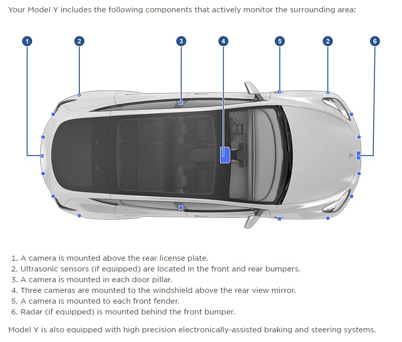
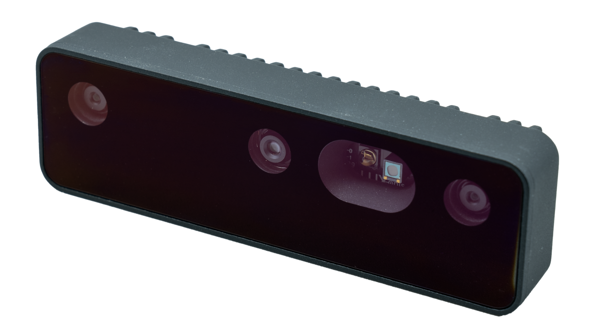
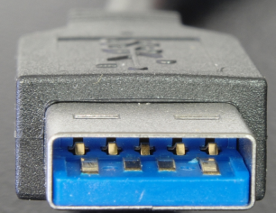
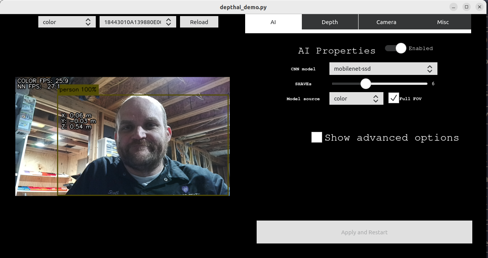
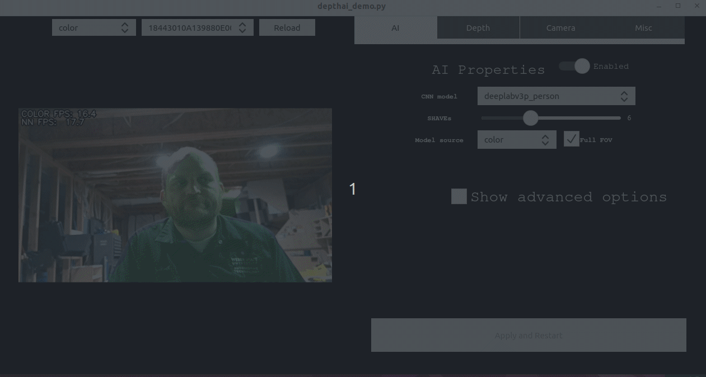

# Stereo Cameras

## Table of Contents

- [Stereo Cameras](#stereo-cameras)
  - [Table of Contents](#table-of-contents)
  - [Introduction](#introduction)
  - [Why 3 Lenses?](#why-3-lenses)
    - [Trifocal Lenses](#trifocal-lenses)
  - [Strengths and Weaknesses](#strengths-and-weaknesses)
    - [Strengths](#strengths)
    - [Weaknesses](#weaknesses)
  - [Comparison to LiDAR](#comparison-to-lidar)
  - [Tesla's Forward-Facing Camera](#teslas-forward-facing-camera)
  - [Other Pertinent Information](#other-pertinent-information)
  - [OAK-D Camera](#oak-d-camera)
  - [OAK-D Camera](#oak-d-camera-1)
    - [Installation Steps](#installation-steps)
    - [DepthAI installation](#depthai-installation)

## Introduction

Stereo cameras are an integral part of perception systems in autonomous vehicles. Unlike single-lens cameras, stereo cameras capture two or more 2D images of a scene from different angles. The images are then combined to form a 3D representation, providing depth perception, which is crucial for various applications such as obstacle detection, lane tracking, and more.

## Why 3 Lenses?

You might have encountered stereo cameras with three lenses. These are called "trinocular" setups and offer several advantages:

1. **Depth Accuracy**: Having an additional lens allows the system to compare more than one pair of images for depth estimation, improving accuracy.
2. **Field of View**: Each lens can be optimized for a different field of view (FoV), providing a more comprehensive representation of the environment.
3. **Redundancy**: In the case of lens malfunction or obstruction, the third lens can provide backup.

### Trifocal Lenses

A trifocal setup includes three lenses typically aligned horizontally. Trifocal lenses enable:

1. **More Matched Points**: The trifocal tensor allows for the simultaneous matching of points across three views, providing richer depth information.
2. **Improved Confidence**: More lenses mean better disambiguation of complex scenes, increasing the confidence in depth estimates.
3. **Enhanced Redundancy**: The trifocal setup further reinforces redundancy in case one of the lenses fails or is obstructed.

## Strengths and Weaknesses

### Strengths
1. **Cost-Effective**: Generally cheaper than LiDAR systems.
2. **High Resolution**: Capable of capturing high-detail 2D images.
3. **Versatility**: Can function well in various lighting conditions.

### Weaknesses
1. **Computational Overhead**: Depth mapping requires more computational power.
2. **Limited Range**: Generally has a shorter range compared to LiDAR.
3. **Sensitivity to Lighting**: Performance can be affected by sudden changes in lighting.

## Comparison to LiDAR

1. **Sensing Capabilities**: 
    - LiDAR provides more accurate depth information but usually at a lower resolution.
    - Cameras can capture color and texture, which is useful for object recognition.
    
2. **Computational Needs**: 
    - Stereo cameras require more computational power for real-time depth mapping.
    - LiDAR data is generally easier and quicker to process for depth.

3. **Cost**: 
    - Stereo cameras are generally more cost-effective.
    - LiDAR systems are more expensive but are often more robust.

## Tesla's Forward-Facing Camera

Tesla uses a multi-lens setup for its forward-facing camera system. Each lens is often tuned for specific tasks or to capture images under various conditions. Telsa uses a main lens, a wide angle lens and a telephoto lens. The telephoto camera can see up to 250 meters ahead. The main lens covers up to 150 meters. The wide angle lens is typically used in intersections and tight curves. They are possibly using only [two cameras](https://electrek.co/2023/03/09/tesla-dummy-camera-new-vehicles) now according to several fairly reliable sites.

<figure class="aligncenter">
    
    <figcaption>Model Y Cameras </figcaption>
</figure>

Model Y Cameras [Tesla Owners Manual](https://www.tesla.com/ownersmanual/modely/en_us/GUID-682FF4A7-D083-4C95-925A-5EE3752F4865.html)


1. **Diverse Range of FoVs**: The multiple lenses allow Tesla to capture a wide, medium, and narrow field of view, enhancing the vehicle's perception capabilities.
2. **Redundancy**: Multiple lenses offer a backup in case one fails or is obstructed.
3. **Software-Reliant**: Tesla uses advanced machine learning algorithms to combine data from different lenses and infer depth and other attributes.

## Other Pertinent Information

1. **Calibration**: Stereo cameras require careful calibration to ensure accurate depth perception.
2. **Sensor Fusion**: Stereo cameras are often used in conjunction with other sensors like LiDAR and radar to create a more robust perception system.

---

## OAK-D Camera

[OAK-D Documentation](https://docs.luxonis.com/projects/hardware/en/latest/pages/DM9098pro/)

<figure class="aligncenter">
    
    <figcaption>OAK-D Pro Camera</figcaption>
</figure>


## OAK-D Camera

The DepthAI platform is designed to work with the OAK (OpenCV AI Kit) cameras, which are powerful, small cameras capable of running machine learning models and performing computer vision tasks directly on the device. The platform is particularly useful for applications that require real-time image and video analysis, such as robotics, drones, IoT devices, and interactive installations.

### Installation Steps

Execute the script below to install DepthAI on Linux systems:

```bash
  sudo wget -qO- https://docs.luxonis.com/install_depthai.sh | bash
```

Plug in the OAK-D Pro into the host computer

### DepthAI installation

[Full Instructions](https://docs.luxonis.com/en/latest/pages/tutorials/first_steps/#first-steps-with-depthai)

```warning
Make sure to use **USB3 cable**, as this is has been a very common culprit of OAK connectivity issues. If you aren't using USB3 cable, :ref:`force USB2 communication <Forcing USB2 Communication>`.
```
<figure class="aligncenter">
    
    <figcaption>USB 3 is colored blue</figcaption>
</figure>

**Install depthai repo**
```bash
git clone --recursive https://github.com/luxonis/depthai.git
```
**Install the other repos tied to depthai**
```bash
cd depthai
git pull --recurse-submodules 
```

```bash
sudo wget -qO- https://docs.luxonis.com/install_depthai.sh | bash
```

**Install dependencies**
```bash
python3 install_requirements.py
```

**Run DepthAI Demo**

```bash 
python3 depthai_demo.py
```

<figure class="aligncenter">
    
    <figcaption>Depth AI Demo</figcaption>
</figure>

**Select an AI Convolutional Neural Network (CNN) Model**

<figure class="aligncenter">
    
    <figcaption>Depth AI Demo deep lab v3</figcaption>
</figure>

[Deeper Dive DeepLabV3](https://learnopencv.com/deeplabv3-ultimate-guide/)


**Additional Info on DepthAI Demo**
[depthAI-demo](https://docs.luxonis.com/en/latest/pages/tutorials/depthai_demo/#depthai-demo)
