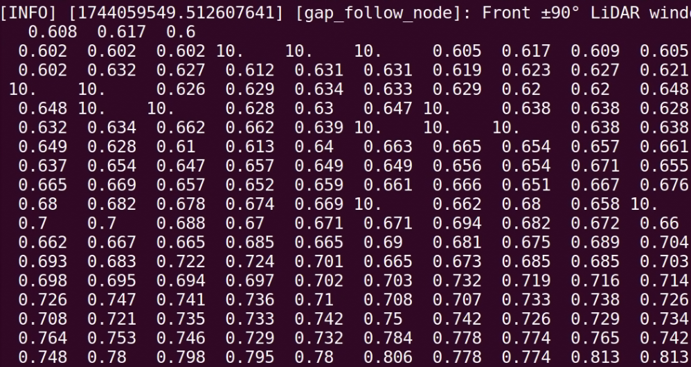

# Preprocessing LiDAR Data

This page describes the implementation of the `preprocess_lidar` function, which is essential for preparing LiDAR sensor data before further analysis, such as gap detection.

## Why Preprocess?
LiDAR sensors often produce data that include noisy or invalid values such as:
- **Infinite values (`inf`)**: Indicate measurements beyond the sensor's maximum range.
- **Not-a-Number values (`NaN`)**: Result from failed sensor measurements.
- **Extreme values**: Measurements that are too close or too far, beyond practical use.

Preprocessing ensures the reliability and accuracy of your navigation algorithms.

## Detailed Implementation

Below is the Python implementation of the LiDAR preprocessing function, broken down with detailed comments for clarity:

```python
import numpy as np

# Function to clean and preprocess LiDAR data
def preprocess_lidar(self, ranges, min_range=0.05, max_range=10.0):
        # Convert incoming ranges list to a numpy array for efficient processing
        processed_ranges = np.array(ranges, dtype=np.float32)

        # Replace infinite values (measurements beyond sensor range) with MAX_RANGE
        processed_ranges[np.isinf(processed_ranges)] = max_range

        # Replace NaN values (failed sensor measurements) with MAX_RANGE to avoid computational issues
        processed_ranges[np.isnan(processed_ranges)] = max_range

        # Clip all values to ensure they are within realistic operational limits
        processed_ranges = np.clip(processed_ranges, min_range,max_range)

        # Return the cleaned and processed LiDAR range data
        return processed_ranges
```

## Usage
This function should be called every time new LiDAR data is received, typically at the start of your scan callback function.

Example usage in the `scan_callback`:

```python
def scan_callback(self, msg):
    processed_ranges = self.preprocess_lidar(msg.ranges)
    # Continue with gap detection logic...
```
Example: Changing NaN and inf to 10m



Proper preprocessing enhances your gap-following algorithm's reliability by ensuring it operates on clean, valid data.

