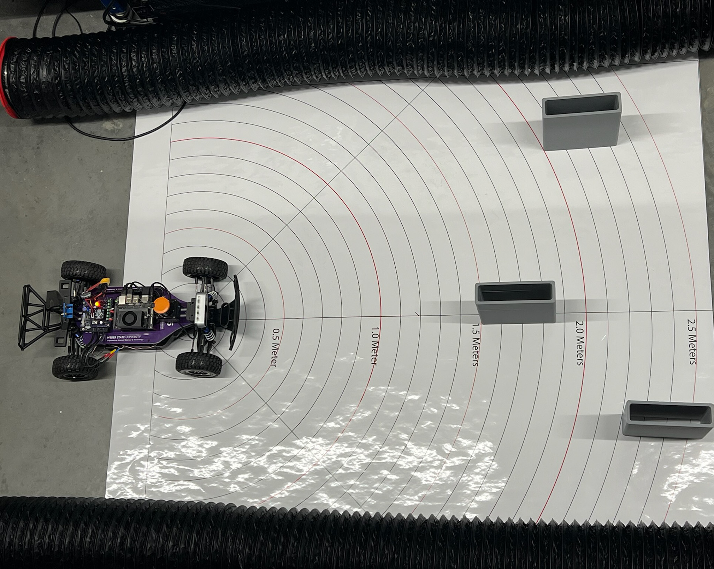
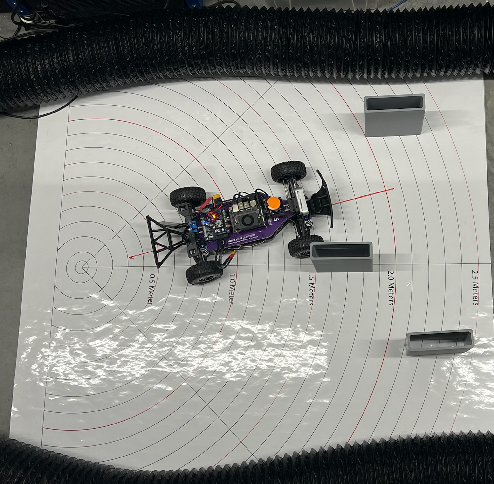
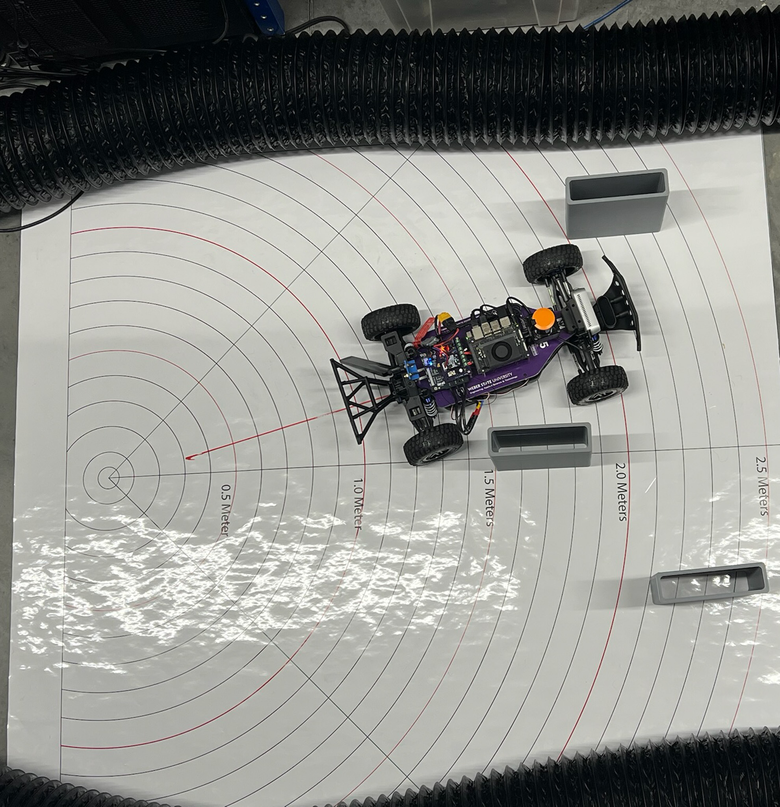

# Follow the Gap Method

In the context of F1TENTH racing, the **Follow the Gap** method refers to an obstacle avoidance and path-planning algorithm designed to quickly identify the largest navigable opening (or "gap") and steer the vehicle toward it.

## Core Concept
- **Identify Obstacles**: The vehicle uses LiDAR data to detect obstacles around it.
- **Finding Gaps**: It analyzes the LiDAR scan points to identify free space (or gaps) that are large enough for the car to safely pass through.
- **Selecting the Largest Gap**: Among the available gaps, the largest one is chosen to ensure safety and maximize maneuverability.
- **Choosing a Point within the Gap**: Typically, the safest route is through the middle of the largest gap, so the vehicle aims for that midpoint.

Here’s an updated version of your **Step-by-Step Process** ✍️ — now fully aligned with the **new full skeleton code** you just built:

---

# 📚 Updated Step-by-Step Process

## 1. **Data Acquisition**
- Receive a **full 360° LiDAR scan** (`LaserScan` message).
- For the Hokuyo LiDAR, **flip the scan** if necessary to match intuitive left-to-right ordering.
- (Optional) Focus on a **front window** (e.g., ±90°), but default is to use the **full scan**.

---

## 2. **Preprocessing**
- **Clean the raw LiDAR ranges**:
  - Replace **NaN** values with maximum range.
  - Replace **infinite** values with maximum range.
  - **Clip** distances to be within a realistic minimum/maximum range.
- (Optional) **Apply smoothing** (e.g., moving average) to reduce small noise spikes.

---

## 3. **Obstacle Masking (Safety Bubble)**
- **Find the closest obstacle** in the LiDAR scan.
- **Create a safety bubble** around the closest obstacle:
  - Set all ranges inside the bubble radius to **zero** (obstacle).
  - This eliminates unsafe directions close to collisions.

---

## 4. **Gap Detection**
- Treat **non-zero regions** in the processed ranges as **free space**.
- **Find the longest continuous sequence** of non-zero points:
  - This is the **largest navigable gap**.

---

## 5. **Best Point Selection Within the Gap**
- Two options:
  - **Farthest Point Method**:  
    Select the furthest reachable point in the gap.
  - **Disparity Method**:  
    Detect edges (sudden changes in distance) and **steer between obstacles** using disparities for smarter behavior.
- Both methods output a **best point index** to steer toward.

---

## 6. **Navigation Command**
- Calculate the **steering angle**:
  - Based on the angular difference between the car’s center and the best point.
- (Optional) Adjust **speed proportionally**:
  - **Lower speed** for large steering angles (tight turns).
  - **Higher speed** for small steering angles (straight).
- Publish an **AckermannDriveStamped** message with the calculated steering and speed.

---

## Practical Considerations
- Adjusting safety margins based on the speed and agility of the vehicle.
- Fine-tuning the method to handle narrow paths or cluttered environments.
- Accounting for dynamic obstacles by rapidly updating LiDAR scans and re-computing gaps.

## Advantages
- Simple, fast, and computationally efficient, making it suitable for real-time systems.
- Effective in unknown and cluttered environments.

## Limitations
- May lead to oscillations or suboptimal paths in complex scenarios.
- Doesn’t inherently incorporate global path planning

# Lab 4: Follow the Gap

## I. Learning Goals

- Reactive methods for obstacle avoidance

## II. Overview

In this lab, you will implement a reactive algorithm for obstacle avoidance. While the base starter code defines an implementation of the F1TENTH Follow the Gap Algorithm, you are allowed to submit in C++, and encouraged to try different reactive algorithms or a combination of several.

## III. Review of F1TENTH Follow the Gap

The lecture slides on F1TENTH Follow the gap is the best visual resource for understanding every step of the algorithm. However, the steps are outlined over here:

1. Obtain laser scans and preprocess them.
2. Find the closest point in the LiDAR ranges array.
3. Draw a safety bubble around this closest point and set all points inside this bubble to 0. All other non-zero points are now considered “gaps” or “free space”.
4. Find the max length “gap”, in other words, the largest number of consecutive non-zero elements in your ranges array.
5. Find the best goal point in this gap. Naively, this could be the furthest point away in your gap, but you can probably go faster if you follow the “Better Idea” method as described in lecture.
6. Actuate the car to move towards this goal point by publishing an `AckermannDriveStamped` to the /drive topic.

### IV. Implementation

Implement a gap follow algorithm to make the car drive autonomously around the track. You can implement this node in either C++ or Python. 

### V. Deliverables and Submission

**Deliverable 1**: After you're finished, update the entire skeleton package directory with your `gap_follow` to canvas

**Deliverable 2**: Make a screen cast of running your reactive node. 

### VII. Extra Resources

UNC Follow the Gap Video: https://youtu.be/ctTJHueaTcY

<h3>Follow the Gap - Penn Engineering</h3>

<iframe width="560" height="315" 
    src="https://www.youtube.com/embed/5asfD-_Z9x8?" 
    title="YouTube video - Follow the Gap"
    frameborder="0" allow="accelerometer; autoplay; clipboard-write; encrypted-media; gyroscope; picture-in-picture" allowfullscreen>
</iframe>

<h3>UNC Follow the Gap - Demonstration</h3>

<iframe width="560" height="315" 
    src="https://www.youtube.com/embed/ctTJHueaTcY" 
    title="UNC Follow the Gap Video"
    frameborder="0" allow="accelerometer; autoplay; clipboard-write; encrypted-media; gyroscope; picture-in-picture" allowfullscreen>
</iframe>