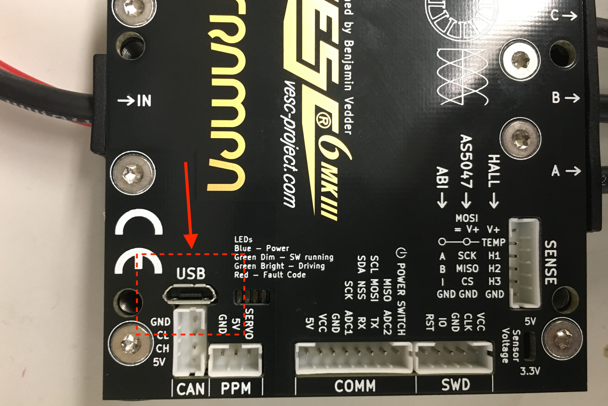
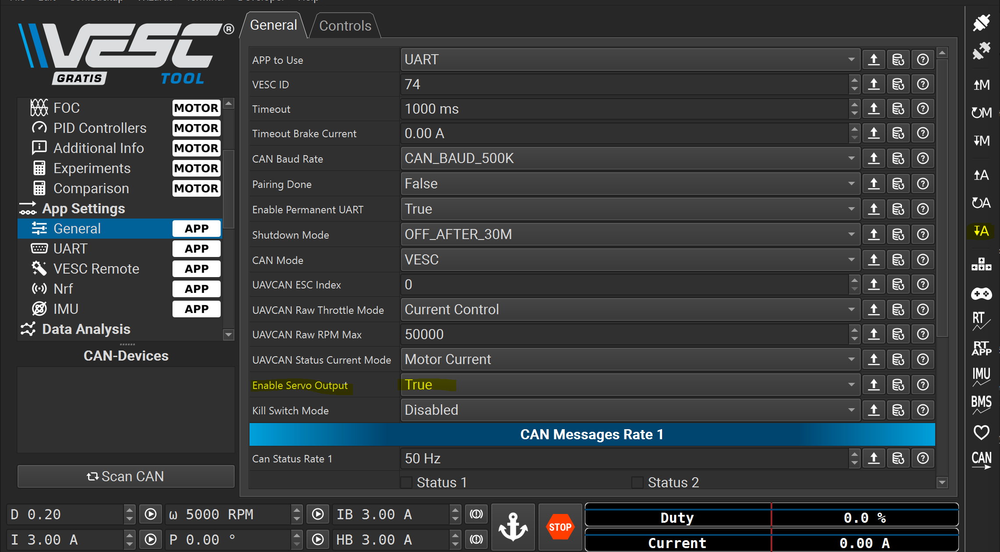
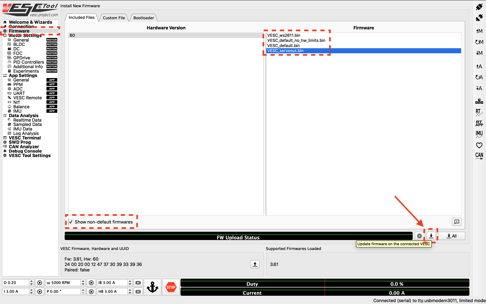
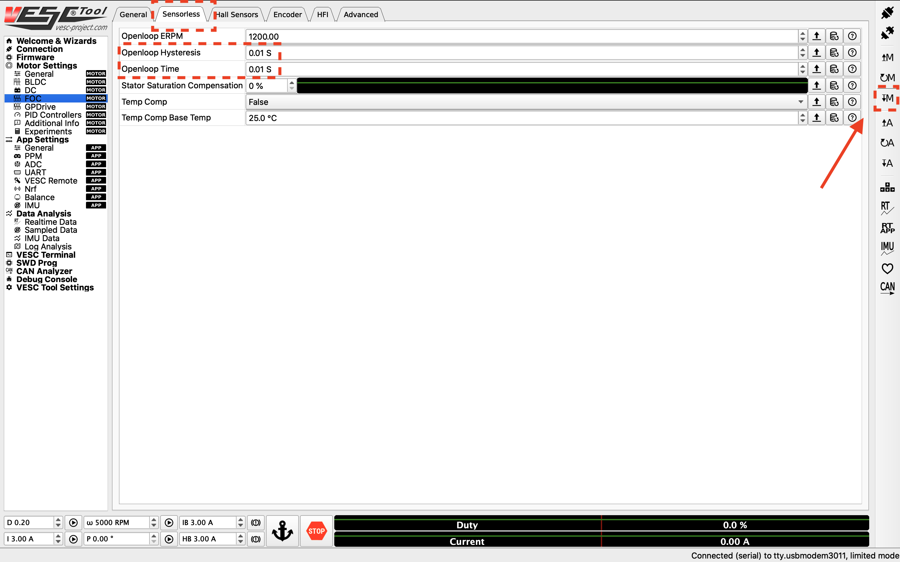
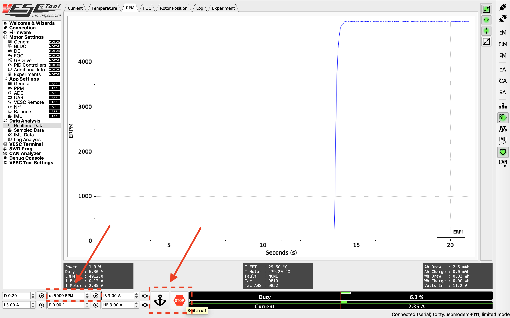
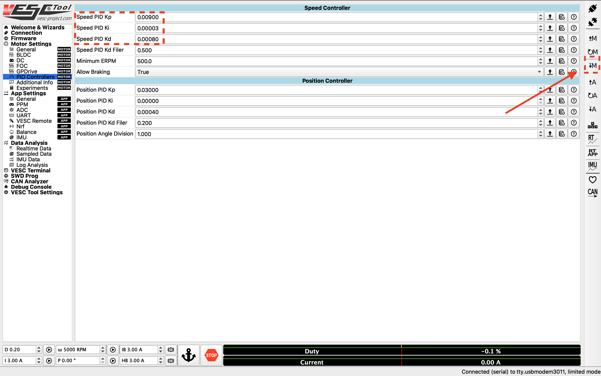
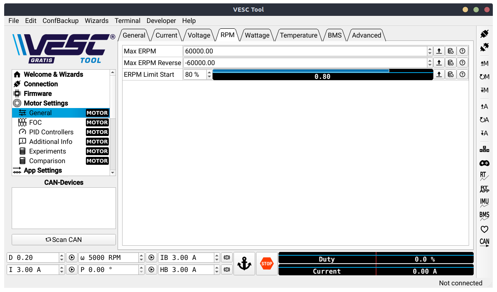

# WSU Roboracer: Configuring the VESC

## 🚨 Important Safety Tips
```warning
 - Put your car on an elevated stand so that its wheels can turn without it going anywhere. If you don’t have an RC car stand, you can use the box that came with your Jetson.
 - Make sure you hold on to the car while testing the motor to prevent it from flying off the stand.
 - Make sure there are no objects (or people) in the vicinity of the wheels while testing.
 - Use a fully charged LiPO battery instead of a power supply to ensure the motor has enough current to spin up.
```

### **Equipment Required:**
- Fully built RoboRacer vehicle
- Box or Car stand to put the vehicle on
- Laptop/computer (does not need to be running Linux)

---

## 1. Installing the VESC Tool
We need to configure the VESC so that it works with our motor and vehicle transmission. Before you start, you'll need to install the [VESC Tool](https://vesc-project.com/vesc_tool). You'll have to register for an account to download it. Add the free tier tool to your cart (you don't have to fill in any information other than your email). After checkout, a download link will be sent to your email. The software is available for Linux, Windows, and macOS.

---

## 2. Powering the VESC
First, we need to power the VESC. Plug the battery in and make sure the polarity is correct. Note that you don't need to turn on the Powerboard for configuring the VESC.


Next, unplug the USB cable of the VESC from the Jetson NX and plug the USB into your laptop that's running the VESC Tool. You may want to use a longer cable.



---

## 3. Connecting the VESC to Your Laptop
Launch the VESC Tool. On the Welcome page, press the **AutoConnect** button at the bottom left of the page. After the VESC is connected, you should see an updated status at the bottom right of the screen.


---

## 4. Updating the Firmware on the VESC
The first thing you'll need to do is to update the firmware onboard the VESC. Depending on the version of the VESC tool you're using, you'll need to go through different steps to enable servo out from the ppm port on the VESC.

With VESC Tool versions released after Mar. 31 2021, you can use the latest default firmware. And to enable servo out, go to **App Settings** > **General** > **Enable Servo Output > True** in the VESC Tool to enable servo out.

Make sure to press the down arrow A button on the far right vertical toolbar to write app configuration. 




 Click on the **Firmware** tab on the left. 
 


---

## 5. Uploading the Motor Configuration XML
After updating the firmware, select **Load Motor Configuration XML** from the dropdown menu and upload the provided XML file from [here](https://drive.google.com/file/d/1-KiAh3hCROPZAPeOJtXWvfxKY35lhhTO/view?usp=sharing). Click on the **Write Motor Configuration** button (down arrow with letter "M") to apply the settings.


---

## 6. Detecting and Calculating Motor Parameters
To detect and calculate the FOC motor parameters, navigate to the **FOC** tab under **Motor Settings**. At the bottom of the screen, click the four buttons in sequence, following the on-screen prompts. 

> ⚠ **Warning:** The motor will make noise and spin during the measurement process. Ensure the wheels are clear of obstacles.


After the parameters are measured, the fields at the bottom of the screen should turn green. Click **Apply**, then **Write Motor Configuration**.


---

## 7. Changing the Openloop Hysteresis and Openloop Time
Go to the **Sensorless** tab and change the **Openloop Hysteresis** and **Openloop Time** to **0.01**. Click **Write Motor Configuration**.



---

## 8. Tuning the PID Controller
To monitor the RPM response, navigate to **Realtime Data > Data Analysis** and click **Stream Realtime Data (RT button)**. Then, go to the **RPM** tab.


To create a step response:
- Set a target RPM (2000 - 10000 RPM).
- Click **Play** to start the motor.
- Click **STOP** to stop.

> ⚠ **Ensure the vehicle's wheels are free from obstacles.**



To fine-tune the speed PID controller, navigate to **PID Controllers > Motor Settings** and adjust the gains. If oscillations occur, modify the **Speed PID Kd Filter**.



---

## 9. Changing the Hardware Speed Limit
By default, the motor configuration sets a safe max RPM. To change the limit, go to:

**Motor Settings > General**, then modify the **Max ERPM** for forward and backward rotations.



> 🚨 **Warning:** See the **Odometry Tuning** section in the software stack setup for converting vehicle velocity to ERPM to calculate a safe max ERPM.

---

