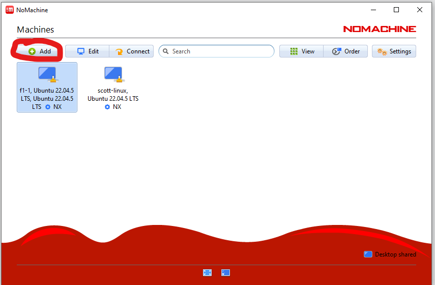
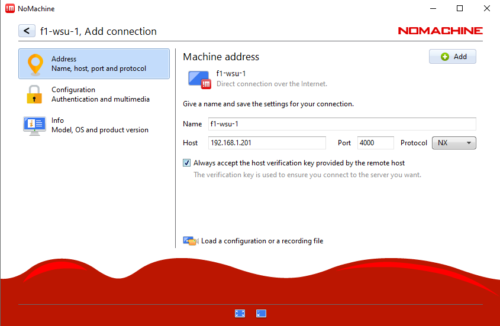
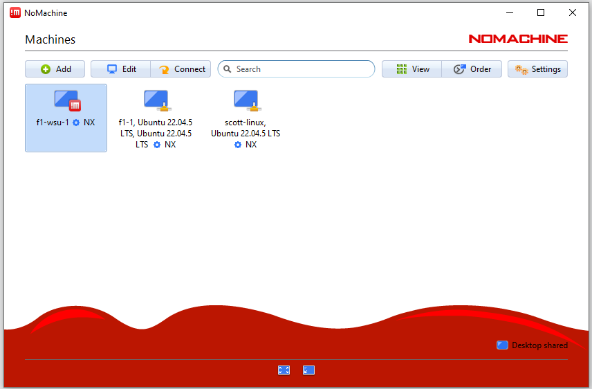
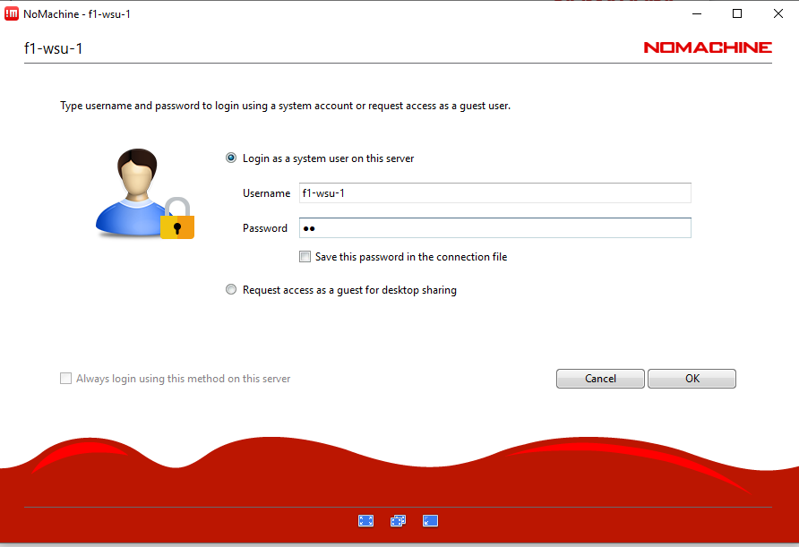
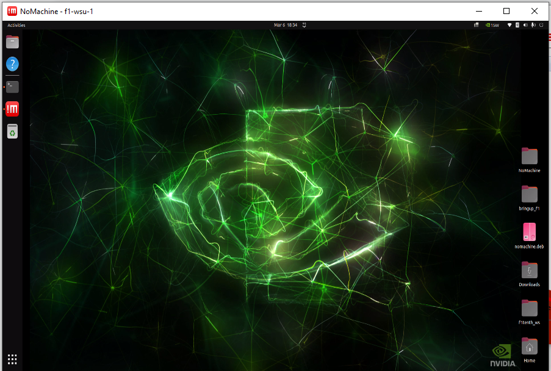

# WSU Roboracer: NoMachine

## Install NoMachine on RoboRacer

```bash
wget https://www.nomachine.com/free/arm/v8/deb -O nomachine.deb
```

### dpkg

```bash 
sudo dpkg -i nomachine.deb
```

[documentation]('https://kb.nomachine.com/AR02R01074')

## Install NoMachine on Host Machine -- Ubuntu


[download this]('https://downloads.nomachine.com/download/?id=1')

### dpkg

```bash 
cd ~/Downloads
sudo dpkg -i nomachine_8.16.1_1_amd64.deb
```

## Connect to Roboracer

On Host machine open NoMachine

Click on the Add button


Add name of bot 
Add ip address of bot 
Check Always accept the hosts verification
Then click Add


Find the bot in the list of computers and select


Enter in the credentials for the roboracer


Connected to Desktop of roboracer
