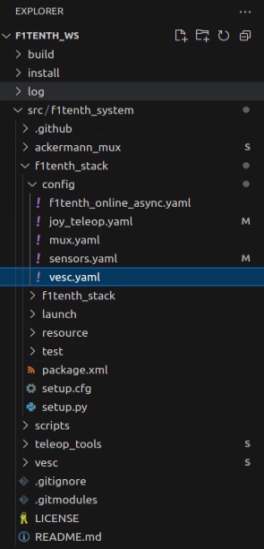
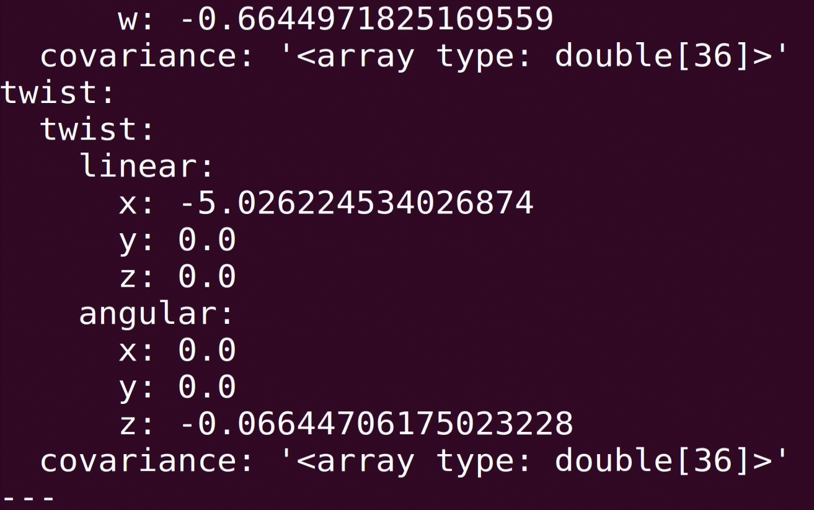

# Calibrate Odom

# Calibrating the Odometry

```note
This section assumes that you have already completed [Building the Car](#doc_build_car), [System Configuration](#doc_software_setup), [Installing Driver Stack](#doc_build_car_firmware), and [Manual Control](#drive_manualcontrol).
```

One final step that's crucial to get an accurate estimate of the car's current velocity, and accurate localization and mapping later on is to calibrate the odometry estimation. On the RoboRacer vehicle, the odometry is estimated from the motor's ERPM and the current angle of the servo.

## Required Equipment:
- Fully built RoboRacer vehicle
- Pit/Host computer
- joystick
- Tape measure
- Tape

## Calibrating the Steering and Odometry

Now that everything is built, configured, and installed, the odometry of the vehicle needs to be calibrated. The VESC receives input velocities in m/s and steering angles in radians. However, the motor and servo require commands in revolutions per minute (RPM) and servo positions. The conversion parameters will need to be tuned to your specific car.

1. The parameters in `vesc.yaml` need to be calibrated. This YAML file is located at:

   ```bash
   $HOME/f1tenth_ws/src/f1tenth_system/f1tenth_stack/config/vesc.yaml
    ```

   

### Preparing for Calibration

```note
**Before starting, ensure you've **lifted the car up with a pit stand or a box** so the wheels can spin freely.
```

### Checking Motor Rotation Direction

1. **Verify Motor Rotation**  

   run bringup in the terminal
   ```note
   bringup is the alias for 'ros2 launch f1tenth_stack bringup_launch.py'
   ```

   ```bash
   bringup
   ```

   ```important 
   If you need to modify the direction of the motor, **disconnect the battery** from the VESC before swapping wires.
   ```

   First, we need to check if our motor is rotating in the right direction. If when given a positive velocity, or commanded moving forward with the joystick, the motor is spinning in the reverse direction, swap 2 of the 3 connections from the vesc to the BLDC motor. 

   

2. **Check VESC Driver Interpretation**  
   Next, we’ll also need to check if the vesc driver is interpreting the motor rotation direction correctly.

   ```bash 
   ros2 topic echo --no-arr /odom
   ```
   
   ```note
      The --no-arr argument hides the large covariance matrices when echoing the odometry message.
   ```

   


   


