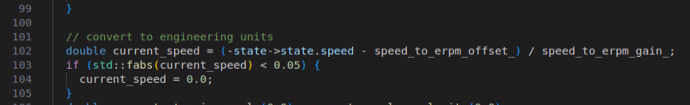
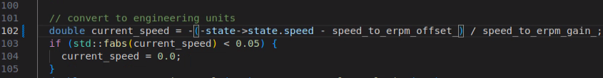
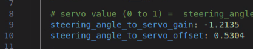

# Calibrate Odom

# Calibrating the Odometry

```note
This section assumes that you have already completed [Building the Car](#doc_build_car), [System Configuration](#doc_software_setup), [Installing Driver Stack](#doc_build_car_firmware), and [Manual Control](#drive_manualcontrol).
```

One final step that's crucial to get an accurate estimate of the car's current velocity, and accurate localization and mapping later on is to calibrate the odometry estimation. On the RoboRacer vehicle, the odometry is estimated from the motor's ERPM and the current angle of the servo.

## Required Equipment:
- Fully built RoboRacer vehicle
- Pit/Host computer
- joystick
- Tape measure
- Tape

## Calibrating the Steering and Odometry

Now that everything is built, configured, and installed, the odometry of the vehicle needs to be calibrated. The VESC receives input velocities in m/s and steering angles in radians. However, the motor and servo require commands in revolutions per minute (RPM) and servo positions. The conversion parameters will need to be tuned to your specific car.

1. The parameters in `vesc.yaml` need to be calibrated. This YAML file is located at:

   ```bash
   $HOME/f1tenth_ws/src/f1tenth_system/f1tenth_stack/config/vesc.yaml
    ```

   

### Preparing for Calibration

```note
**Before starting, ensure you've **lifted the car up with a pit stand or a box** so the wheels can spin freely.
```

### Checking Motor Rotation Direction

1. **Verify Motor Rotation**  

   run bringup in the terminal
   ```note
   bringup is the alias for 'ros2 launch f1tenth_stack bringup_launch.py'
   ```

   ```bash
   bringup
   ```

   ⚠️ 🚨  **Warning:** If you need to modify the direction of the motor, **disconnect the battery** from the VESC before swapping wires.
   

   First, we need to check if our motor is rotating in the right direction. If when given a positive velocity, or commanded moving forward with the joystick, the motor is spinning in the reverse direction, swap 2 of the 3 connections from the vesc to the BLDC motor. 

   

2. **Check VESC Driver Interpretation**  
   Next, we’ll also need to check if the vesc driver is interpreting the motor rotation direction correctly.

   ```bash 
   ros2 topic echo --no-arr /odom
   ```
   
   ```note
      The --no-arr argument hides the large covariance matrices when echoing the odometry message.
   ```

   

   Modify the file found at `/f1tenth_ws/src/f1tenth_system/vesc/vesc_ackermann/src/vesc_to_odom.cpp`

   Modify line double current_speed = ... around line 100

   

   Add a - to the start of the formula

   

   ---

   
   

   open the terminal and do colcon build on the workspace

   ```code

      cd ~/f1tenth_ws
      colcon build

   ```


### Checking Steering Angle Offset

 The first to be tuned is the Steering Offset. This parameter will determine the offset we put on the servo, and whether the car can drive straight when given no steering input. Again, start teleop with the bringup launch. Drive the car in a straight line a couple times with no steering input for a couple meters, and see if it’s driving straight. Adjust the steering_angle_to_servo_offset parameter in vesc.yaml if it’s not. Make small adjustment everytime (in the magnitude of 0.1). Repeat until you find the correct offset so the car drives straight.

  

  

   ```note
      Every time you make an adjustment to the file you need to run colcon build
   ```

### Steering Gain

Next, we’ll tune the Steering Gain. This parameter determines the smallest turning radius of the car. We’ll determine the desired turning radius given the maximum steering angle of the car we’re setting, which is 0.36 radians in both directions. The corresponding turning radius could be then calculated with R=L/(2\sin(\beta)), where L is the wheelbase of the car, which is around 0.33 meters; \beta is calculated as \arctan(0.5\tan(\delta)), with \delta being the maximum steering angle of the car. After calculations, when turning a half circle, the desired diameter of the half circle should be 1.784 meters.

   - Place the car at the 0 of the tape measure such that the rear axle of the car is parallel to the tape measure, and the x-axis (roll axis) of the car coincides with the tape measure at 0.

   - Start teleop. Set the steering angle to the maximum to one side depending on your setup (e.g. if the rest of the tape measure is on the left side of the car, turn left).

   - Hold the steering, and drive forward slowly and steadily until the car runs over the tape measure again and the rear axle realigns with the tape measure. Now the car should be in the opposite direction to where you started.

   - Take a measurement on the tape measure. The goal is 1.784 meters. If the measurement overshoots, increase the gain slightly (0.1 at a time). If it undershoots, decrease the gain. Repeat the process until you’ve hit 1.784 meters.

   - If you notice that the wheels turn to different angles on the two directions when give maximum steering angles, adjust the servo_min and servo_max numbers until they’re symmetric.

### ERPM Gain

Next, we’ll tune the ERPM gain. This parameter determines the conversion from desired velocity in meters/second to desired motor ERPM.

   - Place the car at the 0 of the tape measure such that the rear axle of the car coincides with 0 and the x-axis (roll axis) of the car is parallel to the tape measure.

   - Start teleop. Open another bash window in the container, and run ros2 topic echo --no-arr /odom. We’re particularly interested in the pose/pose/position/x value. Before giving any driving commands on the joystick, this value should be zero. If it is not zero, kill teleop and restart teleop.

   - If you notice this value is drifting even when the car is stationary. Change the speed_to_erpm_offset value so that it stops drifting.

   - Drive slowly and steadily forward without any steering input for more than 3 meters. Record the distance traveled by the car on the tape measure. Note that you’ll have to take the reading from the rear axle.

   - Compare the measured value to the value shown in the echoed message. If the distance reported by echo is larger, decrease the speed_to_erpm_gain value. Otherwise increase the gain. The change is usually on the order of thousands. Note that changing this value also changes the forward speed of teleop. Please drive carefully once the velocity is calibrated. If the forward speed when teleoping is too high, change the scale in human_control for drive-speed in joy_teleop.yaml.

   - Repeat the process until these values are within 2-3 cm.

### Changing the software speed limit

If you wish to change the top speed of the car and has already followed the instructions to change the hardware limit in the vesc firmware section. All you’ll need to do is also change the speed_min and speed_max values in vesc.yaml. Note that the corresponding max speed in meters/second will be the max erpm value divided by the erpm gain. (e.g. speed_max/speed_to_erpm_gain)
