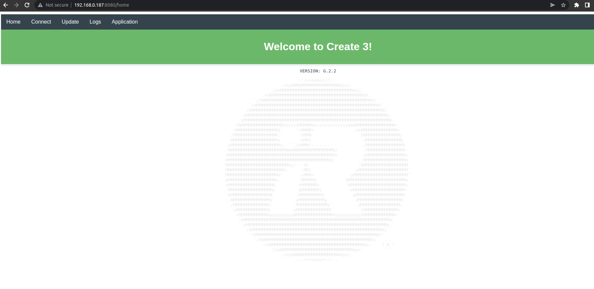

# TurtleBot 4 Galactic

```warning
**ROS 2 Galactic is no longer supported.** Please consider updating to a newer release
```

TurtleBot 4 RPi4 image changelogs. Latest images are available [here](http://download.ros.org/downloads/turtlebot4/).

## v0.1.3

**OS**: Ubuntu Server 20.04.5 LTS

**ROS**: Galactic

**Create® 3 Firmware**: G.3.1

### General

- Added a service to forward the Create® 3 webserver through the RPi4
    - Users can now access the Create® 3 webserver by navigating to the IP address of their TurtleBot 4 with the port 8080 on a web browser.
    - The Create® 3 does not need to be placed into AP mode to access the webserver.
    - Example: TurtleBot 4 with an IP address of `192.168.0.187`.
        - Enter `192.168.0.187:8080` into your browser:
<figure class="aligncenter">
    
    <figcaption>Create® 3 webserver accessed through the RPi4</figcaption>
</figure>

- Updated the `install.py` script to use an argparser and allow for the **RMW** to be changed.
    - **ROS_DOMAIN_ID** defaults to 0, and **RMW** defaults to `rmw_cyclonedds_cpp`.
    - Example usage: `install.py standard --domain 4 --rmw rmw_fastrtps_cpp`

- Added the `ros_config.py` script that allows users to easily reconfigure the robot's **RMW** and **ROS_DOMAIN_ID**.
    - The script prompts users for a **RMW** and **ROS_DOMAIN_ID**.
    - Once entered, the script will apply the changes to the Create® 3 and will reinstall the `turtlebot4` robot upstart job with the new settings.

### TurtleBot 4 Packages

<table>
    <thead>
        <tr>
            <th>Package</th>
            <th>Version</th>
            <th>Changes</th>
        </tr>
    </thead>
    <tbody>
        <tr>
            <td>turtlebot4_base</td>
            <td>0.1.3</td>
            <td>-</td>
        </tr>
        <tr>
            <td>turtlebot4_bringup</td>
            <td>0.1.3</td>
            <td>
                - Added RPLIDAR Motor start/stop to default menu config
            </td>
        </tr>
        <tr>
            <td>turtlebot4_description</td>
            <td>0.1.2</td>
            <td>-</td>
        </tr>
        <tr>
            <td>turtlebot4_diagnostics</td>
            <td>0.1.3</td>
            <td>-</td>
        </tr>
        <tr>
            <td>turtlebot4_msgs</td>
            <td>0.1.2</td>
            <td>-</td>
        </tr>
        <tr>
            <td>turtlebot4_navigation</td>
            <td>0.1.2</td>
            <td>
                - Added TurtleBot 4 Navigator <br/>
                - Fixed AMCL crashing issue <br/>
                - Install turtlebot4_navigation python module
            </td>
        </tr>
        <tr>
            <td>turtlebot4_node</td>
            <td>0.1.2</td>
            <td>
                - Added support for Empty service <br/>
                - Added RPLIDAR motor start/stop service as a function option <br/>
                - Added timeouts to services (defaults to 30s) <br/>
                - Updated rclcpp Action api
            </td>
        </tr>
        <tr>
            <td>turtlebot4_robot</td>
            <td>0.1.3</td>
            <td>-</td>
        </tr>
        <tr>
            <td>turtlebot4_tests</td>
            <td>0.1.3</td>
            <td>-</td>
        </tr>
    </tbody>
</table>

## v0.1.2

**OS**: Ubuntu Server 20.04.4 LTS

**ROS**: Galactic

**Create® 3 Firmware**: G.2.2

### General

- Initial public release

### TurtleBot 4 Packages

<table>
    <thead>
        <tr>
            <th>Package</th>
            <th>Version</th>
            <th>Changes</th>
        </tr>
    </thead>
    <tbody>
        <tr>
            <td>turtlebot4_base</td>
            <td>0.1.2</td>
            <td>-</td>
        </tr>
        <tr>
            <td>turtlebot4_bringup</td>
            <td>0.1.2</td>
            <td>-</td>
        </tr>
        <tr>
            <td>turtlebot4_description</td>
            <td>0.1.0</td>
            <td>-</td>
        </tr>
        <tr>
            <td>turtlebot4_diagnostics</td>
            <td>0.1.2</td>
            <td>-</td>
        </tr>
        <tr>
            <td>turtlebot4_msgs</td>
            <td>0.1.0</td>
            <td>-</td>
        </tr>
        <tr>
            <td>turtlebot4_navigation</td>
            <td>0.1.0</td>
            <td>-</td>
        </tr>
        <tr>
            <td>turtlebot4_node</td>
            <td>0.1.0</td>
            <td>-</td>
        </tr>
        <tr>
            <td>turtlebot4_robot</td>
            <td>0.1.2</td>
            <td>-</td>
        </tr>
        <tr>
            <td>turtlebot4_tests</td>
            <td>0.1.2</td>
            <td>-</td>
        </tr>
    </tbody>
</table>


