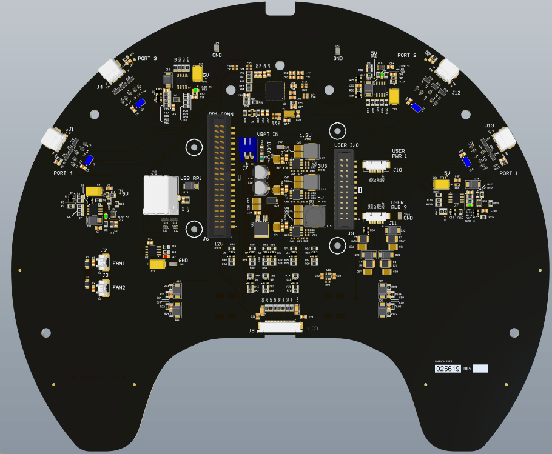
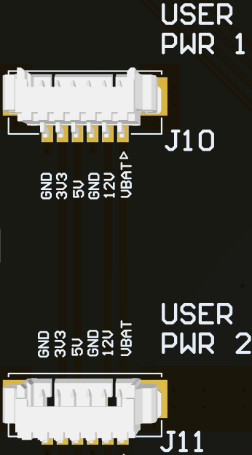
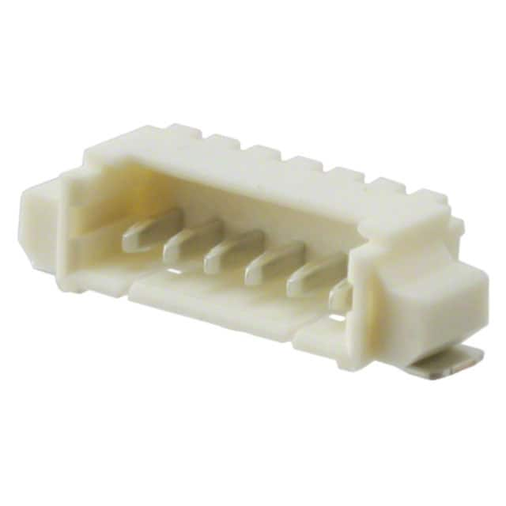
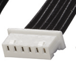

# User Interface PCBA

```note
The User Interface PCBA is only available on the TurtleBot 4 and NOT the TurtleBot 4 Lite.
```

## Overview

The TurtleBot 4 comes with an additional User Interface board that expands on the Raspberry Pi 4 functionality to give the user ease of control over the Create 3 robot and Raspberry Pi and to act as an expansion board for addons, sensors, gadgets the user might have in mind to utilize.

<figure class="aligncenter">
    
    <figcaption>TurtleBot 4 User Interface PCBA</figcaption>
</figure>

## User I/O

The TurtleBot 4 has a 2x20 pin internal connector connecting it to the Raspberry Pi via a flex cable, and another 2x12 pin connector allowing the user to access the remaining GPIOs and a set of 5V, and 3.3V power pins coming from the Raspberry Pi.

The IO interface between the 2x20 connector and 2x12 connector and the available GPIOs to the user are shown in Table 1, and 2.
The GPIO numbers are a direct match to the Raspberry Pi 4 [GPIO](https://datasheets.raspberrypi.com/rpi4/raspberry-pi-4-datasheet.pdf).

<figure>
    <figcaption style="text-align:center;">Table 1: 2x20 RPi Connector Pinout</figcaption>
    <table class="center-table">
        <thead>
            <tr>
                <th>GPIO #</th>
                <th>Function</th>
                <th>Pin #</th>
                <th>Pin #</th>
                <th>Function</th>
                <th>GPIO #</th>
            </tr>
        </thead>
        <tbody>
            <tr>
                <td></td>
                <td>3V3_RPi</td>
                <td>1</td>
                <td>2</td>
                <td>5V_RPi</td>
                <td></td>
            </tr>
            <tr>
                <td>GPIO2</td>
                <td>USER_PORT</td>
                <td>3</td>
                <td>4</td>
                <td>5V_RPi</td>
                <td></td>
            </tr>
            <tr>
                <td>GPIO3</td>
                <td>USER_PORT</td>
                <td>5</td>
                <td>6</td>
                <td>GND</td>
                <td></td>
            </tr>
            <tr>
                <td>GPIO4</td>
                <td>SDA</td>
                <td>7</td>
                <td>8</td>
                <td>USER_PORT</td>
                <td>GPIO14</td>
            </tr>
            <tr>
                <td></td>
                <td>GND</td>
                <td>9</td>
                <td>10</td>
                <td>USER_PORT</td>
                <td>GPIO15</td>
            </tr>
            <tr>
                <td>GPIO17</td>
                <td>PWR_LED</td>
                <td>11</td>
                <td>12</td>
                <td>MTR_LED</td>
                <td>GPIO18</td>
            </tr>
            <tr>
                <td>GPIO27</td>
                <td>COMM_LED</td>
                <td>13</td>
                <td>14</td>
                <td>GND</td>
                <td></td>
            </tr>
            <tr>
                <td>GPIO22</td>
                <td>BATT_GRN_LED</td>
                <td>15</td>
                <td>16</td>
                <td>BATT_RED_LED</td>
                <td>GPIO23</td>
            </tr>
            <tr>
                <td></td>
                <td>3V3_RPi</td>
                <td>17</td>
                <td>18</td>
                <td>WIFI_LED</td>
                <td>GPIO24</td>
            </tr>
            <tr>
                <td>GPIO10</td>
                <td>USER_PORT</td>
                <td>19</td>
                <td>20</td>
                <td>GND</td>
                <td></td>
            </tr>
            <tr>
                <td>GPIO9</td>
                <td>USER_PORT</td>
                <td>21</td>
                <td>22</td>
                <td>USER1_GRN_LED</td>
                <td>GPIO25</td>
            </tr>
            <tr>
                <td>GPIO11</td>
                <td>USER_PORT</td>
                <td>23</td>
                <td>24</td>
                <td>USER_PORT</td>
                <td>GPIO8</td>
            </tr>
            <tr>
                <td></td>
                <td>GND</td>
                <td>25</td>
                <td>26</td>
                <td>USER_PORT</td>
                <td>GPIO7</td>
            </tr>
            <tr>
                <td>GPIO0</td>
                <td>EEPROM_SD</td>
                <td>27</td>
                <td>28</td>
                <td>EEPROM_SC</td>
                <td>GPIO1</td>
            </tr>
            <tr>
                <td>GPIO5</td>
                <td>SCL</td>
                <td>29</td>
                <td>30</td>
                <td>GND</td>
                <td></td>
            </tr>
            <tr>
                <td>GPIO6</td>
                <td>USER2_GRN_LED</td>
                <td>31</td>
                <td>32</td>
                <td>USER_PORT</td>
                <td>GPIO12</td>
            </tr>
            <tr>
                <td>GPIO13</td>
                <td>DISPLAY-RST</td>
                <td>33</td>
                <td>34</td>
                <td>GND</td>
                <td></td>
            </tr>
            <tr>
                <td>GPIO19</td>
                <td>USER_SW1</td>
                <td>35</td>
                <td>36</td>
                <td>USER_SW2</td>
                <td>GPIO16</td>
            </tr>
            <tr>
                <td>GPIO26</td>
                <td>USER_SW3</td>
                <td>37</td>
                <td>38</td>
                <td>USER_SW4</td>
                <td>GPIO20</td>
            </tr>
            <tr>
                <td></td>
                <td>GND</td>
                <td>39</td>
                <td>40</td>
                <td>USER2_RED_LED</td>
                <td>GPIO21</td>
            </tr>
        </tbody>
    </table>
</figure>

```note
ALL USER_PORTs are routed to the 2X12 Auxiliary connectors
```

<figure>
    <figcaption style="text-align:center;">Table 2: 2x12 User I/O Pinout</figcaption>
    <table class="center-table">
        <thead>
            <tr>
                <th>GPIO #</th>
                <th>Function</th>
                <th>Pin #</th>
                <th>Pin #</th>
                <th>Function</th>
                <th>GPIO #</th>
            </tr>
        </thead>
        <tbody>
            <tr>
                <td></td>
                <td>3V3_RPi</td>
                <td>1</td>
                <td>2</td>
                <td>5V_RPi</td>
                <td></td>
            </tr>
            <tr>
                <td>GPIO2</td>
                <td>USER_PORT</td>
                <td>3</td>
                <td>4</td>
                <td>5V_RPi</td>
                <td></td>
            </tr>
            <tr>
                <td>GPIO3</td>
                <td>USER_PORT</td>
                <td>5</td>
                <td>6</td>
                <td>GND</td>
                <td></td>
            </tr>
            <tr>
                <td></td>
                <td>GND</td>
                <td>7</td>
                <td>8</td>
                <td>USER_PORT</td>
                <td>GPIO14</td>
            </tr>
            <tr>
                <td></td>
                <td>3V3_RPi</td>
                <td>9</td>
                <td>10</td>
                <td>USER_PORT</td>
                <td>GPIO15</td>
            </tr>
            <tr>
                <td>GPIO0</td>
                <td>EEPROM_SD</td>
                <td>11</td>
                <td>12</td>
                <td>EEPROM_SC</td>
                <td>GPIO1</td>
            </tr>
            <tr>
                <td>GPIO10</td>
                <td>USER_PORT</td>
                <td>13</td>
                <td>14</td>
                <td>GND</td>
                <td></td>
            </tr>
            <tr>
                <td>GPIO9</td>
                <td>USER_PORT</td>
                <td>15</td>
                <td>16</td>
                <td>GND</td>
                <td></td>
            </tr>
            <tr>
                <td>GPIO11</td>
                <td>USER_PORT</td>
                <td>17</td>
                <td>18</td>
                <td>USER_PORT</td>
                <td>GPIO8</td>
            </tr>
            <tr>
                <td></td>
                <td>GND</td>
                <td>19</td>
                <td>20</td>
                <td>USER_PORT</td>
                <td>GPIO7</td>
            </tr>
            <tr>
                <td></td>
                <td>GND</td>
                <td>21</td>
                <td>22</td>
                <td>USER_PORT</td>
                <td>GPIO12</td>
            </tr>
            <tr>
                <td></td>
                <td>GND</td>
                <td>23</td>
                <td>24</td>
                <td>GND</td>
                <td></td>
            </tr>
        </tbody>
    </table>
</figure>

## User Power

In addition to these GPIO ports, the user has two additional power ports available supplying 3.3V, 5V, 12V, VBAT (14.4V), and two grounds each. 

<figure class="aligncenter">
    
    <figcaption>TurtleBot 4 Additional Power Ports</figcaption>
</figure>

The pinout and power ratings can be found in Table 3.

<figure>
    <figcaption style="text-align:center;">Table 3: User Power Port Pinout</figcaption>
    <table class="center-table">
        <thead>
            <tr>
                <th>Pinout</th>
                <th>Source</th>
                <th>Max current output (mA)</th>
                <th>Fuse Hold at (mA)</th>
            </tr>
        </thead>
        <tbody>
            <tr>
                <td>1</td>
                <td>VBAT</td>
                <td>300</td>
                <td>350</td>
            </tr>
            <tr>
                <td>2</td>
                <td>12V</td>
                <td>300</td>
                <td>350</td>
            </tr>
            <tr>
                <td>3</td>
                <td>GND</td>
                <td></td>
                <td></td>
            </tr>
            <tr>
                <td>4</td>
                <td>5V</td>
                <td>500</td>
                <td>500</td>
            </tr>
            <tr>
                <td>5</td>
                <td>3V3</td>
                <td>250</td>
                <td>300</td>
            </tr>
            <tr>
                <td>6</td>
                <td>GND</td>
                <td></td>
                <td></td>
            </tr>
        </tbody>
    </table>
</figure>

### Molex Picoblade 6-Pin cable assembly

The two connectors are both [6-Pin Molex PicoBlade P/N 0532610671](https://www.digikey.ca/en/products/detail/molex/0532610671/699098). The cable assembly needed to use these connectors are [P/N 0151340602](https://www.digikey.ca/en/products/detail/molex/0151340602/6198156?s=N4IgTCBcDaIAwEYCsCDMAWOA2OEC6AvkA). 

<figure class="aligncenter">
    
    
    <figcaption>Molex PicoBlade: Connector 0532610671 (left) and Cable 0151340602 (right)</figcaption>
</figure>

## User USB-C Ports

The are 4 USB-C ports that go through an integrated hub on the User Interface board and connect to the Raspberry Pi through a single USB 3.0 cable. The current available to all 4 ports is 3A. Additionally, each individual port is current limited to 3A. In other words, each port is capable of supplying 3A if the others aren’t in use, or the available 3A is shared amongst ports that are in use. The bandwidth for communication is split among 4 dynamically depending on how many of the ports are communication at once, and is limited by the USB 3.0 connection to the Raspberry Pi.
