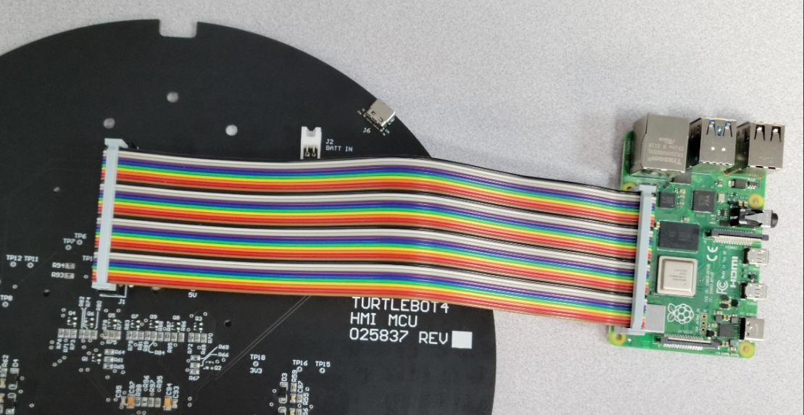
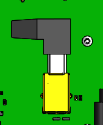

# Raspberry Pi 4B

The Raspberry Pi 4 is present on both the TurtleBot 4 and TurtleBot 4 Lite. On the TurtleBot 4 it can be found inside the shell, while on the Lite it is mounted in the Create® 3 cargo bay.

 The TurtleBot 4 connects the Raspberry Pi with the [User Interface Board](pcba.md) through a 40 pin connector and a USB 3.0 (Type B) cable. The USB 3.0 type cable enables communication to 4 USB-C ports on the UI board, while the ribbon cable passes the 40 GPIO pins of the Raspberry Pi through to the UI Board.

<figure class="aligncenter">
    
    <figcaption>TurtleBot 4 UI Board to Raspberry Pi connector</figcaption>
</figure>

The TurtleBot 4 comes with a USB-A to USB-B 3.0 cable to connect the UI board and Raspberry Pi. Without this connection the USB-C ports will only be able to supply power, but not communication.

<figure class="aligncenter">
    
    <figcaption>TurtleBot 4 UI Board USB type B connector</figcaption>
</figure>