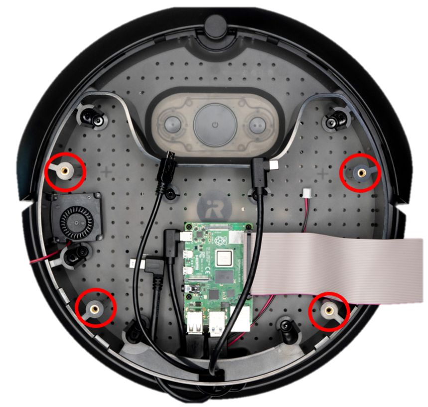
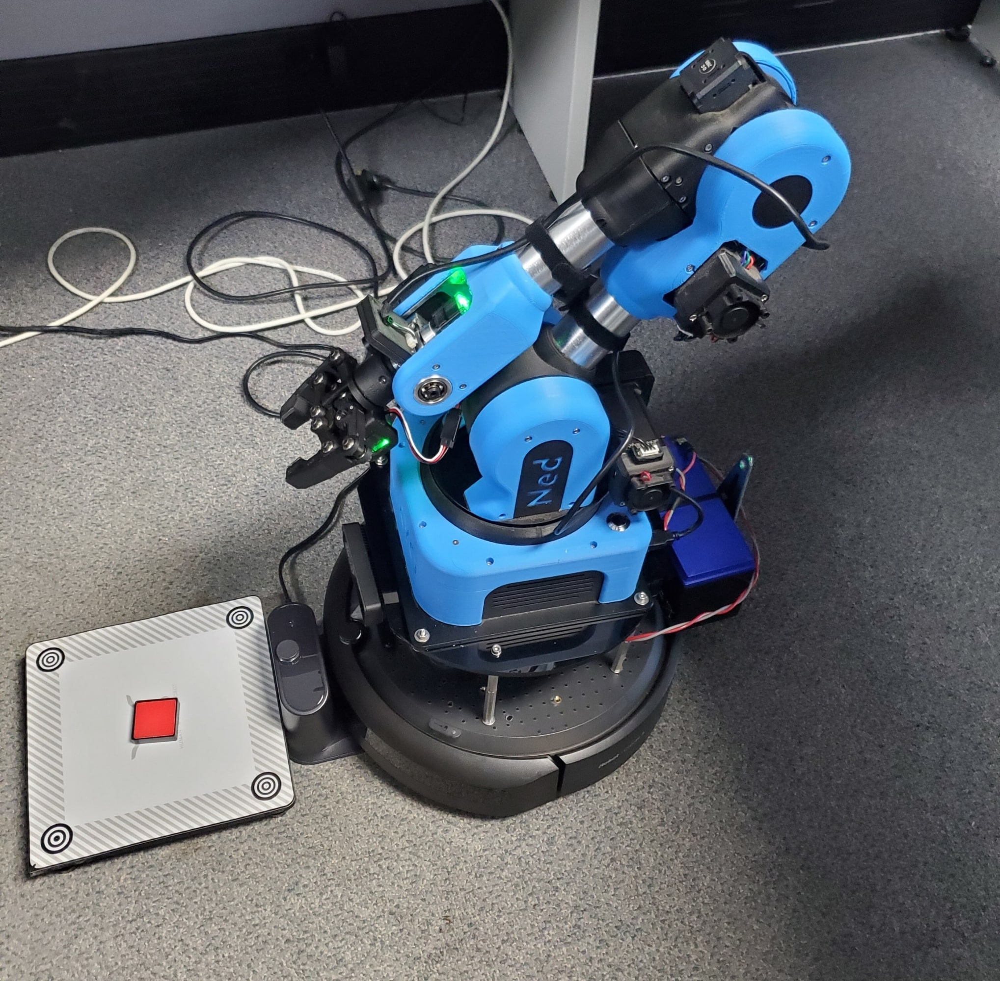
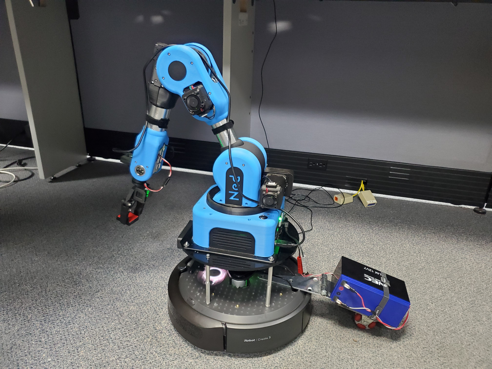

# Payloads Over 9kg

The TurtleBot4 is able to perform with heavier payloads over 9 kg, however some mechanical and software changes must be made for ideal operation. If these changes are not used the system may become unstable and difficult to control. 

## Mechanical Modification

In order to ensure the robot is as stable as possible during operation, it is important to mount the payload such that its center of gravity (COG) is fully supported by the wheelbase. This can be achieved through two methods:
1.	Design the payload mounting to accommodate for the offset COG. This can be done by using the existing acrylic integration plate or by using a custom plate. 
2.	Add an additional caster wheel to the rear of the Create® 3. This will ensure that the payload is fully supported and balanced. Detailed instructions as well as design files are available [here](https://iroboteducation.github.io/create3_docs/hw/mechanical/#adding-a-rear-caster).

Additionally, the payload height can be lowered to ensure better stability for the robot, particularly if an additional caster wheel is not used and the system is balanced on three wheels. While the acceleration and speed can be modified to accommodate for the elevated COG (see below), lowering it will optimize robot performance. 

### Lower payload height

Lowering the integration plate of the Standard TurtleBot4, and therefore the payload, is the simplest way to make the COG as low as possible. Follow the steps below:

1. Remove the four M4 screws using a 2.5mm hex key. The integration plate should now be free; set it aside. 

<figure class="aligncenter">
    
    <figcaption>TurtleBot 4 Top Integration Plate screw locations</figcaption>
</figure>

2. Remove the four round standoffs by hand and set them aside. Note that the PCBA is now free to move and care should be taken to ensure it is not damaged.

3. Use alternative standoffs (e.g. from [Mcmaster Carr](https://www.mcmaster.com/standoffs/male-female-threaded-hex-standoffs-6/system-of-measurement~metric/thread-size~m4/)) or other mounting options. The threaded inserts of the robot are M4x0.7mm. The mounting pattern can be taken from 3D CAD available on [Github](https://github.com/turtlebot/turtlebot4-hardware) or it can be transferred from the integration plate itself. 

<figure class="aligncenter">
    
    <figcaption>TurtleBot 4 Mounting Inserts</figcaption>
</figure>

When reassembling the robot with new hardware, ensure that all fasteners are torqued according to the fastener and mating threads and that a threadlocker is used. 

For the TurtleBot4 Lite, the Create® 3 plate can be used to secure payloads. Tips for mounting directly to this plate can be found on the [Create® 3 Github](https://iroboteducation.github.io/create3_docs/hw/mechanical/).

```note
The minimum clearance to accommodate the OAK-D-Pro is 108mm. For the OAK-D-Lite it is 102mm.
```

### Example

The pictures below show a Clearpath Robotics Hackday project where a NED2 Robot manipulator (8.9kg) mounted on top of a TurtleBot4 Lite using 4X2 M4 standoffs ([Mcmaster Carr P/N 98952A450](https://www.mcmaster.com/98952A450/)) and an integration plate from a TurtleBot4 Standard.The manipulator was mounted such that the COG was further forward and supported by the front caster wheel. An external NEC ALM 12V7 Battery (0.9kg) was also attached to power the device. In this particular case the battery was installed on a hinge that would allow the battery to sit closer to the robot or to be laid out and supported on its own omni-wheel. This was a design choice to allow the demonstration of either a larger weight mounted to the unit or a payload hitched to the robot as an alternative payload mounting design method.

<figure class="aligncenter">
    
    
    <figcaption>TurtleBot 4 Lite with a NED2 arm</figcaption>
</figure>

## Software Modifications

Velocity and acceleration limits should be set appropriately to maintain stability when driving the robot. Otherwise you may find that the robot will shake, stall, or not drive as commanded.

### Acceleration Limits

The acceleration limit on the Create® 3 can be changed using the `wheel_accel_limit` parameter of the `motion_control` node.

```bash
ros2 param set /motion_control wheel_accel_limit 300
```

The acceleration value can be between 1 and 900.

```note
The `wheel_accel_limit` is applied to both acceleration and deceleration. If you set it too low, the robot will stop very slowly.
```

### Velocity Limits

The Create® 3 has linear velocity limits of 0.31 m/s with safety enabled, and 0.46 m/s with safety overridden. The angular velocity is limited to 1.9 rad/s. For heavy payloads you may want to limit this further. The method to do this will vary based on how you are [driving](../tutorials/driving.md) the robot.

#### Keyboard Teleoperation

If you are using the `teleop_twist_keyboard` ROS 2 node, you can follow the CLI instructions to reduce linear and angular velocities.

#### Joystick Teleoperation

To limit the `teleop_twist_joy` velocities you will need create a modified version the [TurtleBot4 controller config file](https://github.com/turtlebot/turtlebot4_robot/blob/galactic/turtlebot4_bringup/config/turtlebot4_controller.config.yaml). The `scale_linear.x` value limits the linear velocity, and the `scale_angular.yaw` value limits the angular velocity.

Once you have created the config file, you can launch `joy_teleop` and set the `controller_config` parameter to the full path of your new config file. 

```bash
ros2 launch turtlebot4_bringup joy_teleop.launch.py controller_config:=/path/to/config.yaml
```

#### Command Velocity

If you are manually sending the velocity through the `/cmd_vel` topic, simply reduce the velocity values to an appropriate level.

#### Create® 3 Actions

If you are driving the robot through one of the Create® 3 actions, you can set velocity limits in the action goal.

#### Nav2

To limit velocity during navigation, you can create a modified [nav2.yaml](https://github.com/turtlebot/turtlebot4/blob/galactic/turtlebot4_navigation/config/nav2.yaml) configuration file. Changing parameters such as `controller_server.FollowPath.max_vel_x` will limit the velocity commands sent by the Nav2 stack.

Launch Nav2 with your modified parameter file:

```bash
ros2 launch turtlebot4_navigation nav_bringup.launch.py params_file:=/path/to/your/nav2.yaml
```

