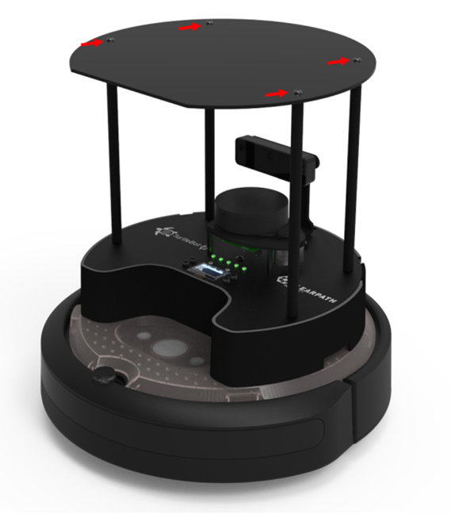
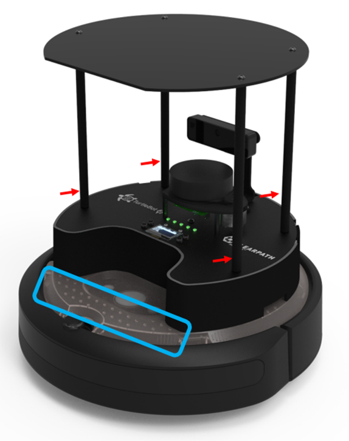
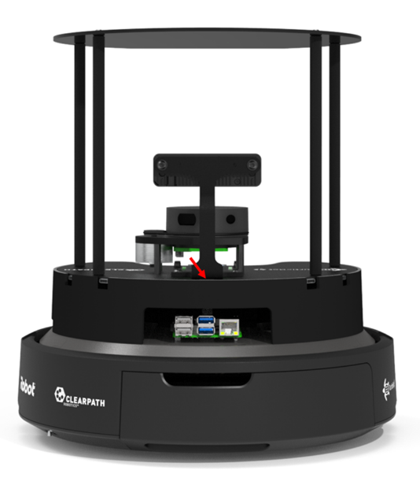
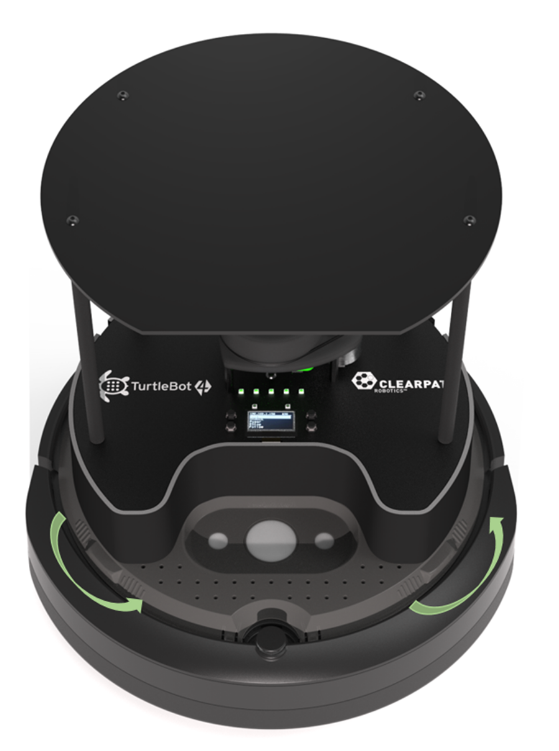

# TurtleBot 4

TurtleBot 4 is designed to be modified to meet your needs and make it possible to attach additional sensors and accessories. 

## Attaching Accessories to the Top Integration Plate
The TurtleBot 4 is equipped with an acrylic plate at the top that is easy to modify in order to attach additional sensors and peripherals.

```warning
Modifications to the plate should only be done when it is removed from the robot, attempting to modify the plate while mounted can cause the plastic to crack.
```

### Removing the Top Integration Plate

The plate is attached to the robot by four Round head M4x0.7 screws. Remove the screws by using a 2.5mm hex key.

<figure class="aligncenter">
    
    <figcaption>TurtleBot 4 Top Integration Plate screw locations</figcaption>
</figure>
 
### Making Modifications to the Top Integration Plate

Modifying the plate can be done roughly by hand, however a 3D model and 2D drawing of the part is available at [Github](https://github.com/turtlebot/turtlebot4-hardware). When cutting or drilling into the plate, ensure proper safety precautions are taken; wear safety glasses, be familiar with your tools, fasten the plate securely to a work surface. When working with acrylic, it is best to start with a smaller hole (Ø3mm) and enlarge it to the desired size incrementally.

To reattach the plate, insert the screws and torque them to 120 N-cm. With additional weight on the top integration plate, it is recommended that a low or medium strength thread locker is used for additional security.
 
## Attaching Accessories to the Base Unit

There is space for sensors to be attached to the base unit above the PCBA as well as near the Create® 3 User Buttons and inside the Shell.

To attach accessories above the PCBA, mounting brackets can be designed for the desired accessory and attached to the TurtleBot 4 by securing them to the standoffs. 3D models of the TurtleBot4 are available on [Github](https://github.com/turtlebot/turtlebot4-hardware) that can help in the design process.

To attach accessories inside the Shell, the [PCBA](#removing-the-pcba) and the [Create® 3 Integration Plate](#removing-the-create%C2%AE-3-integration-plate-and-shell) should be removed. Inside, the existing holes can be used or additional mounting features can be machined or 3D printed.

To attach accessories to the Create® 3, the existing holes in the plate can be used, or additional holes can be drilled by [removing the Create® 3 Integration Plate](#removing-the-create%C2%AE-3-integration-plate-and-shell).

<figure class="aligncenter">
    
    <figcaption>TurtleBot 4 Attachment Locations</figcaption>
</figure>

## Removing the PCBA
 
To access the inside of the “Shell” of the TurtleBot4, the PCBA can be removed. Ensure that you have a safe spot to place the PCBA when it is removed to prevent damage to the components. It is recommended that this procedure is done on an Electrostatic Discharge Mat to protect the PCBA from damage caused by static electricity.
Follow the steps below to remove the PCBA.

1. [Remove the Top Integration Plate](#removing-the-top-integration-plate) and the four standoffs.
2. Disconnect the USB cables connected to the Oak-D Camera and the RPLIDAR. Feed these cables through the opening at the back of the Robot.

    <figure class="aligncenter">
        
        <figcaption>TurtleBot 4 Cable passthrough</figcaption>
    </figure>

3. Carefully lift the PCBA by holding the camera bracket or the RPLIDAR base.
4. Disconnect the USB-B cable, the power harness, the 40 pin ribbon cable, and the fan cable, as well as any other cables that may have been attached.

The PCBA should now be free to be removed and placed safely.

## Removing the Create® 3 Integration Plate and Shell

The Create® 3 Integration Plate and Shell can be removed with the rest of the assembly on or off. To remove the Create® 3 Integration Plate, first open and remove the rear Create® 3 tray. Then disconnect the USB C cable and the power harness from the Create® 3 base. Feed these cables through the slot at the back of the Create® 3. Using the tabs on the Create® 3, twist the plate counter-clockwise until it snaps to unlock it and remove the plate.

<figure class="aligncenter">
    
    <figcaption>Create® 3 Integration Plate Removal</figcaption>
</figure>

To reattach the plate, place the plate slightly angled such that the posts fit into the tabs. Then, twist the plate clockwise until it snaps back into place.


