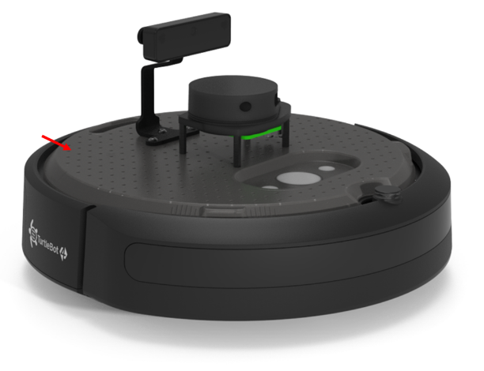
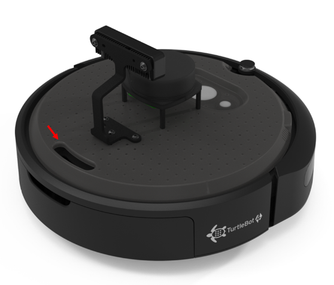
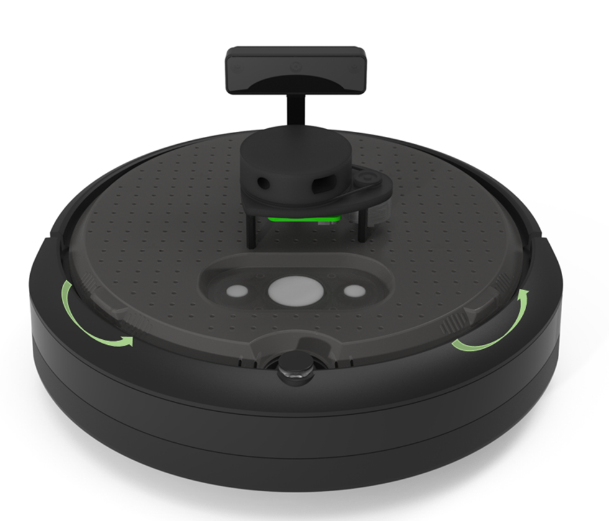

# TurtleBot 4 Lite

TurtleBot Lite is built on the iRobot Create® 3 learning platform which features an easy to modify integration plate.

## Attaching Accessories to the Base Unit

There is space for sensors and accessories to be attached to the base unit around the Oak Camera and RPILIDAR. To attach accessories to the Create® 3, the existing holes in the plate can be used. These Ø3.5mm holes are spaced apart 10mm. Alternatively, holes can be drilled by [removing the Create® 3 Integration Plate](#removing-the-create%C2%AE-3-integration-plate). 3D models of the robot are available on [Github](https://github.com/turtlebot/turtlebot4-hardware) which can help in the design.

<figure class="aligncenter">
    
    <figcaption>TurtleBot 4 Lite Integration</figcaption>
</figure>

## Removing the Create® 3 Integration Plate

The Create® 3 Integration Plate can be removed. To remove the Create® 3 Integration Plate follow the steps below.

1. Disconnect the USB cables connected to the Oak-D Camera and the RPLIDAR. Feed these cables through the slot opening at the back of the Robot.

<figure class="aligncenter">
    
    <figcaption>TurtleBot 4 Lite Cable Passthrough</figcaption>
</figure>

2. Using the tabs on the Create® 3, twist the plate counter-clockwise until it snaps to unlock it and remove the plate.

<figure class="aligncenter">
    
    <figcaption>Create® 3 Integration Plate Removal</figcaption>
</figure>

To reattach the plate, place the plate slightly angled such that the posts fit into the tabs. Then, twist the plate clockwise until it snaps back into place. Open the rear tray and feed the USB cables that were previously disconnected through the slot. Attach the USB-C cable to the Oak-Camera and connect the USB Micro cable to the RPLIDAR.

## Accessing the Raspberry Pi Computer

The Raspberry Pi is found in the rear tray of the robot. To fully access the Raspberry Pi, disconnect the USB cables connected to the Oak Camera and RPLIDAR and feed them through the slot opening at the rear of the robot. You can now carefully slide out the cargo bay.
 
<figure class="aligncenter">
    
    <figcaption>Create® 3 Cargo Bay removal</figcaption>
</figure>