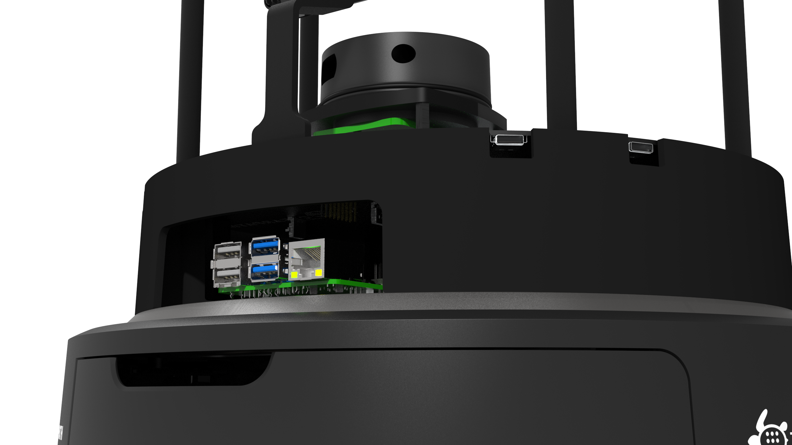
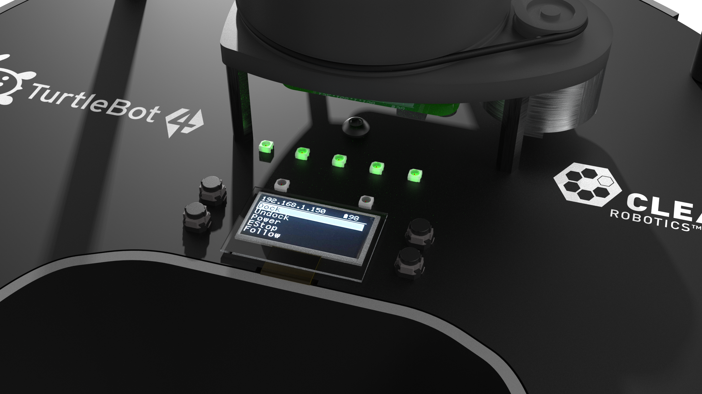
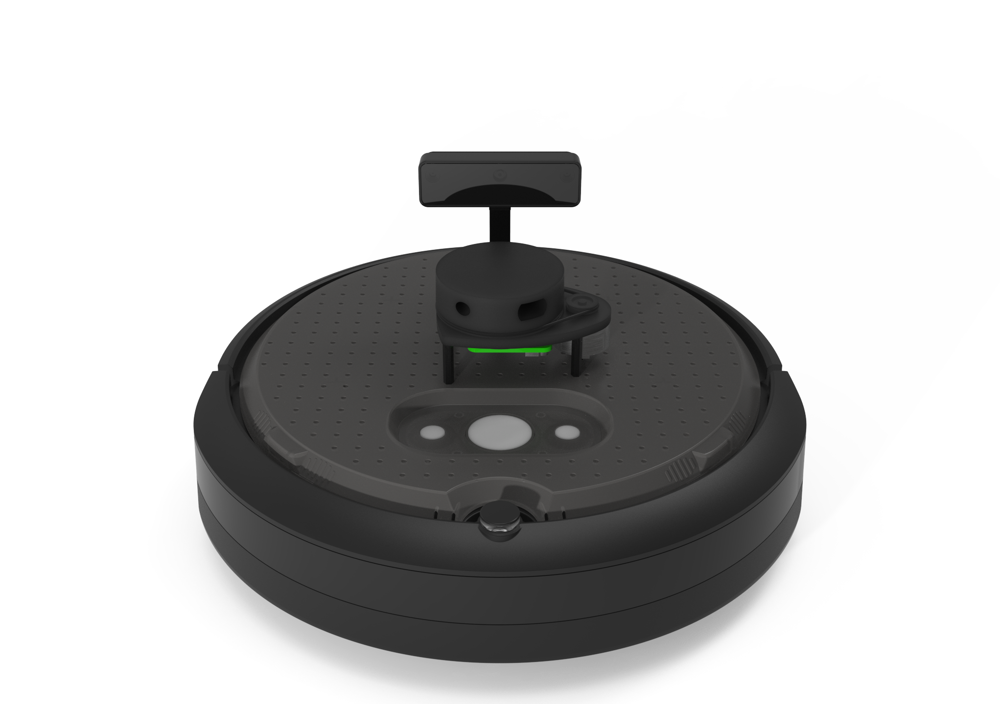
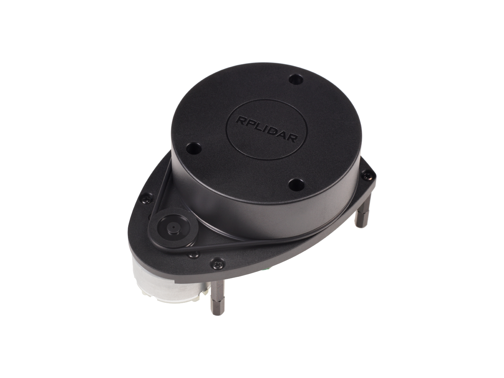
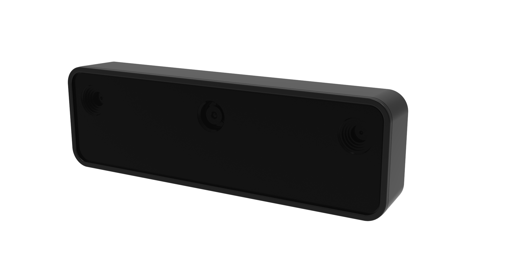
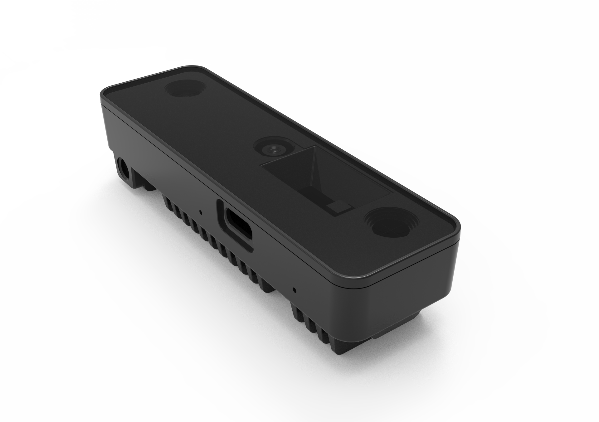

# Features

## TurtleBot 4

<figure class="aligncenter">
    
    <figcaption>TurtleBot 4</figcaption>
</figure>

The TurtleBot 4 is a ROS2-based mobile robot intended for education and research. The TurtleBot 4 is capable of mapping its surroundings, navigation autonomously, running AI models on its camera, and more.

It uses a [Create® 3](https://edu.irobot.com/what-we-offer/create3) as the base platform, and builds on it with the TurtleBot 4 shell and User Interface (UI) board. Inside the shell sits a Raspberry Pi 4B which runs the TurtleBot 4 software.

<figure class="aligncenter">
    
    <figcaption>Raspberry Pi 4B</figcaption>
</figure>

The UI Board offers status and user LEDs, user buttons, and a 128x64 user display. Additionally, it exposes 4 USB 3.0 (type C) ports, as well as additional power ports and some Raspberry Pi pins for the user.

<figure class="aligncenter">
    
    <figcaption>TurtleBot 4 UI Board</figcaption>
</figure>

On top of the UI board sits a [RPLIDAR A1M8](#rplidar-a1m8) 360 degree lidar, and an [OAK-D-Pro](#oak-d-pro) camera. Above the sensors is the sensor tower, which allows the user to customize their TurtleBot4 with additional sensors or payloads. 

## TurtleBot 4 Lite

<figure class="aligncenter">
    
    <figcaption>TurtleBot 4 Lite</figcaption>
</figure>

The TurtleBot 4 Lite is a barebones version of the TurtleBot 4. It has just the necessary components for navigation, mapping, and AI applications. The TurtleBot 4 has the same Raspberry Pi 4B, which sits in the cargo bay of the Create® 3, as well as the same RPLIDAR A1M8. The camera on the TurtleBot 4 Lite is the [OAK-D-Lite](#oak-d-lite). Additional sensors and payloads can be attached to the Create® 3 faceplate, or placed inside the cargo bay.

## Hardware Specifications

<table class="center-table">
    <thead>
        <tr>
            <th>Feature</th>
            <th>
                TurtleBot 4 Lite
                
            </th>
            <th>
                TurtleBot 4
                
            </th>
        </tr>
    </thead>
    <tbody>
        <tr>
            <td>Size (L x W x H)</td>
            <td>342 x 339 x 192 mm</td>
            <td>342 x 339 x 351 mm</td>
        </tr>
        <tr>
            <td>Weight</td>
            <td>3270 g</td>
            <td>3945 g</td>
        </tr>
        <tr>
            <td>Base platform</td>
            <td>iRobot® Create® 3</td>
            <td>iRobot® Create® 3</td>
        </tr>
        <tr>
            <td>Wheels (Diameter)</td>
            <td>72 mm</td>
            <td>72 mm</td>
        </tr>
        <tr>
            <td>Ground Clearance</td>
            <td>4.5 mm</td>
            <td>4.5 mm</td>
        </tr>
        <tr>
            <td>On-board Computer</td>
            <td>Raspberry Pi 4B 4GB</td>
            <td>Raspberry Pi 4B 4GB</td>
        </tr>
        <tr>
            <td>Maximum linear velocity	</td>
            <td>0.31 m/s in safe mode, 0.46 m/s without safe mode</td>
            <td>0.31 m/s in safe mode, 0.46 m/s without safe mode</td>
        </tr>
        <tr>
            <td>Maximum angular velocity</td>
            <td>1.90 rad/s</td>
            <td>1.90 rad/s</td>
        </tr>
        <tr>
            <td>Maximum payload	</td>
            <td>9 kg</td>
            <td>9 kg</td>
        </tr>
        <tr>
            <td>Operation time	</td>
            <td>2h 30m - 4h depending on load</td>
            <td>2h 30m - 4h depending on load</td>
        </tr>
        <tr>
            <td>Charging time</td>
            <td>2h 30m</td>
            <td>2h 30m</td>
        </tr>
        <tr>
            <td>Bluetooth Controller</td>
            <td>Not Included</td>
            <td>TurtleBot 4 Controller</td>
        </tr>
        <tr>
            <td>Lidar</td>
            <td>RPLIDAR A1M8</td>
            <td>RPLIDAR A1M8</td>
        </tr>
        <tr>
            <td>Camera</td>
            <td>OAK-D-Lite</td>
            <td>OAK-D-Pro</td>
        </tr>
        <tr>
            <td>User Power</td>
            <td>
                VBAT @1.9A  
                5V @ Low current  
                3.3V @ Low current
            </td>
            <td>
                VBAT @ 300 mA  
                12V @ 300 mA  
                5V @ 500 mA  
                3.3v @ 250 mA
            </td>
        </tr>
        <tr>
            <td>USB Expansion</td>
            <td>
                USB 2.0 (Type A) x2  
                USB 3.0 (Type A) x2
            </td>
            <td>
                USB 2.0 (Type A) x2  
                USB 3.0 (Type A) x1  
                USB 3.0 (Type C) x4
            </td>
        </tr>
        <tr>
            <td>Programmable LEDs</td>
            <td>Create® 3 Lightring</td>
            <td>
                Create® 3 Lightring  
                User LED x2
            </td>
        </tr>
        <tr>
            <td>Status LEDs</td>
            <td>-</td>
            <td>
                Power LED  
                Motors LED  
                WiFi LED  
                Comms LED  
                Battery LED
            </td>
        </tr>
        <tr>
            <td>Buttons and Switches</td>
            <td>
                Create® 3 User buttons x2  
                Create® 3 Power Button x1
            </td>
            <td>
                Create® 3 User buttons x2  
                Create® 3 Power Button x1  
                User Buttons x4
            </td>
        </tr>
        <tr>
            <td>Battery</td>
            <td>26 Wh Lithium Ion (14.4V nominal)</td>
            <td>26 Wh Lithium Ion (14.4V nominal)</td>
        </tr>
        <tr>
            <td>Charging Dock</td>
            <td>Included</td>
            <td>Included</td>
        </tr>
    </tbody>
</table>

## Sensors

### RPLIDAR A1M8

<figure class="aligncenter">
    
    <figcaption>RPLIDAR A1M8</figcaption>
</figure>

The RPLIDAR A1M8 is a 360 degree Laser Range Scanner with a 12m range. It is used to generate a 2D scan of the robots surroundings.
Both the TurtleBot 4 and TurtleBot 4 Lite use this sensor. For more information, click [here](https://www.slamtec.com/en/Lidar/A1).

### OAK-D-Lite

<figure class="aligncenter">
    
    <figcaption>OAK-D-Lite</figcaption>
</figure>

The OAK-D-Lite camera from Luxonis uses a 4K IMX214 colour sensor along with a pair of OV7251 stereo sensors to produce high quality colour and depth images. The on-board Myriad X VPU gives the camera the power to run computer vision applications, object tracking, and run AI models. For more information, visit the Luxonis [documentation](https://docs.luxonis.com/projects/hardware/en/latest/pages/DM9095.html).

### OAK-D-Pro

<figure class="aligncenter">
    
    <figcaption>OAK-D-Pro</figcaption>
</figure>

The OAK-D-Pro offers all of the same features the OAK-D-Lite has, but uses higher resolution OV9282 stereo sensors and adds an IR laser dot projector and an IR illumination LED. This allows the camera to create higher quality depth images, and perform better in low-light environments. For more information, visit the Luxonis [documentation](https://docs.luxonis.com/projects/hardware/en/latest/pages/DM9098pro.html).

