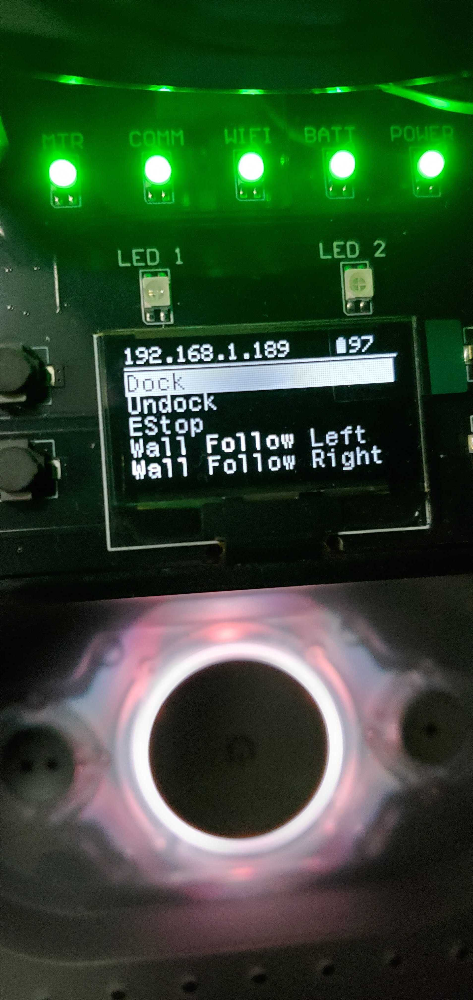
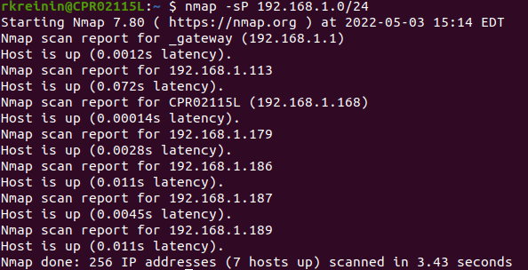
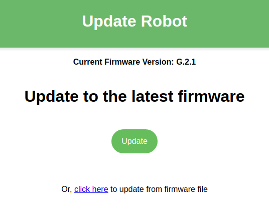

# Quick Start

## Powering on the robot

To power the robot, place it on the charging dock. The Create® 3 lightring will turn on and the Raspberry Pi will be powered as well. To power off the robot, remove it from the dock and press and hold the Power button on the Create® 3. The lightring will flash 3 times, and the Create® 3 will play a sound before turning off.

## Installing ROS2 Galactic on your PC

Follow [these instructions](https://docs.ros.org/en/galactic/Installation/Ubuntu-Install-Debians.html) to install ROS2 Galactic Desktop on your PC.

Also, install useful tools with this command:

```bash
sudo apt update && sudo apt install -y \
  build-essential \
  cmake \
  git \
  python3-colcon-common-extensions \
  python3-flake8 \
  python3-pip \
  python3-pytest-cov \
  python3-rosdep \
  python3-setuptools \
  python3-vcstool \
  wget
```

## Network Configuration

ROS2 Galactic supports two middlewares: [CycloneDDS](https://github.com/eclipse-cyclonedds/cyclonedds) and [FastRTPS](https://github.com/eProsima/Fast-DDS). The default is CycloneDDS.

The Create® 3 and Raspberry Pi both use the `usb0` and `wlan0` network interfaces to communicate. As a result, CycloneDDS needs to be configured on the user PC in order to see the robot topics properly.

CycloneDDS is configured in an XML file, and that configuration should be applied to the `CYCLONEDDS_URI` environment variable.

Add this line to your `~/.bashrc` file to automatically configure CycloneDDS each time you open your terminal:

```bash
export CYCLONEDDS_URI='<CycloneDDS><Domain><General><DontRoute>true</></></></>'
```

For more CycloneDDS configuration options, visit the [CycloneDDS documentation](https://github.com/eclipse-cyclonedds/cyclonedds#run-time-configuration).

If you wish to switch middlewares or want more information on configuring the Create® 3, check out the [Create® 3 Docs](https://iroboteducation.github.io/create3_docs/setup/xml-config/).

## WiFi Setup

- On the first boot, the Raspberry Pi will enter AP mode which will allow you to connect to it over WiFi.

- On a PC, connect to the `Turtlebot4` WiFi network. The password is also `Turtlebot4`.

- Once connected, you can SSH into the Raspberry Pi to configure its WiFi.

```bash
ssh ubuntu@10.42.0.1
```
- The default password is `turtlebot4`

- In `/usr/local/bin` there will be a script called `wifi.sh` which can be used to configure the Raspberry Pi's WiFi:

```bash
sudo wifi.sh -s '<WIFI_SSID>' -p '<WIFI_PASSWORD>' -r <REGULATORY_DOMAIN> && sudo reboot
```

```note
The Regulatory Domain is based on the country you live in. USA: `US`, Canada: `CA`, UK: `GB`, Germany: `DE`, Japan: `JP3`, Spain: `ES`. For a full list, click [here](https://www.arubanetworks.com/techdocs/InstantWenger_Mobile/Advanced/Content/Instant%20User%20Guide%20-%20volumes/Country_Codes_List.htm#regulatory_domain_3737302751_1017918).
```

- Your Raspberry Pi will reboot and connect to your WiFi network.

### Find the Raspberry Pi IP on your network

The TurtleBot 4 will display its WiFi IP address on the display.

<figure class="aligncenter">
    
    <figcaption>WiFi IP address on a TurtleBot 4</figcaption>
</figure>

For the TurtleBot 4 Lite, you will need to check the `/ip` topic for the new address.

On your PC, run the following commands:

```bash
source /opt/ros/galactic/setup.bash
ros2 topic echo /ip
```

You should see the IP address printed out in your terminal periodically.

<figure class="aligncenter">
    
    <figcaption>Echoing the IP address of a TurtleBot 4</figcaption>
</figure>

If you are unable to find the IP address with the previous methods, you can try to use:

```bash
nmap -sP 192.168.1.0/24
```

Make sure to replace `192.168.1` with your subnet.

<figure class="aligncenter">
    
    <figcaption>Scanning IP Addresses with nmap</figcaption>
</figure>

Once you have found the IP address, you can now ssh back into the robot with it.

```bash
ssh ubuntu@xxx.xxx.xxx.xxx
```

If you wish to put the Raspberry Pi back into AP mode, you can call

```bash
sudo wifi.sh -a
```

## Create® 3 WiFi Setup

- Press both Create® 3 button 1 and 2 simultaneously until light ring turns blue

<figure class="aligncenter">
    
    <figcaption>Putting the Create® 3 in AP mode</figcaption>
</figure>

- The Create® 3 is now in AP mode. Connect to its WiFi network called 'Create-XXXX'
- In a browser go to `192.168.10.1`
- Go to the Connect tab, enter your WiFi ssid and password, and then click 'Connect'

<figure class="aligncenter">
    
    <figcaption>Connecting the Create® 3 to WiFi</figcaption>
</figure>


- Wait for it to connect to WiFi and play a chime
- On your PC, run `ros2 topic list` to ensure that the Create® 3 is publishing its topics

## TurtleBot 4 Controller Setup

The TurtleBot 4 comes with an included TurtleBot 4 Controller. It is paired in advance with the Raspberry Pi.

If you wish to manually pair a controller, follow these instructions:

- SSH into the TurtleBot 4

```bash
sudo bluetoothctl --agent=NoInputNoOutput
```

- The `bluetoothd` CLI interface will start.
- Type `scan on` and press enter.
- Press and hold both the home and share buttons on the TurtleBot 4 controller until the light starts blinking.

<figure class="aligncenter">
    
    <figcaption>Putting the TurtleBot 4 in pair mode</figcaption>
</figure>

- In the CLI look for a *Wireless Controller* device to be found. It will have a MAC address similar to `A0:5A:5C:DF:4D:7F`.
- Copy the MAC address.
- In the CLI enter `trust MAC_ADDRESS`, replacing `MAC_ADDRESS` with the controllers address.
- Then, enter `pair MAC_ADDRESS`.
- Finally, enter `connect MAC_ADDRESS`.
- The CLI should report that the controller has been connected and the light on the controller will turn blue.
- Enter `exit` to exit the CLI.

Visit the [Driving Tutorial](../tutorials/driving.md#joystick-teleoperation) to begin driving your TurtleBot 4.

## Updating the TurtleBot 4

It is recommended to update both the Create® 3 and the Raspberry Pi when you first use it to receive the latest bug fixes and improvements.

### Create® 3

Check the [Create® 3 software releases](https://iroboteducation.github.io/create3_docs/releases/overview/) to see if a newer firmware version is available. You can check the firmware version of your robot by visiting the Create® 3's webserver.

#### Update over WiFi

The Create® 3 can be updated through its webserver. There are two options to connect to the webserver:

##### Find the IP address of the Create® 3 on your WiFi network.

This can be done by going to your routers portal and viewing connected devices. You should see the Create® 3 in your Wireless Clients if it is connected.

Enter the IP address into a browser. You will be taken to the Create® 3 webserver.

Go to the Update tab and click the 'Update' button. The robot will automatically download and install the latest firmware.

<figure class="aligncenter">
    
    <figcaption>Updating the Create® 3 over WiFi</figcaption>
</figure>


##### Place the robot into AP mode.

If you cannot find the IP address of the Create® 3 on your WiFi network, you can alternatively put it into AP mode and connect directly to it with your PC:

- Download the latest firmware from <http://edu.irobot.com/create3-latest-fw>.
- Place the robot into AP mode and access the webserver. See [Create® 3 WiFi Setup](#create-3-wifi-setup).
- Go to the Update tab and click on the link to update from firmware file.
- Upload the latest firmware and wait for the robot to be updated.

#### Update over USB-C

Download the latest firmware from <http://edu.irobot.com/create3-latest-fw>.

Copy the firmware to the Raspberry Pi:

```bash
sudo scp ~/Downloads/Create3-G.X.Y.swu ubuntu@xxx.xxx.xxx.xxx:/home/ubuntu/
```

SSH into the Raspberry Pi and update the Create® 3 firmware over USB-C:

```bash
sudo create_update.sh Create3-G.X.Y.swu
```

or

```bash
curl -X POST --data-binary @Create3-G.X.Y.swu http://192.168.186.2/api/firmware-update
```

This may take a few minutes.


### Debian packages

Debian packages can be updated by calling:

```bash
sudo apt update
sudo apt install <PACKAGE>
```

For example, updating the `turtlebot4_desktop` package can be done like this:

```bash
sudo apt update
sudo apt install ros-galactic-turtlebot4-desktop
```

### Source packages

To update a source package you will need to use a terminal to manually pull changes.

For example, updating the `turtlebot4_robot` package on the `galactic` branch:

```bash
cd ~/turtlebot4_ws/src/turtlebot4_robot
git checkout galactic
git pull origin galactic
```

You will then need to rebuild the packages:

```bash
cd ~/turtlebot4_ws
source /opt/ros/galactic/setup.bash
colcon build --symlink-install
source install/setup.bash
```

### Install latest Raspberry Pi image

```warning
Installing a new image on the Raspberry Pi will delete any changes you may have made. Save your changes before proceeding.
```

If you wish to install the latest image onto your robot, follow these instructions.

The latest TurtleBot 4 Raspberry Pi images are available at http://download.ros.org/downloads/turtlebot4/.

- Download the latest image for your robot model and extract it. 
- Power off your robot and then remove the microSD card from the Raspberry Pi.
- Insert the microSD card into your PC. You may need an adapter.
- Install the imaging tool `dcfldd`

```bash
sudo apt install dcfldd
```
- Identify your SD card

```bash
sudo fdisk -l
```

- The SD card should have a name like `/dev/mmcblk0` or `/dev/sda`.

- If you wish to backup your current image, do so now:

```bash
sudo dd if=/dev/<SD_NAME> of=<IMAGE_PATH> bs=1M
```

```note
SD_NAME is the device name (`mmcblk0`, `sda`, etc.).

IMAGE_PATH is the path to where you want the image saved -- e.g., `~/turtlebot4_images/backup_image`.
```

- Get the SD flash script from `turtlebot4_setup` and flash the SD card:

```bash
wget https://raw.githubusercontent.com/turtlebot/turtlebot4_setup/galactic/scripts/sd_flash.sh
bash sd_flash.sh /path/to/downloaded/image
```
- Follow the instructions and wait for the SD card to be flashed. Remove the SD card from your PC.
- Ensure your Raspberry Pi 4 is not powered on before inserting the flashed SD card.
- Follow [WiFi Setup](#wifi-setup) to configure your WiFi.


