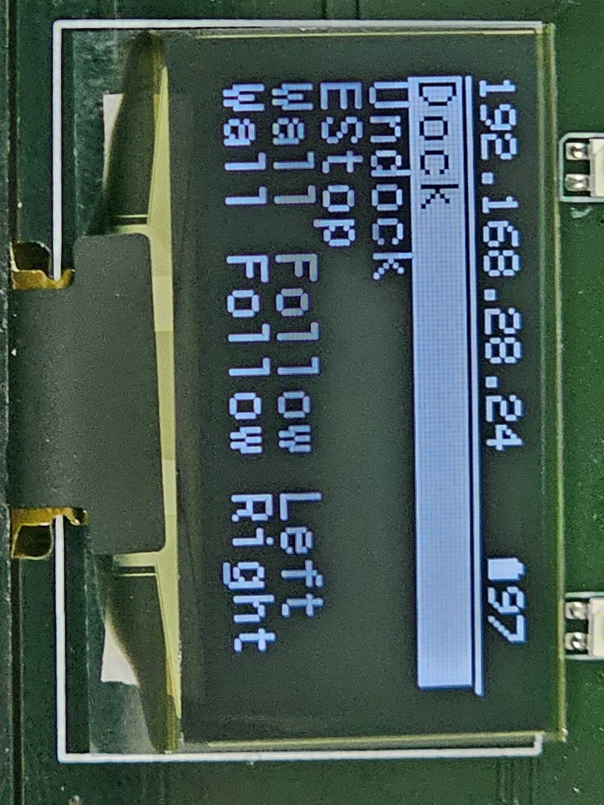
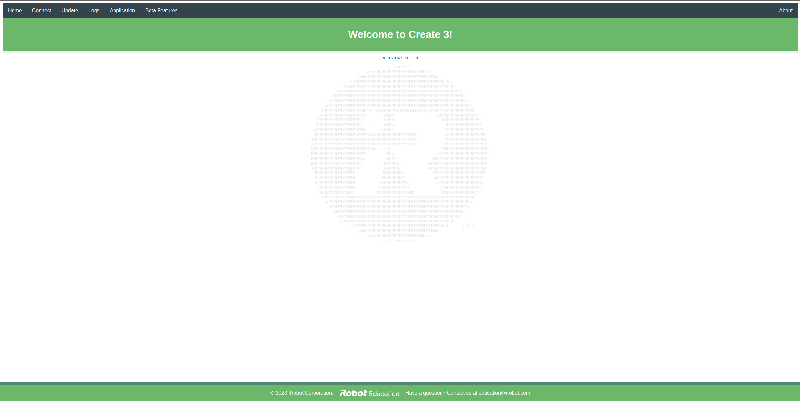
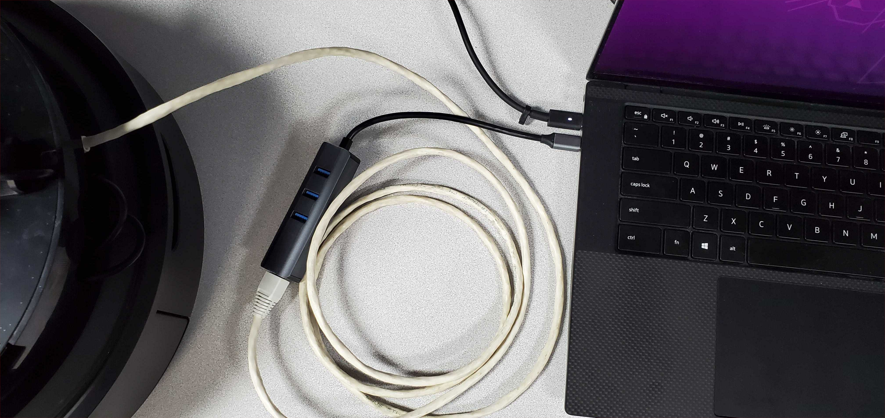
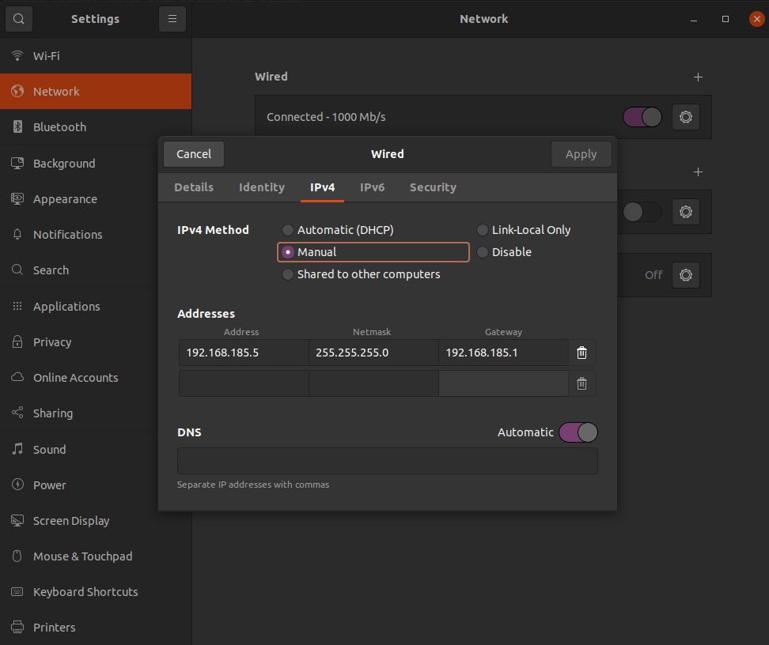

# Basic Setup

These instructions will set up the user PC and robot for basic communication. Further setup will depend on the chosen [networking](./networking.md) configuration.

## 1. User PC {#user-pc}

### Installing ROS 2

To interface with the robot, it is recommended to use a remote PC running the appropriate version of Ubuntu Desktop, with ROS 2 installed.




> :warning: **ROS 2 Galactic is no longer supported.** Please consider upgrading to a newer release

Required OS: [Ubuntu 20.04](https://releases.ubuntu.com/20.04/)

Follow [these instructions](https://docs.ros.org/en/galactic/Installation/Ubuntu-Install-Debians.html) to install ROS 2 Galactic on your PC.

Once ROS 2 is installed, install `turtlebot4_desktop`:

```bash
sudo apt update && sudo apt install ros-galactic-turtlebot4-desktop
```




Required OS: [Ubuntu 22.04](https://releases.ubuntu.com/22.04/)

Follow [these instructions](https://docs.ros.org/en/humble/Installation/Ubuntu-Install-Debians.html) to install ROS 2 Humble on your PC.

Once ROS 2 is installed, install `turtlebot4_desktop`:

```bash
sudo apt update && sudo apt install ros-humble-turtlebot4-desktop
```




Required OS: [Ubuntu 24.04](https://releases.ubuntu.com/24.04/)

Follow [these instructions](https://docs.ros.org/en/jazzy/Installation/Ubuntu-Install-Debians.html) to install ROS 2 Jazzy on your PC.

Once ROS 2 is installed, install `turtlebot4_desktop`:

```bash
sudo apt update && sudo apt install ros-jazzy-turtlebot4-desktop
```




## 2. Robot {#robot}

The first step for setting up the TurtleBot 4 is to power it on and connect it to your Wi-Fi network.

### Power on the robot

Place the TurtleBot 4 onto its dock. The green LED on the dock will turn on for a few seconds, and the TurtleBot 4 should power on. Allow the robot some time to boot up.

For more details on the robot buttons and indicator lights, visit the [Create&reg;3 Documentation](https://iroboteducation.github.io/create3_docs/hw/face/)

### Connect to the Access Point

On the first boot, the Raspberry Pi will enter Access Point (AP) mode which will allow you to connect to it over Wi-Fi. On your PC, connect to the `Turtlebot4` Wi-Fi network. The password is also `Turtlebot4`.

```note
The TurtleBot 4 AP network is a 5GHz network. Your computer will need to support 5GHz Wi-Fi to connect to the network.
```

### SSH into the Raspberry Pi

Once connected, you can SSH into the Raspberry Pi to configure its Wi-Fi. Open a terminal on your PC and call:

```bash
ssh ubuntu@10.42.0.1
```

Log in using the password `turtlebot4`.

### Connect the Raspberry Pi to your network

Once logged in, configure the Raspberry Pi to connect to your Wi-Fi network.

```tip
Connect the Raspberry Pi to a 5GHz Wi-Fi network for optimal performance.
```




> :warning: **ROS 2 Galactic is no longer supported.** Please consider upgrading to a newer release

In your SSH session, call:

```bash
sudo wifi.sh -s '<WIFI_SSID>' -p '<WIFI_PASSWORD>' -r <REGULATORY_DOMAIN> && sudo reboot
```

```note
The Regulatory Domain is based on the country you live in. USA: `US`, Canada: `CA`, UK: `GB`, Germany: `DE`, Japan: `JP3`, Spain: `ES`. For a full list, click [here](https://www.arubanetworks.com/techdocs/InstantWenger_Mobile/Advanced/Content/Instant%20User%20Guide%20-%20volumes/Country_Codes_List.htm#regulatory_domain_3737302751_1017918).
```




In your SSH session, run the [TurtleBot 4 setup tool](../software/turtlebot4_setup.md#configuration-tools):

```bash
turtlebot4-setup
```

This will start the TurtleBot 4 setup tool. Navigate to the "Wi-Fi Setup" menu and configure your connection. When you have finished, save and apply the settings.

<figure class="aligncenter">
    
    <figcaption>Wi-Fi Setup using the TurtleBot 4 Setup tool</figcaption>
</figure>

```note
Change your Wi-Fi mode to 'Client' when connecting to an existing network.
```




In your SSH session, run the [TurtleBot 4 setup tool](../software/turtlebot4_setup.md#configuration-tools):

```bash
turtlebot4-setup
```

This will start the TurtleBot 4 setup tool. Navigate to the "Wi-Fi Setup" menu and configure your connection. When you have finished, save and apply the settings.

<figure class="aligncenter">
    
    <figcaption>Wi-Fi Setup using the TurtleBot 4 Setup tool</figcaption>
</figure>

```note
Change your Wi-Fi mode to 'Client' when connecting to an existing network.
```




### Find the new Raspberry Pi IP

Once the Wi-Fi settings are applied, the Raspberry Pi will reboot and connect to your network. DHCP will assign it a new IP address. On the TurtleBot 4, this IP address will be shown at the top of the display.

<figure class="aligncenter">
    
    <figcaption>Wi-Fi IP address on a TurtleBot 4</figcaption>
</figure>

For the TurtleBot 4 Lite, you will need to check the `/ip` topic for the new address.




> :warning: **ROS 2 Galactic is no longer supported.** Please consider upgrading to a newer release

On your PC, run the following commands:

```bash
source /opt/ros/galactic/setup.bash
export RMW_IMPLEMENTATION=rmw_cyclonedds_cpp
export ROS_DOMAIN_ID=0
ros2 topic echo /ip
```




On your PC, run the following commands:

```bash
source /opt/ros/humble/setup.bash
export RMW_IMPLEMENTATION=rmw_fastrtps_cpp
export ROS_DOMAIN_ID=0
ros2 topic echo /ip
```




On your PC, run the following commands:

```bash
source /opt/ros/humble/setup.bash
export RMW_IMPLEMENTATION=rmw_fastrtps_cpp
export ROS_DOMAIN_ID=0
ros2 topic echo /ip
```




You should see the IP address printed out in your terminal periodically.

```bash
$ ros2 topic echo /ip
data: 192.168.28.24
---
data: 192.168.28.24
---
```

```note
If you are unable to find the IP address with the previous methods, try logging into your gateway and looking for a device with host name "ubuntu".
```

Once you have found the IP address, you can now SSH back into the robot with it.

```bash
ssh ubuntu@192.168.28.24
```

### Accessing the Create® 3 webserver

Once you have acquired the Raspberry Pi IP address, you can access the [Create® 3 webserver](https://iroboteducation.github.io/create3_docs/webserver/overview/).

Open a web browser and navigate to your Raspberry Pi IP with the port 8080.

<figure class="aligncenter">
    
    <figcaption>Accessing the Create® 3 webserver</figcaption>
</figure>

You will be greeted by the Create® 3 webserver home page.

<figure class="aligncenter">
    
    <figcaption>Create® 3 webserver home page</figcaption>
</figure>

### Updating the TurtleBot 4

It is recommended to update both the Create® 3 and the Raspberry Pi when you first use it to receive the latest bug fixes and improvements.

#### Create® 3

Check the [Create® 3 software releases](https://iroboteducation.github.io/create3_docs/releases/overview/) to see if a newer firmware version is available. You can check the firmware version of your Create® 3 by visiting the webserver.



> :warning: **ROS 2 Galactic is no longer supported.** Please consider upgrading to a newer release

```note
If you are using ROS 2 Galactic, make sure you install firmware with version `G.*.*`; firmware versions starting with `H` or `I` are _not_ compatible with Galactic.
```


```note
If you are using ROS 2 Humble, make sure you install firmware with version `H.*.*`; firmware versions starting with `G` or `I` are _not_ compatible with Humble.
```


```note
If you are using ROS 2 Jazzy, make sure you install firmware with version `I.*.*`; firmware versions starting with `G` or `H` are _not_ compatible with Jazzy.
```



If new firmware is available, download it, then access the [webserver](./basic.md#accessing-the-create-3-webserver). Go to the <b>Update</b> tab, upload the firmware, then update your robot.

#### Raspberry Pi packages

SSH into the Raspberry Pi, then update all packages by calling:

```bash
sudo apt update && sudo apt upgrade
```

## 3. Next Steps {#next-steps}

Next the networking must be configured. Review the [Networking](networking.md) page to select a networking configuration.


## Supplemental Configuration

### TurtleBot 4 Controller Manual Setup

The TurtleBot 4 comes with an included TurtleBot 4 Controller. It is paired in advance with the Raspberry Pi.

If you wish to manually pair a controller, follow these instructions:

- SSH into the TurtleBot 4

```bash
sudo bluetoothctl
```

- The `bluetoothd` CLI interface will start.
- Type `scan on` and press enter.
- Press and hold both the home and share buttons on the TurtleBot 4 controller until the light starts blinking.

<figure class="aligncenter">
    
    <figcaption>Putting the TurtleBot 4 in pair mode</figcaption>
</figure>

- In the CLI look for a *Wireless Controller* device to be found. It will have a MAC address similar to `A0:5A:5C:DF:4D:7F`.
- Copy the MAC address.
- In the CLI enter `trust MAC_ADDRESS`, replacing `MAC_ADDRESS` with the controllers address.
- Then, enter `pair MAC_ADDRESS`.
- Finally, enter `connect MAC_ADDRESS`.
- The CLI should report that the controller has been connected and the light on the controller will turn blue.
- Enter `exit` to exit the CLI.

```warning
Ensure that the commands are completed in quick succession. Too much delay between commands can result in the process timing out and to ultimately fail. If pairing fails then remove the device by using the `untrust` command followed by `remove` command alongside the MAC Address and try again.
```

### Access Point Mode

Placing the Raspberry Pi into Access Point mode can be useful when using the robot in an area without Wi-Fi connection.




> :warning: **ROS 2 Galactic is no longer supported.** Please consider upgrading to a newer release

SSH into the Raspberry Pi and call:

```bash
sudo wifi.sh -a && sudo reboot
```

The Raspberry Pi will revert back to the original AP mode.

Optionally you can set your own SSID and password with:

```bash
sudo wifi.sh -s '<SSID>' -p '<PASSWORD>' -a && sudo reboot
```




SSH into the Raspberry Pi and run the [TurtleBot 4 setup tool](../software/turtlebot4_setup.md#configuration-tools):

```bash
turtlebot4-setup
```

Go to <b>Wi-Fi Setup</b> and select <b>Apply Defaults</b>. Optionally you can set your own SSID and password before saving and applying the new settings.




SSH into the Raspberry Pi and run the [TurtleBot 4 setup tool](../software/turtlebot4_setup.md#configuration-tools):

```bash
turtlebot4-setup
```

Go to <b>Wi-Fi Setup</b> and select <b>Apply Defaults</b>. Optionally you can set your own SSID and password before saving and applying the new settings.




```tip
If you are moving your TurtleBot 4 to a new location with a different Wi-Fi network,
reconfigure the Raspberry Pi to connect to that network beforehand or place it into AP mode.
Otherwise it will continue trying to connect to your current network.
```

## Troubleshooting

### Recovering the Raspberry Pi

If you entered incorrect Wi-Fi credentials or your Wi-Fi network is down, you will not be able to access the Raspberry Pi over Wi-Fi. To recover from this, you can connect directly to the Raspberry Pi using an ethernet cable. You may need a USB to Ethernet adapter for your PC.

<figure class="aligncenter">
    
    <figcaption>Connecting to the TurtleBot 4 over Ethernet</figcaption>
</figure>

The Raspberry Pi uses a static IP address for the ethernet interface, `192.168.185.3`. You will need to configure your wired connection to use the same subnet:

- Go to your wired connection settings.
- Set your IPv4 Method to `Manual` and set your static IP. The IP address cannot be the same as the Raspberry Pi.

<figure class="aligncenter">
    
    <figcaption>Configure your PC's wired IP</figcaption>
</figure>

- Click 'Apply'

You can now go to your terminal and SSH into the robot by typing:

```bash
ssh ubuntu@192.168.185.3
```

### Install latest Raspberry Pi image

Resetting to a fresh Raspberry Pi image allows complete resetting of the Raspberry Pi. This is suggested if the system has been modified in a way that has corrupted the wired connection or general operating system.

```warning
Installing a new image on the Raspberry Pi will delete any changes you may have made. Save your changes externally before proceeding.
```

Find the latest TurtleBot 4 Raspberry Pi images at <http://download.ros.org/downloads/turtlebot4/>.

- Download the latest image for the given ROS distribution and robot model.
- Extract the zip file to get the `.img` file
- Power off your robot and then remove the microSD card from the Raspberry Pi.
- Insert the microSD card into your PC. You may need an adapter.
- Install the imaging tool `dcfldd`

```bash
sudo apt install dcfldd
```
- Identify your SD card by running

```bash
lsblk -d -e7
```

- The SD card should have a name like `mmcblk0` or `sdb`.

- If you wish to backup your current image, do so now:

```bash
sudo dd if=/dev/<SD_NAME> of=<IMAGE_PATH> bs=1M
```

```note
SD_NAME is the device name (`mmcblk0`, `sda`, etc.).

IMAGE_PATH is the path to where you want the image saved -- e.g., `~/turtlebot4_images/backup_image`.
```

- Get the SD flash script from `turtlebot4_setup` and flash the SD card:


```bash
wget https://raw.githubusercontent.com/turtlebot/turtlebot4_setup/jazzy/scripts/sd_flash.sh
bash sd_flash.sh /path/to/downloaded/image.img
```
- Follow the instructions and wait for the SD card to be flashed.
- Remove the SD card from your PC.
- Ensure your Raspberry Pi 4 is not powered on before inserting the flashed SD card.
- Follow the [Robot Setup](#robot) to configure your TurtleBot 4.