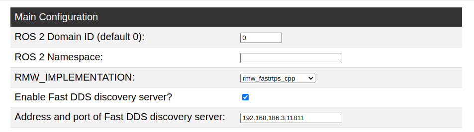

# Discovery Server

```note
The TurtleBot 4 should be configured for either Simple Discovery or Discovery Server, not both. 
See [Networking](./networking.md) for details.
```

## Robot




<u><b style="font-size: 20px;">Create® 3</b></u>

The Create® 3 needs to be updated to the latest firmware, have its Wi-Fi disabled, and be configured to use the Raspberry Pi as the discovery server over the USB-C connection.

<b>Setup instructions:</b>
- Update to the [latest firmware](https://iroboteducation.github.io/create3_docs/releases/overview/) using the webserver.
- Once updated, perform a [factory reset](https://iroboteducation.github.io/create3_docs/webserver/about/#:~:text=set%20to%20USB.-,Factory%20Reset,-A%20hyperlink%20to) to disconnect the Create® 3 from any Wi-Fi networks.
- On the webserver, go to Application -> Configuration. Save the following settings:

<figure class="aligncenter">
    
    <figcaption>Create® 3 discovery server settings</figcaption>
</figure>

<u><b style="font-size: 20px;">Raspberry Pi</b></u>

The Raspberry Pi needs to enable IP forwarding, configure itself as the discovery server, and reinstall the TurtleBot 4 upstart job with the new configuration. Environment variables will now be declared in `/etc/turtlebot4_discovery/setup.bash`, such that both the terminal and upstart environment will have the same configurations.

<b>Setup instructions:</b>
- SSH into the Raspberry Pi
- Uncomment "net.ipv4.ip_forward=1" in `/etc/sysctl.conf`
- Get and install discovery files:
```
git clone https://github.com/turtlebot/turtlebot4_setup.git -b galactic && \
sudo mv turtlebot4_setup/turtlebot4_discovery /etc/ && \
sudo mv turtlebot4_setup/scripts/install.py /usr/local/bin/ && \
rm turtlebot4_setup -rf
```
- Source other workspaces in `/etc/turtlebot4_discovery/setup.bash` if needed
- Add the following line to .bashrc: `source /etc/turtlebot4_discovery/setup.bash`
- Re-install the upstart job with the updated `install.py` script:

```bash
install.py --discovery on --workspace /etc/turtlebot4_discovery/setup.bash
```

When the Create® 3 chimes, restart the robot by powering it off with the power button and placing it back on the dock.

```tip
You can move any ROS2 related environment variables such as `ROS_DOMAIN_ID` from `~/.bashrc` to `/etc/turtlebot4_discovery/setup.bash`
```




<u><b style="font-size: 20px;">Create® 3</b></u>

The Create® 3 needs to be updated to the latest firmware and have its Wi-Fi disabled.

<b>Setup instructions:</b>
- Update to the [latest firmware](https://iroboteducation.github.io/create3_docs/releases/overview/) using the webserver.
- Once updated, perform a [factory reset](https://iroboteducation.github.io/create3_docs/webserver/about/#:~:text=set%20to%20USB.-,Factory%20Reset,-A%20hyperlink%20to) to disconnect the Create® 3 from any Wi-Fi networks.

<u><b style="font-size: 20px;">Raspberry Pi</b></u>

The Raspberry Pi needs to configure itself as the discovery server, and reinstall the TurtleBot 4 upstart job with the new configuration.

<b>Setup instructions:</b>
- SSH into the Raspberry Pi
- Run the [TurtleBot 4 setup tool](../software/turtlebot4_setup.md#configuration-tools):

```bash
turtlebot4-setup
```
- Enter the <b>Discovery Server</b> menu via <b>ROS Setup</b>.
- Enable the discovery server.
- Leave the IP address as `127.0.0.1`, and the port as `11811`.
- Save the settings, navigate to the main menu, and apply settings.
- Exit the setup tool
- In your terminal, call `turtlebot4-source` to apply the new settings.
- Restart the ROS 2 daemon with `turtlebot4-daemon-restart` or `ros2 daemon stop; ros2 daemon start`
- When the Create® 3 chimes, call `ros2 topic list` to view topics

```note
When a network change occurs or a new node is added, you may need to restart the ros2 daemon to see it with ros2cli. 
You may also need to call `ros2 topic list` twice to get a full list of topics.
```




## User PC

Because the Create® 3 is not on the same network as the user PC, an IP route has to be added to the Create® 3, through the Raspberry Pi. This route must be up at all times to maintain a connection between the PC and the Create® 3. Additionally, every device in the system must use `rmw_fastrtps_cpp` as their DDS and must define the `ROS_DISCOVERY_SERVER` environment variable to inform FastDDS of the IP and port of the server.




Each remote PC that will be communicating with the TurtleBot 4 will have to add an IP route for the Create® 3, as well as configure the ROS 2 environment to use the RPi4 as the discovery server. The IP route will be added using a service so that it persists through reboots.

Get and install discovery files:
```
git clone https://github.com/turtlebot/turtlebot4_setup.git -b galactic && \
sudo mv turtlebot4_setup/ip_route/ip_route.service /etc/systemd/system/ && \
sudo mv turtlebot4_setup/ip_route/ip_route.sh /usr/local/sbin/ && \
sudo mkdir /etc/turtlebot4_discovery/ && \
sudo mv turtlebot4_setup/turtlebot4_discovery/discovery_super_client.xml /etc/turtlebot4_discovery/ && \
sudo mv turtlebot4_setup/turtlebot4_discovery/setup.bash /etc/turtlebot4_discovery/ && \
rm turtlebot4_setup -rf
```
Get the RPi4 Wi-Fi IP address and replace the following values with it:
- In `/usr/local/sbin/ip_route.sh`, replace `10.42.0.1`
- In `/etc/turtlebot4_discovery/discovery_super_client.xml`, replace `127.0.0.1`
- In `/etc/turtlebot4_discovery/setup.bash`, replace `127.0.0.1`

Start the ip route service:
```bash
sudo systemctl daemon-reload
sudo systemctl enable ip_route.service
sudo systemctl start ip_route.service
```

Add this line to .bashrc: `source /etc/turtlebot4_discovery/setup.bash`

Source .bashrc to apply settings:
```bash
source ~/.bashrc
```

Then, run:

```bash
ros2 daemon stop; ros2 daemon start
```

to restart the ROS 2 daemon.

You should now be able to see the Raspberry Pi and Create® 3 topics:

```bash
ros2 topic list
```

```note
When a network change occurs or a new node is added, you may need to restart the ros2 daemon to see it with ros2cli. 
You may also need to call `ros2 topic list` twice to get a full list of topics.
```




A convenient script to configure the user PC exists in the [turtlebot4_setup](https://github.com/turtlebot/turtlebot4_setup/blob/humble/turtlebot4_discovery/configure_discovery.sh) repo.

To download and run the script, call:

```bash
wget -qO - https://raw.githubusercontent.com/turtlebot/turtlebot4_setup/humble/turtlebot4_discovery/configure_discovery.sh | bash <(cat) </dev/tty
```

You will be prompted for a few settings:

- The Raspberry Pi Wi-Fi IP address
- The Discovery Server IP address (Raspberry Pi IP by default)
- The Discovery Server port (11811 by default)
- The `ROS_DOMAIN_ID` of your robot (0 by default)

Once you have entered these values, the script will perform the following:

- Check if an IP route already exists from a previous call of the script. If it does, delete the route.
- Create a directory called `/etc/turtlebot4_discovery/`
- Install an IP route service for the given Raspberry Pi IP address.
- Install a FastDDS super client [profile](https://github.com/turtlebot/turtlebot4_setup/blob/humble/turtlebot4_discovery/fastdds_discovery_super_client.xml) to `/etc/turtlebot4_discovery/`.
- Install a [setup.bash](https://github.com/turtlebot/turtlebot4_setup/blob/humble/turtlebot4_discovery/setup.bash) file to `/etc/turtlebot4_discovery/` with the required configurations.
- Add the line `source /etc/turtlebot4_discovery/setup.bash` to your `~/.bashrc` file.
- Enable and start the IP route service.

When the script has run, call:
```bash
source ~/.bashrc
```
to apply the new settings.

Check that the IP route has been applied by calling:

```bash
ip route
```

You should see an entry like:

```bash
192.168.186.0/24 via 10.0.0.121 dev wlp0s20f3
```

where `10.0.0.121` would be your Raspberry Pi IP, and `wlp0s20f3` would be your Wi-Fi interface.

```note
If you cannot see the route, make sure you are able to ping your Raspberry Pi from your PC. 
Try manually adding the route with `sudo ip route add 192.168.186.0/24 via 10.0.0.121`, replacing 10.0.0.121 with your
Raspberry Pi IP.
```

Then, run:

```bash
ros2 daemon stop; ros2 daemon start
```

to restart the ROS 2 daemon.

You should now be able to see the Raspberry Pi and Create® 3 topics:

```bash
ros2 topic list
```

```note
When a network change occurs or a new node is added, you may need to restart the ros2 daemon to see it with ros2cli. 
You may also need to call `ros2 topic list` twice to get a full list of topics.
```


