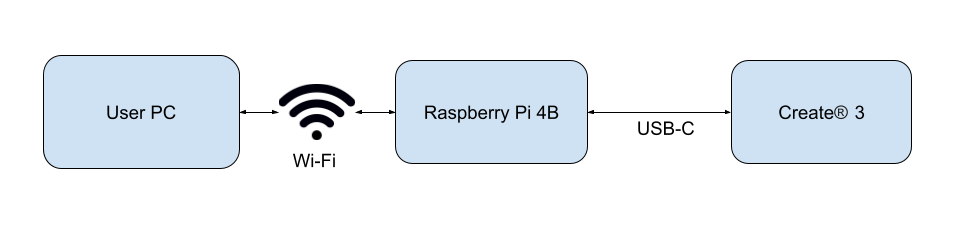

# Networking

The TurtleBot 4 consists of two computing units: the Create® 3, and the Raspberry Pi. They connect to each other over a USB-C cable, which is used to both power the Raspberry Pi, and establish a ethernet connection between the units. Both units also have Wi-Fi cards. The Create® 3 is able to connect to only 2.4 GHz networks, while the Raspberry Pi can connect to both 2.4 and 5 GHz networks. The user can also use their PC to communicate with the robot over Wi-Fi.

```note
For best performance you will need a router capable of supporting 2.4 and 5 GHz.  Older wireless equipment, such as routers that only support 802.11b/g, may have bandwidth limitations that will result in poor performance.
```

## DDS

ROS 2 has multiple [DDS](https://docs.ros.org/en/humble/Concepts/About-Different-Middleware-Vendors.html) vendors, but the TurtleBot 4 only supports [CycloneDDS](https://github.com/ros2/rmw_cyclonedds) and [FastDDS](https://github.com/ros2/rmw_fastrtps) out of the box. In Galactic, CycloneDDS is the default while in Humble, FastDDS is the default. The TurtleBot 4 can switch between the two DDS implementations on both versions of ROS 2.

## Network Configurations

For ROS 2 networking, the TurtleBot 4 can function with two different configurations: Simple Discovery, and Discovery Server.

### Simple Discovery

Simple Discovery is the default protocol that ROS 2 uses, and is available with both FastDDS and CycloneDDS. Simple Discovery uses multicasting to allow each ROS 2 participant to contact every other ROS 2 participant at the same time. This allows for all devices on the network to automatically discover each other's ROS 2 nodes.

```note
Connecting the Raspberry Pi using a 2.4 GHz network or over a network with very limited bandwidth can limit functionality including navigation and sending/receiving images.
```



```warning
**ROS 2 Galactic is no longer supported.** Please consider upgrading to a newer release
```

To use the TurtleBot 4 in the multicast configuration, both the RPi4 and the Create® 3 should be connected to the same Wi-Fi network. It is recommended that the RPi4 is connected to a 5GHz network for improved performance, so the network must bridge the 2.4 GHz and 5 GHz bands. Networks that provide 2.4 GHz and 5 GHz on the same SSID may not work properly with the Create3. This issue can be avoided by using [Discovery Server](#discovery-server).

<figure class="aligncenter">
    
    <figcaption>TurtleBot 4 Simple Discovery configuration for ROS 2 Galactic</figcaption>
</figure>


To use the TurtleBot 4 in the multicast configuration, both the RPi4 and the Create® 3 should be connected to the same Wi-Fi network. It is recommended that the RPi4 is connected to a 5GHz network for improved performance, so the network must bridge the 2.4 GHz and 5 GHz bands. Networks that provide 2.4 GHz and 5 GHz on the same SSID may not work properly with the Create3. This issue can be avoided by using [Discovery Server](#discovery-server).

<figure class="aligncenter">
    
    <figcaption>TurtleBot 4 Simple Discovery configuration for ROS 2 Humble</figcaption>
</figure>


To use the TurtleBot 4 in the multicast configuration, the RPi4 should be connected to the Wi-Fi network, but the Create® 3 should be left offline. It is recommended that the RPi4 is connected to a 5GHz network for improved performance. Note that this is the same network configuration as used with [Discovery Server](#discovery-server).

<figure class="aligncenter">
    
    <figcaption>TurtleBot 4 Simple Discovery configuration for ROS 2 Jazzy. Note that the Create® 3 is not connected to wi-fi.</figcaption>
</figure>



### Discovery Server

The Discovery Server option is supported only on FastDDS. The FastDDS Discovery Server allows for one or more devices on the network to act as a discovery server, while other devices are discovery clients for those servers. This is akin to the ROS Master in ROS 1. These discovery servers create connections between ROS 2 nodes to connect publishers and subscribers. Check out the Discovery Server [documentation](https://fast-dds.docs.eprosima.com/en/latest/fastdds/ros2/discovery_server/ros2_discovery_server.html) for more details.

```note
Multi-robot configuration with Discovery Server is not supported on Galactic.
```

With this configuration, the TurtleBot 4 is able to fully function without the Create® 3 being connected to Wi-Fi. Instead, all communication for each robot is routed through the Raspberry Pi which runs a discovery server.

<figure class="aligncenter">
    
    <figcaption>TurtleBot 4 Discovery Server configuration</figcaption>
</figure>

### Choosing a networking configuration

Each configuration has its own advantages and disadvantages.

**Simple Discovery**

Recommended for systems of up to 1-2 robots running simple functionality.

<table>
    <tr>
        <th style="width:50%">Advantages</th>
        <th style="width:50%">Disadvantages</th>
    </tr>
    <tr>
        <td style="vertical-align:top">
            <ul>
                <li>Easy to connect to the robot from any device on the network.</li>
                <li>The default discovery protocol in ROS 2, so there is no additional setup required.</li>
                <li>Supports both CycloneDDS and FastDDS.</li>
            </ul>
        </td>
        <td style="vertical-align:top">
            <ul>
                <li>Uses multicasting which can be problematic with some Wi-Fi networks, such as university and corporate networks.</li>
                <li>Create® 3 must also be connected to Wi-Fi for an offboard / user computer to be able to interact with the TurtleBot 4. Therefore, the network must bridge the 2.4 GHz and 5 GHz bands as well.</li>
                <li>Significant baseline network traffic required to keep the system operational. This means that too many ROS devices/nodes can result in saturating the network and/or increased CPU usage on each of the devices.</li>
            </ul>
        </td>
    </tr>
</table>


**Discovery Server**

Recommended for systems with 1+ robots running complex functionality such as navigation or 2+ robots running simple functionality.

<table>
    <tr>
        <th style="width:50%">Advantages</th>
        <th style="width:50%">Disadvantages</th>
    </tr>
    <tr>
        <td style="vertical-align:top">
            <ul>
                <li>Avoids multicasting issues.</li>
                <li>Has much lower baseline network traffic and therefore is scalable to many robots.</li>
                <li>Create® 3 does not need to be connected to WiFi, allowing full TurtleBot 4 functionality with only the Raspberry Pi connected to Wi-Fi and therefore the system can fully operate on a 5 GHz band.</li>
            </ul>
        </td>
        <td style="vertical-align:top">
            <ul>
                <li>Extra setup is required on the Raspberry Pi, and User PC, particularly if more than one robot is being used.</li>
                <li>Currently requires FastDDS as the middleware.</li>
            </ul>
        </td>
    </tr>
</table>

## Next Steps

Once the networking configuration has been selected, proceed to the corresponding page for instructions on how to configure it, [Simple Discovery](simple_discovery.md) or [Discovery Server](discovery_server.md).