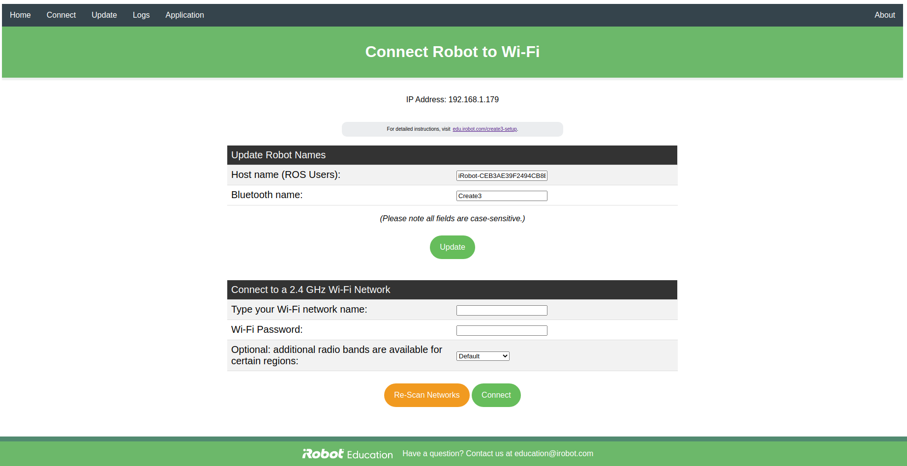
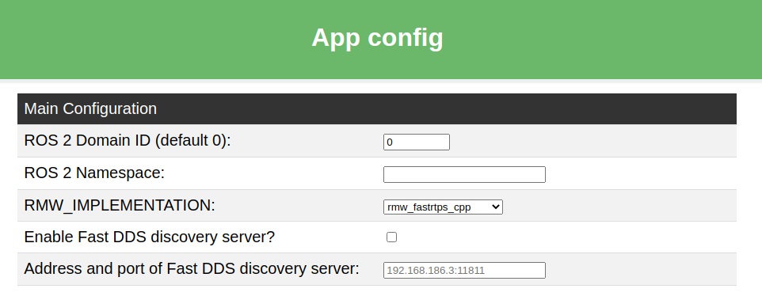

# Simple Discovery

```note
The TurtleBot 4 should be configured for either Simple Discovery or Discovery Server, not both.
See [Networking](./networking.md) for details.
```

## Create® 3

To use the TurtleBot 4 with Simple Discovery, the Create® 3 should be connected to Wi-Fi.

```note
The Create® 3 can only be connected to 2.4 GHz Wi-Fi networks.
```

### Wi-Fi Setup

Access the [Create® 3 webserver](./basic.md#accessing-the-create-3-webserver), then navigate to the <b>Connect</b> tab.
Enter your Wi-Fi SSID and password, and then click 'Connect'. Wait for it to initiate the WiFi connection, and then play a "happy sound" to signal successful connection. This may take a couple minutes. Click on the <b>Connect</b> tab once again and it should now show an IP address if the connection was successful. If the light ring turns yellow during this process, it indicates an error in connection. See [the Create® 3 documentation](https://iroboteducation.github.io/create3_docs/hw/face/) to understand what the different light ring colors indicate.

```note
If the Create® 3 is unable to connect to your 2.4 GHz WiFi network and the light ring does not show any particular error color, press and hold both [Buttons 1 and 2](https://iroboteducation.github.io/create3_docs/hw/face/) on the Create® 3 for about 5 seconds until the light ring shows spinning blue light. Now, reload the <b>Connect</b> page and try again. You may hear several chimes, but you must wait until the light ring color changes.
```

<figure class="aligncenter">
    
    <figcaption>Connecting the Create® 3 to Wi-Fi</figcaption>
</figure>

### Application Configuration

Access the [Create® 3 webserver](./basic.md#accessing-the-create-3-webserver), then navigate to the <b>Application Configuration</b> tab.
Set ROS 2 Domain ID to 0, ROS 2 Namespace to an empty string, and RMW_IMPLEMENTATION to the [default](networking.md#dds) for your ROS 2 version. Additionally, make
sure that the Fast DDS discovery server is disabled.

<figure class="aligncenter">
    
    <figcaption>Configuring the Create® 3 application for Humble</figcaption>
</figure>

## User PC

The user PC should be configured to use the same [DDS vendor](./networking.md#dds) and [ROS_DOMAIN_ID](../tutorials/multiple_robots.md#rosdomainid) as the robot. It is
recommended to use the default DDS for your ROS 2 version.




> :warning: **ROS 2 Galactic is no longer supported.** Please consider upgrading to a newer release

Create a file called `setup.bash` in a convenient location:

```bash
sudo mkdir /etc/turtlebot4/
sudo touch /etc/turtlebot4/setup.bash
```

Add the following lines to `setup.bash` with your favourite text editor:

```bash
source /opt/ros/galactic/setup.bash
export ROS_DOMAIN_ID=0
export RMW_IMPLEMENTATION=rmw_cyclonedds_cpp
```

```tip
Source your workspaces and export any other environment variables in this file.
```

Finally, add the following line in `~/.bashrc` to apply the settings to every new terminal:

```bash
source /etc/turtlebot4/setup.bash
```

```note
Call `source ~/.bashrc` to apply these settings to your current terminal.
```




Create a file called `setup.bash` in a convenient location:

```bash
sudo mkdir /etc/turtlebot4/
sudo touch /etc/turtlebot4/setup.bash
```

Add the following lines to `setup.bash` with your favourite text editor:

```bash
source /opt/ros/humble/setup.bash
export ROS_DOMAIN_ID=0
export RMW_IMPLEMENTATION=rmw_fastrtps_cpp
```

```tip
Source your workspaces and export any other environment variables in this file.
```

Finally, add the following line in `~/.bashrc` to apply the settings to every new terminal:

```bash
source /etc/turtlebot4/setup.bash
```

```note
Call `source ~/.bashrc` to apply these settings to your current terminal.
```




### Additional CycloneDDS configuration

If using CycloneDDS, the user PC needs further configuration to see the robot topics properly. CycloneDDS is configured in an XML file, and that configuration should be applied to the `CYCLONEDDS_URI` environment variable. An example XML file is available [here](https://github.com/turtlebot/turtlebot4_setup/blob/galactic/conf/cyclonedds_pc.xml). Download this file to your PC by calling:

```bash
wget https://raw.githubusercontent.com/turtlebot/turtlebot4_setup/galactic/conf/cyclonedds_pc.xml
```

```note
The `DontRoute` setting is required to see the Create® 3 topics.
```

Move the xml file to a convenient location:

```bash
sudo mv cyclonedds_pc.xml /etc/turtlebot4/
```

Add this line to your `/etc/turtlebot4/setup.bash` file to automatically configure CycloneDDS each time you open a new terminal:

```bash
export CYCLONEDDS_URI=/etc/turtlebot4/cyclonedds_pc.xml
```

```note
Call `source ~/.bashrc` to apply these settings to your current terminal.
```

For more CycloneDDS configuration options, visit the [CycloneDDS documentation](https://github.com/eclipse-cyclonedds/cyclonedds#run-time-configuration).

## Verification
Verify that your PC and the robot are able to communicate using ROS topics. Run the following command on both the robot and you PC to display the Raspberry Pi and Create®3 ROS topics and ensure that both outputs match:

```bash
ros2 topic list
```