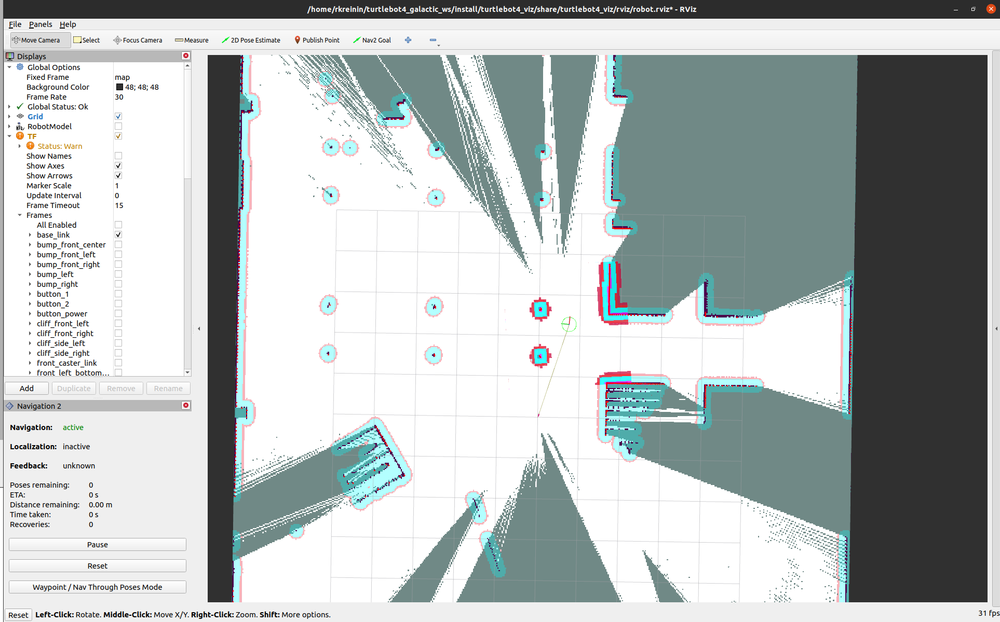

# Nav2

[Nav2](https://navigation.ros.org/) is the official navigation stack in ROS2. Nav2 can be used to calculate and execute a travel path for the robot by using a map of its surroundings. The map can be loaded at launch or generated with [SLAM](slam.md) while navigating.


## Launching Navigation

### Launch files

- **Nav2 Bringup**: Launches Nav2 nodes, with the option to launch SLAM or Localization as well.

### Parameters

- **nav2**: Whether to launch Nav2 nodes.
  - *options*: [true, false]
  - *default*: true
- **slam**: Launch SLAM along with Nav2.
  - *options*: [off, sync, async]
  - *default*: off
- **localization**: Launch localization with an existing map
  - *options*: [true, false]
  - *default*: false
- **map**: Path to existing map.
  - *default*: /path/to/turtlebot4_navigation/maps/depot.yaml
- **params_file**: Full path to parameter file for Nav2 and localization nodes.
  - *default*: /path/to/turtlebot4_navigation/config/nav2.yaml

### Configuration

The default TurtleBot 4 configuration can be found [here](https://github.com/turtlebot/turtlebot4/blob/galactic/turtlebot4_navigation/config/nav2.yaml). It is a slightly modified version of the [default](https://github.com/ros-planning/navigation2/blob/main/nav2_bringup/params/nav2_params.yaml) configuration from the Nav2 github. The configuration file allows the user to modify parameters such as velocity while pathing, the radius of the robot, costmap update frequencies and resolutions, and more. For more information, read the Nav2 [configuration guide](https://navigation.ros.org/configuration/index.html).


### Examples

Launching Nav2 with synchronous SLAM:

```bash
ros2 launch turtlebot4_navigation nav2_bringup.launch.py slam:=sync
```

The map and costmaps can be viewed in Rviz2:

```bash
ros2 launch turtlebot4_viz view_robot.launch.py
```

<figure class="aligncenter">
    
    <figcaption>Nav2 with SLAM</figcaption>
</figure>

Obstacles that are detected on the map will have a padding around with a radius equivalent to the radius of the robot. When navigating, Nav2 will drive the robot outside of the padded area to avoid hitting obstacles.


#### Navigating with Rviz2

The easiest way to set a navigation goal is to use **Nav2 Goal** in Rviz2. With Nav2 running, select the Nav2 Goal tool at the top of Rviz2, and click the location on the map where you would like to navigate to.

<figure class="aligncenter">
    
    <figcaption>Navigating with Rviz2</figcaption>
</figure>