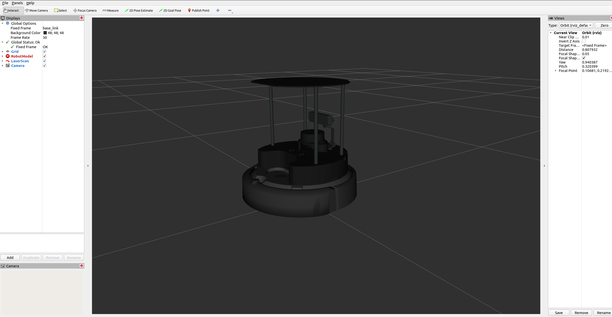
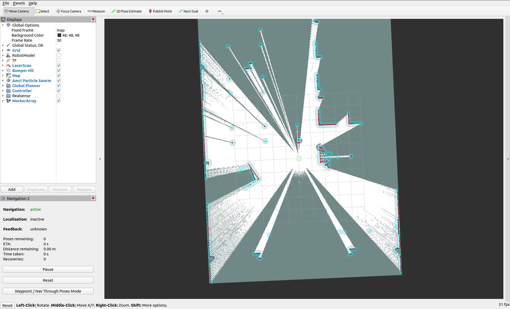
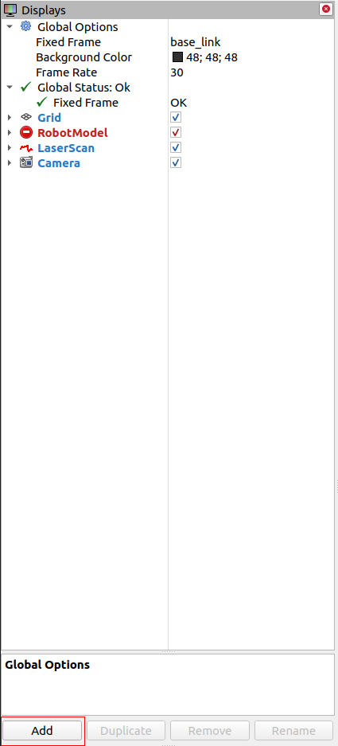
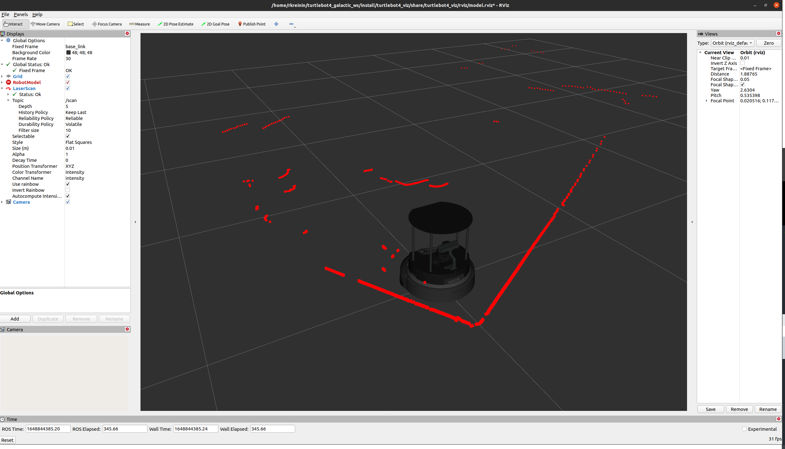
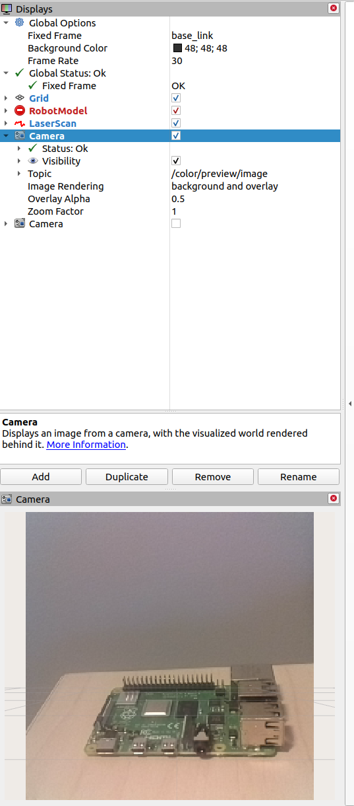
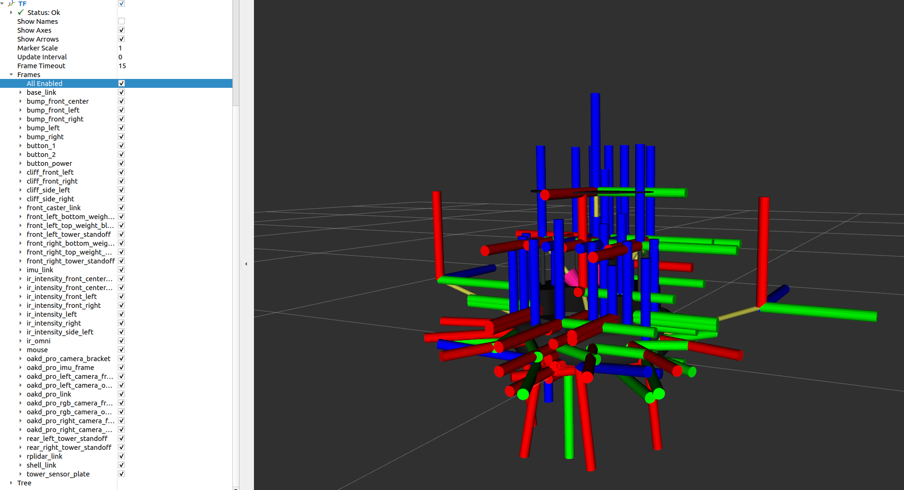
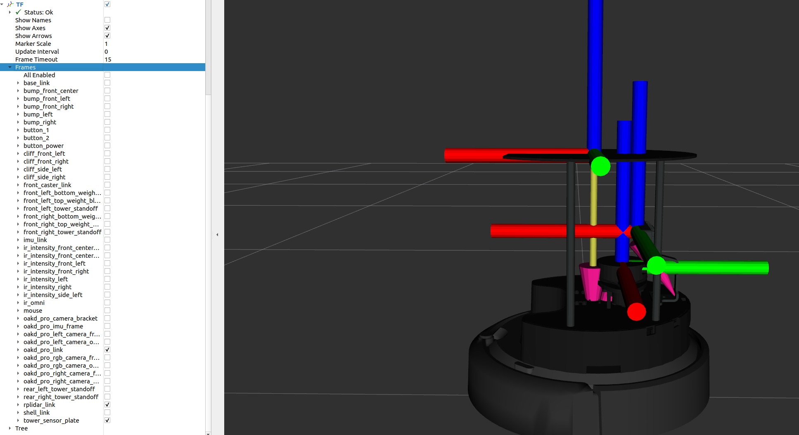

# Rviz2

Rviz2 is a port of Rviz to ROS2. It provides a graphical interface for users to view their robot, sensor data, maps, and more. It is installed by default with ROS2 and requires a desktop version of Ubuntu to use.

`turtlebot4_desktop` provides launch files and configurations for viewing the TurtleBot 4 in Rviz2.

## View Model

To inspect the model and sensor data, run `ros2 launch turtlebot4_viz view_model.launch.py`.

<figure class="aligncenter">
    
    <figcaption>Rviz2 launched with the View Model configuration</figcaption>
</figure>

## View Robot

For a top down view of the robot in its environment, run `ros2 launch turtlebot4_viz view_robot.launch.py`.

This is useful when mapping or navigating with the robot

<figure class="aligncenter">
    
    <figcaption>Rviz2 launched with the View Robot configuration</figcaption>
</figure>

## Rviz2 Displays

Rviz2 offers support for displaying data from various sources. Displays can be added using the "Add" button.

<figure class="aligncenter">
    
    <figcaption>Adding Displays in Rviz2</figcaption>
</figure>

### LaserScan

The LaserScan display shows data for `sensor_msgs/msg/LaserScan` messages. On the TurtleBot 4 the RPLIDAR supplies this data on the `/scan` topic.

<figure class="aligncenter">
    
    <figcaption>LaserScan displayed in Rviz2</figcaption>
</figure>

### Camera

The Camera display shows camera images from `sensor_msgs/msg/Image` messages. The OAK-D cameras publish images on the `/color/preview/image` and `/stereo/depth` topics.

<figure class="aligncenter">
    
    <figcaption>Camera image displayed in Rviz2</figcaption>
</figure>

### TF

The TF display can be used to visualise the links that make up the robot. When you first add the TF display, it will show every link that makes up the robot.

<figure class="aligncenter">
    
    <figcaption>TF with default settings</figcaption>
</figure>

You can uncheck the "All Enabled" box, and then select the links you wish to see.

<figure class="aligncenter">
    
    <figcaption>TF with selected links</figcaption>
</figure>