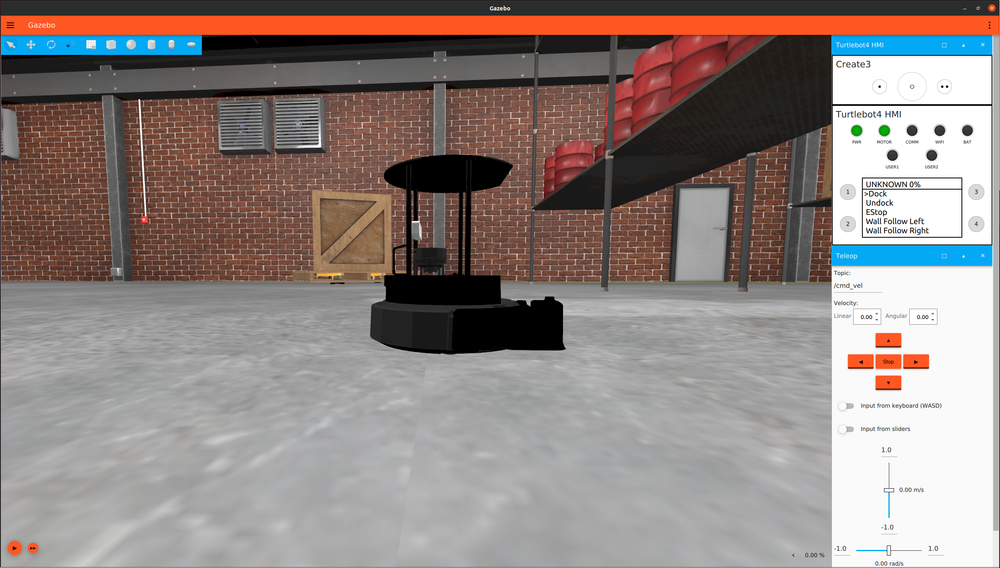
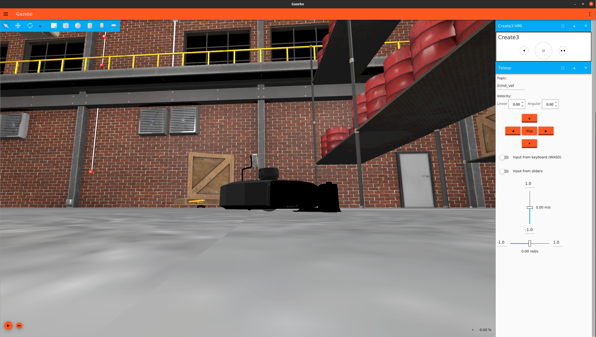

# Simulation

The simulator allows the user to test the robot without the need for a physical robot. It has all of the same functionality as the real robot. The TurtleBot 4 can be simulated using [Ignition Gazebo](https://ignitionrobotics.org/home). Unlike [Gazebo](http://gazebosim.org/), Ignition Gazebo does not natively support ROS. Instead, it has its own transport stack with a similar topic and node implementation. To communicate with ROS, we can use the [ros_ign_bridge](https://github.com/ignitionrobotics/ros_ign/tree/ros2/ros_ign_bridge). This ROS node translates data from ROS to Ignition, and vice versa.

## Installing Ignition Gazebo

Requirements:
- Ubuntu 20.04
- ROS2 Galactic

Recommended:
- PC with dedicated GPU

### Source

#### Install

Dev tools:

```bash
sudo apt install -y \
python3-colcon-common-extensions \
python3-rosdep \
python3-vcstool
```

Ignition Edifice:

```bash
sudo apt-get update && sudo apt-get install wget
sudo sh -c 'echo "deb http://packages.osrfoundation.org/gazebo/ubuntu-stable `lsb_release -cs` main" > /etc/apt/sources.list.d/gazebo-stable.list'
wget http://packages.osrfoundation.org/gazebo.key -O - | sudo apt-key add -
sudo apt-get update && sudo apt-get install ignition-edifice
```

#### Build

- Create a workspace if you don't already have one:

```bash
mkdir -p ~/turtlebot4_ws/src
```

- Clone this repository into the src directory from above

```bash
cd ~/turtlebot4_ws/src
git clone https://github.com/turtlebot/turtlebot4_simulator.git
```

- Use `vcs` to clone additional dependencies into the workspace:

```bash
vcs import ~/turtlebot4_ws/src/ < ~/turtlebot4_ws/src/turtlebot4_simulator/dependencies.repos
```

- Navigate to the workspace and install ROS 2 dependencies with:

```bash
cd ~/turtlebot4_ws
rosdep install --from-path src -yi
```

- Build the workspace:

```bash
source /opt/ros/galactic/setup.bash
export IGNITION_VERSION=edifice
colcon build --symlink-install
source install/local_setup.bash
```

## Launching Ignition Gazebo

The `ignition.launch.py` launch file has several [launch configurations](turtlebot4_packages.md#ignition-bringup) that allow the user to customize the simulation.

Default TurtleBot 4 launch:

```bash
ros2 launch turtlebot4_ignition_bringup ignition.launch.py
```

Ignition Gazebo will launch and spawn the TurtleBot 4 in the default world along with all of the necessary nodes.

<figure class="aligncenter">
    
    <figcaption>TurtleBot 4 in Ignition Gazebo</figcaption>
</figure>

TurtleBot 4 Lite launch:

```bash
ros2 launch turtlebot4_ignition_bringup ignition.launch.py model:=lite
```

<figure class="aligncenter">
    
    <figcaption>TurtleBot 4 Lite in Ignition Gazebo</figcaption>
</figure>


