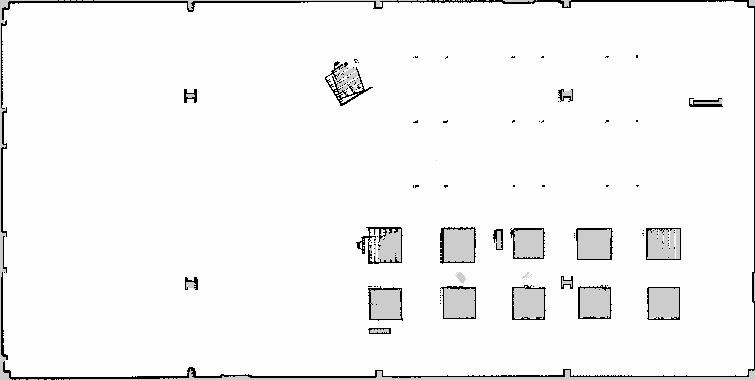

# SLAM

[Simultaneous localization and mapping (SLAM)](https://en.wikipedia.org/wiki/Simultaneous_localization_and_mapping) is a method used in robotics for creating a map of the robots surroundings while keeping track of the robots position in that map. The TurtleBot 4 uses [slam_toolbox](https://github.com/SteveMacenski/slam_toolbox) to generate maps by combining odometry data from the Create® 3 with laser scans from the RPLIDAR. `slam_toolbox` supports both synchronous and asynchronous SLAM nodes.

<figure class="aligncenter">
    
    <figcaption>Map generated by slam_toolbox</figcaption>
</figure>


## Synchronous SLAM

Synchronous SLAM requires that the map is updated everytime new data comes in. This results in maps with high accuracy and detail. The downside to synchronous SLAM is that it requires high processing power from the computer running it to keep up with the sensor data. This approach is ideal for use on a PC, whether it is for the simulator or for getting better SLAM performance on the physical robot.

Launching synchronous SLAM:

```bash
ros2 launch turtlebot4_navigation slam_sync.launch.py
```

## Asynchronous SLAM

Asynchronous SLAM will update the map as fast as the processor running it can handle. This may cause it to drop some laser scans or odometry data. Maps created with asynchronous SLAM may have reduced accuracy and detail, but this method requires significantly less proccessing power. This approach is ideal for use on the TurtleBot 4's Raspberry Pi. The default parameters for asynchronous SLAM use a reduced map resolution to further improve performance on the Pi.

Launching asynchronous SLAM:

```bash
ros2 launch turtlebot4_navigation slam_async.launch.py
```