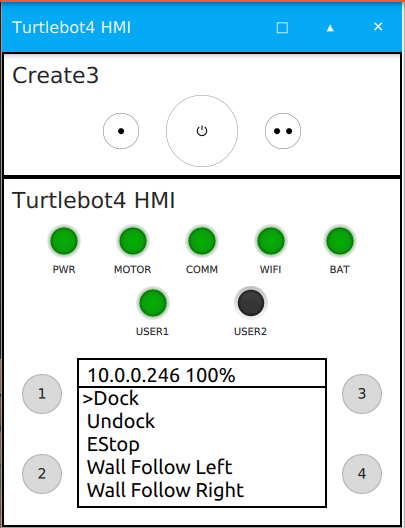
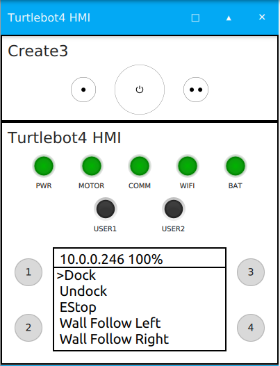
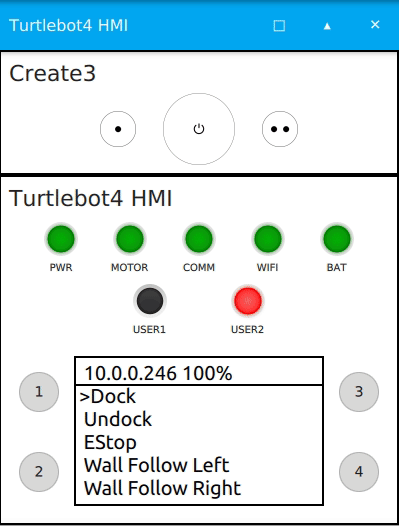
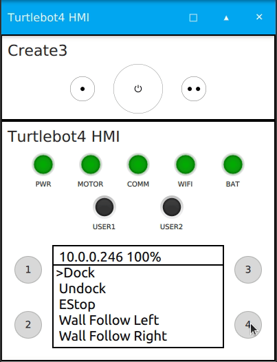
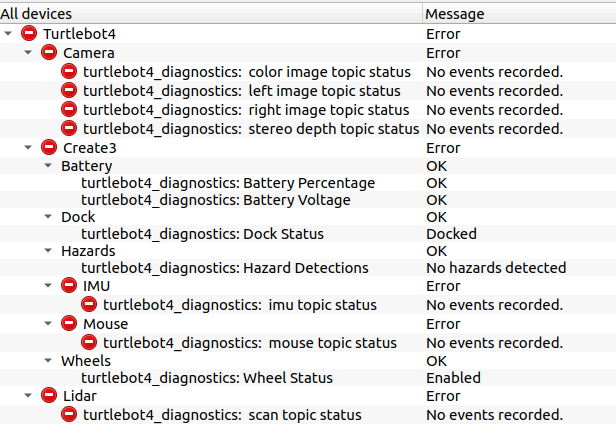
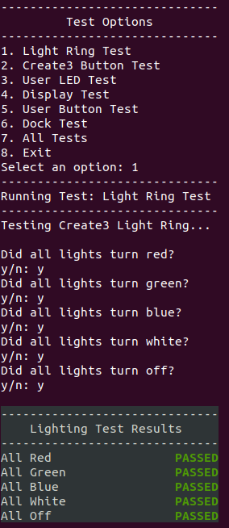
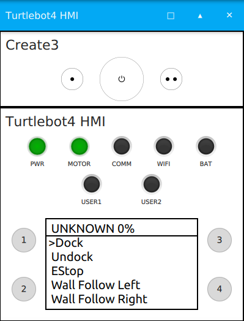

# TurtleBot 4 Packages

The TurtleBot 4 has 4 main repositories for software: [`turtlebot4`](https://github.com/turtlebot/turtlebot4), [`turtlebot4_robot`](https://github.com/turtlebot/turtlebot4_robot), [`turtlebot4_desktop`](https://github.com/turtlebot/turtlebot4_desktop), and [`turtlebot4_simulator`](https://github.com/turtlebot/turtlebot4_simulator). Each repository is also a [metapackage](http://wiki.ros.org/Metapackages) and contains one or more ROS2 packages.

## TurtleBot 4

The `turtlebot4` metapackage contains common packages that are used by both `turtlebot4_robot` and `turtlebot4_simulator`.

### Installation

Source code is available [here](https://github.com/turtlebot/turtlebot4).

```note
The `turtlebot4` packages are automatically installed when either of `turtlebot4_robot` or `turtlebot4_simulator` is installed.
```

#### Source installation

To manually install this metapackage from source, clone the git repository:

```bash
cd ~/turtlebot4_ws/src
git clone https://github.com/turtlebot/turtlebot4.git
```

Install dependencies:

```bash
cd ~/turtlebot4_ws
vcs import src < src/turtlebot4/dependencies.repos
rosdep install --from-path src -yi
```

Build the packages:

```bash
source /opt/ros/galactic/setup.bash
colcon build --symlink-install
```

### Description

The `turtlebot4_description` package contains the URDF description of the robot and the mesh files for each component.

The description can be published with the `robot_state_publisher`.

### Messages

The `turtlebot4_msgs` package contains the custom messages used on the TurtleBot 4:

* [UserButton](https://github.com/turtlebot/turtlebot4/blob/galactic/turtlebot4_msgs/msg/UserButton.msg): User Button states.
* [UserLed](https://github.com/turtlebot/turtlebot4/blob/galactic/turtlebot4_msgs/msg/UserLed.msg): User Led control.
* [UserDisplay](https://github.com/turtlebot/turtlebot4/blob/galactic/turtlebot4_msgs/msg/UserDisplay.msg): User Display data.

The TurtleBot 4 can also use all of the actions, messages, and services that the iRobot® Create® 3 platform supports:

#### Actions
* [AudioNoteSequence](https://github.com/iRobotEducation/irobot_create_msgs/blob/main/action/AudioNoteSequence.action): Play a given set of notes from the speaker for a given number of iterations.
* [DockServo](https://github.com/iRobotEducation/irobot_create_msgs/blob/main/action/DockServo.action): Command the robot to dock into its charging station.
* [DriveArc](https://github.com/iRobotEducation/irobot_create_msgs/blob/main/action/DriveArc.action): Command the robot to drive along an arc defined by radius.
* [DriveDistance](https://github.com/iRobotEducation/irobot_create_msgs/blob/main/action/DriveDistance.action): Command the robot to drive a defined distance in a straight line.
* [LedAnimation](https://github.com/iRobotEducation/irobot_create_msgs/blob/main/action/LedAnimation.action): Command the lights to perform specified animation.
* [NavigateToPosition](https://github.com/iRobotEducation/irobot_create_msgs/blob/main/action/NavigateToPosition.action): Command the robot to drive to a goal odometry position using simple approach that rotates to face goal position then translates to goal position then optionally rotates to goal heading.
* [RotateAngle](https://github.com/iRobotEducation/irobot_create_msgs/blob/main/action/RotateAngle.action): Command the robot to rotate in place a specified amount.
* [Undock](https://github.com/iRobotEducation/irobot_create_msgs/blob/main/action/Undock.action): Command the robot to undock from its charging station.
* [WallFollow](https://github.com/iRobotEducation/irobot_create_msgs/blob/main/action/WallFollow.action): Command the robot to wall follow on left or right side using bump and IR sensors.

#### Messages
* [AudioNote](https://github.com/iRobotEducation/irobot_create_msgs/blob/main/msg/AudioNote.msg): Command the robot to play a note.
* [AudioNoteVector](https://github.com/iRobotEducation/irobot_create_msgs/blob/main/msg/AudioNoteVector.msg): Command the robot to play a sequence of notes.
* [Button](https://github.com/iRobotEducation/irobot_create_msgs/blob/main/msg/Button.msg): Status for a button.
* [Dock](https://github.com/iRobotEducation/irobot_create_msgs/blob/main/msg/Dock.msg): Information about the robot sensing the its dock charging station.
* [HazardDetection](https://github.com/iRobotEducation/irobot_create_msgs/blob/main/msg/HazardDetection.msg): An hazard or obstacle detected by the robot.
* [HazardDetectionVector](https://github.com/iRobotEducation/irobot_create_msgs/blob/main/msg/HazardDetectionVector.msg): All the hazards and obstacles detected by the robot.
* [InterfaceButtons](https://github.com/iRobotEducation/irobot_create_msgs/blob/main/msg/InterfaceButtons.msg): Status of the 3 interface buttons on the Create® robot faceplate.
* [IrIntensity](https://github.com/iRobotEducation/irobot_create_msgs/blob/main/msg/IrIntensity.msg): Reading from an IR intensity sensor.
* [IrIntensityVector](https://github.com/iRobotEducation/irobot_create_msgs/blob/main/msg/IrIntensityVector.msg): Vector of current IR intensity readings from all sensors.
* [IrOpcode](https://github.com/iRobotEducation/irobot_create_msgs/blob/main/msg/IrOpcode.msg): Opcode detected by the robot IR receivers. Used to detect the dock and virtual walls.
* [KidnapStatus](https://github.com/iRobotEducation/irobot_create_msgs/blob/main/msg/KidnapStatus.msg): Whether the robot has been picked up off the ground.
* [LedColor](https://github.com/iRobotEducation/irobot_create_msgs/blob/main/msg/LedColor.msg): RGB values for an LED.
* [LightringLeds](https://github.com/iRobotEducation/irobot_create_msgs/blob/main/msg/LightringLeds.msg): Command RGB values of 6 lightring lights.
* [Mouse](https://github.com/iRobotEducation/irobot_create_msgs/blob/main/msg/Mouse.msg): Reading from a mouse sensor.
* [SlipStatus](https://github.com/iRobotEducation/irobot_create_msgs/blob/main/msg/SlipStatus.msg): Whether the robot is currently slipping or not.
* [StopStatus](https://github.com/iRobotEducation/irobot_create_msgs/blob/main/msg/StopStatus.msg): Whether the robot is currently stopped or not.
* [WheelStatus](https://github.com/iRobotEducation/irobot_create_msgs/blob/main/msg/WheelStatus.msg): Current/PWM readings from the robot's two wheels in addition to whether wheels are enabled.
* [WheelTicks](https://github.com/iRobotEducation/irobot_create_msgs/blob/main/msg/WheelTicks.msg): Reading from the robot two wheels encoders.
* [WheelVels](https://github.com/iRobotEducation/irobot_create_msgs/blob/main/msg/WheelVels.msg): Indication about the robot two wheels current speed.

#### Services
* [EStop](https://github.com/iRobotEducation/irobot_create_msgs/blob/main/srv/EStop.srv): Set system EStop on or off, cutting motor power when on and enabling motor power when off.
* [ResetPose](https://github.com/iRobotEducation/irobot_create_msgs/blob/main/srv/ResetPose.srv): Reset the robot pose estimate to the specified value.
* [RobotPower](https://github.com/iRobotEducation/irobot_create_msgs/blob/main/srv/RobotPower.srv): Power off robot.

See [irobot_create_msgs](https://github.com/iRobotEducation/irobot_create_msgs) for more details.

### Navigation

The `turtlebot4_navigation` packages contains launch and configuration files for using SLAM and navigation on the TurtleBot 4.

Launch files:
* [Nav2 Bringup](https://github.com/turtlebot/turtlebot4/blob/galactic/turtlebot4_navigation/launch/nav2_bringup.launch.py): Launches navigation. Allows for launch configurations to use SLAM, Nav2, and localization.
* [SLAM Sync](https://github.com/turtlebot/turtlebot4/blob/galactic/turtlebot4_navigation/launch/slam_sync.launch.py): Launches `slam_toolbox` with online synchronous mapping. Recommended for use on a PC.
* [SLAM Async](https://github.com/turtlebot/turtlebot4/blob/galactic/turtlebot4_navigation/launch/slam_async.launch.py): Launches `slam_toolbox` with online asynchronous mapping. Recommended for use on the Raspberry Pi 4.

Nav Bringup launch configuration options:
- **namespace**: Top-level namespace.
    - default: *None*
- **use_namespace**: Whether to apply a namespace to the navigation stack.
    - options: *true, false*
    - default: *false*
- **slam**: Whether to launch SLAM.
    - options: *off, sync, async*
    - default: *off*
- **localization**: Whether to launch localization.
    - options: *true, false*
    - default: *false*
- **nav2**: Whether to launch Nav2.
    - options: *true, false*
    - default: *false*
- **map**: Full path to map yaml file to load.
    - default: */path/to/turtlebot4_navigation/maps/depot.yaml*
- **use_sim_time**: Use simulation (Gazebo) clock if true.
    - options: *true, false*
    - default: *false*
- **param_file**: Full path to the ROS2 parameters file to use for nav2 and localization nodes.
    - default: */path/to/turtlebot4_navigation/config/nav2.yaml*
- **autostart**: Automatically startup the nav2 stack.
    - options: *true, false*
    - default: *true*
- **use_composition**: Whether to use composed bringup.
    - options: *true, false*
    - default: *true*

Running synchronous SLAM:
```bash
ros2 launch turtlebot4_navigation nav_bringup.launch.py slam:=sync
```

Running asynchronous SLAM with Nav2:
```bash
ros2 launch turtlebot4_navigation nav_bringup.launch.py slam:=async nav2:=true
```

Running Nav2 with localization and existing map:
```bash
ros2 launch turtlebot4_navigation nav_bringup.launch.py localization:=true nav2:=true map:=/path/to/map.yaml
```

### Node

The `turtlebot4_node` package contains the source code for the [rclcpp](https://github.com/ros2/rclcpp) node `turtlebot4_node` that controls the robots HMI as well as other logic. This node is used by both the physical robot and the simulated robot.

Publishers:
- **/hmi/display**: *turtlebot4_msgs/msg/UserDisplay*
    - description: The current information that is to be displayed (TurtleBot 4 model only).
- **/ip**: *std_msgs/msg/String*
    - description: The IP address of the Wi-Fi interface. 

Subscribers:
- **/battery_state**: *sensor_msgs/msg/BatteryState*
    - description: Current battery state of the Create® 3.
- **/hmi/buttons**: *turtlebot4_msgs/msg/UserButton*
    - description: Button states of the TurtleBot 4 HMI (TurtleBot 4 model only).
- **/hmi/display/message**: *std_msgs/msg/String*
    - description: User topic to print custom message to display (TurtleBot 4 model only).
- **/hmi/led**: *turtlebot4_msgs/msg/UserLed*
    - description: User topic to control User LED 1 and 2 (TurtleBot 4 model only).
- **/interface_buttons**: *irobot_create_msgs/msg/InterfaceButtons*
    - description: Button states of Create® 3 buttons.
- **/joy**: *sensor_msgs/msg/Joy*
    - description: Bluetooth controller button states (TurtleBot 4 model only).
- **/wheel_status**: *irobot_create_msgs/msg/WheelStatus*
    - description: Wheel status reported by Create® 3.

Service Clients:
- **/e_stop**: *irobot_create_msgs/srv/EStop*
    - description: Enable or disable motor stop.
- **/robot_power**: *irobot_create_msgs/srv/RobotPower*
    - description: Power off the robot.

Action Clients:
- **/dock**: *irobot_create_msgs/action/DockServo*
    - description: Command the robot to dock into its charging station.
- **/wall_follow**: *irobot_create_msgs/action/WallFollow*
    - description: Command the robot to wall follow on left or right side using bump and IR sensors.
- **/undock**: *irobot_create_msgs/action/Undock*
    - description: Command the robot to undock from its charging station.

#### Functions

The node has a set of static functions that can be used either with a button or through the display menu.

Currently, the supported functions are:

- **Dock**: Call the */dock* action.
- **Undock**: Call the */undock* action.
- **Wall Follow Left**: Call the */wall_follow* action with direction `FOLLOW_LEFT` and a duration of 10 seconds.
- **Wall Follow Right**: Call the */wall_follow* action with direction `FOLLOW_RIGHT` and a duration of 10 seconds.
- **Power**: Call the */robot_power* service and power off the robot.
- **EStop**: Call the */e_stop* service and toggle EStop state.

The TurtleBot 4 also supports the following menu functions:

- **Scroll Up**: Scroll menu up.
- **Scroll Down**: Scroll menu down.
- **Back**: Exit message screen or return to first menu entry.
- **Select**: Select currently highlighted menu entry.
- **Help**: Print help statement.

#### Configuration

This node can be configured using a parameter *.yaml* file. The default robot parameters can be found [here](https://github.com/turtlebot/turtlebot4_robot/blob/galactic/turtlebot4_bringup/config/turtlebot4.yaml). 

Parameters:

- **wifi.interface**: The Wi-Fi interface being used by the computer. This is used to find the current IP address of the computer.
- **menu.entries**: Set menu entries to be displayed. Each entry must be one of the support [functions](#functions).
- **buttons**: Set the function of Create® 3 and HMI buttons.
- **controller**: Set the function of TurtleBot 4 Controller buttons.

#### Buttons

The `Buttons` class in `turtlebot4_node` provides functionality to all buttons on the robot. This includes the Create® 3 buttons, HMI buttons, and TurtleBot 4 Controller buttons.
The node receives button states from the */interface_buttons*, */hmi/buttons*, and */joy* topics.

Each button can be configured to have either a single function when pressed, or two functions by using a short or long press. This is done through [configuration](#configuration).

Supported buttons:

```yaml
buttons:
    create3_1:
    create3_power:
    create3_2:
    hmi_1:
    hmi_2:
    hmi_3:
    hmi_4:

controller:
    a:
    b:
    x:
    y:
    up:
    down:
    left:
    right:
    l1:
    l2:
    l3:
    r1:
    r2:
    r3:
    share:
    options:
    home:
```

##### Example

Lets say we want the TurtleBot 4 to have the following button functions:
- Make a short press of Create® 3 button 1 toggle EStop.
- Power off robot with 5 second press of Home on the TurtleBot 4 Controller.
- Short press of HMI button 1 performs Wall Follow Left, long press of 3 seconds performs Wall Follow Right.

Create a new yaml file:

```bash
cd /home/ubuntu/turtlebot4_ws
touch example.yaml
```

Use your favourite text editor and paste the following into `example.yaml`:
```yaml
turtlebot4_node:
  ros__parameters:
    buttons:  
      create3_1: ["EStop"]
      hmi_1: ["Wall Follow Left", "Wall Follow Right", "3000"]

    controller:
      home: ["Power", "5000"]
```

Launch the robot with your new configuration:

```bash
ros2 launch turtlebot4_bringup standard.launch.py param_file:=/home/ubuntu/turtlebot4_ws/example.yaml
```

The buttons should now behave as described in `example.yaml`.

#### LEDs

The `Leds` class in `turtlebot4_node` controls the states of the HMI LEDs on the TurtleBot 4. It is not used for the TurtleBot 4 Lite.

There are 5 status LEDs which are controlled by the node: `POWER`, `MOTOR`, `COMMS`, `WIFI`, and `BATTERY`. There are also 2 user LEDs: `USER_1` and `USER_2` which are controlled by the user via the */hmi/led* topic. The `BATTERY` and `USER_2` LEDs consist of a red and green LED which allows them to be turned on as either green, red, or yellow (red + green). The rest are green only.

Status LEDs:
- **POWER**: Always ON while `turtlebot4_node` is running.
- **MOTOR**: ON when wheels are enabled, OFF when wheels are disabled.
    - Wheel status is reported on the */wheel_status* topic.
- **COMMS**: ON when communication with Create® 3 is active. OFF otherwise.
    - Receiving data on the */battery_state* topic implies that communication is active.
- **WIFI**: ON when an IP address can be found for the Wi-Fi interface specified in the [configuration](#configuration).
- **BATTERY**: Colour and pattern will vary based on battery percentage.
    - Battery percentage is received on */battery_state* topic.

User LEDs:

The user LEDs can be set by publishing to the */hmi/led* topic with a [UserLed](https://github.com/turtlebot/turtlebot4/blob/galactic/turtlebot4_msgs/msg/UserLed.msg) message.

UserLed message:

- **led**: Which available LED to use.
    - `uint8 USER_LED_1 = 0`
    - `uint8 USER_LED_2 = 1`
- **color**: Which color to set the LED to.
    - `uint8 COLOR_OFF = 0`
    - `uint8 COLOR_GREEN = 1`
    - `uint8 COLOR_RED = 2`
    - `uint8 COLOR_YELLOW = 3`
- **blink_period**: Blink period in milliseconds.
    - `uint32 ms`
- **duty_cycle**: Percentage of blink period that the LED is ON.
    - `float64 (0.0 to 1.0)`

##### Examples

Set `USER_1` to solid green:

```bash
ros2 topic pub /hmi/led turtlebot4_msgs/msg/UserLed "led: 0
color: 1
blink_period: 1000
duty_cycle: 1.0" --once
```

<figure class="aligncenter">
    
    <figcaption>User 1: Solid Green</figcaption>
</figure>

Set `USER_1` OFF:

```bash
ros2 topic pub /hmi/led turtlebot4_msgs/msg/UserLed "led: 0
color: 0
blink_period: 1000
duty_cycle: 1.0" --once
```

<figure class="aligncenter">
    
    <figcaption>User 1: Off</figcaption>
</figure>

Blink `USER_2` red at 1hz with 50% duty cycle:

```bash
ros2 topic pub /hmi/led turtlebot4_msgs/msg/UserLed "led: 1
color: 2
blink_period: 1000
duty_cycle: 0.5" --once
```

<figure class="aligncenter">
    
    <figcaption>User 2: Red, 1hz, 50%</figcaption>
</figure>

#### Display

The `Display` class in `turtlebot4_node` controls the HMI display of the TurtleBot 4. The physical display is a 128x64 OLED which is controlled over I2C with a SSD1306 driver.

The display has a header line which contains the IP address of the Wi-Fi interface specified in [configuration](#configuration), as well as the battery percentage received on the */battery_state* topic. The display also has 5 additional lines which are used for the menu by default. The menu entries are specified in [configuration](#configuration) and are a set of the available functions. The 5 menu lines can be overwritten by publishing to the */hmi/display/message* with a **String** message.

```note
The menu can have any number of entries. If there are more than 5 entries, the user will have to scroll down to see the entries that do not fit on the 5 menu lines.
```

##### Menu Control

The TurtleBot 4 display has a simple scrolling menu. There are 4 control functions for the menu: Scroll up, Scroll down, Select, and Back. 

* Scroll up and down allow the users to navigate through the menu entries and by default are mapped to user buttons 3 and 4 respectively. 
* The select function will call the currently selected menu entry. This can trigger an action such as docking, a service such as EStop, or display a message such as the Help message. This function is mapped to user button 1 by default.
* The back function allows the user to return back to the menu from a message screen. If the menu is already showing the menu entries, it will return to showing the first 5 menu entries and the first entry will be highlighted.

<figure class="aligncenter">
    
    <figcaption>TurtleBot 4 Menu Controls</figcaption>
</figure>

## TurtleBot 4 Robot

Source code is available [here](https://github.com/turtlebot/turtlebot4_robot).

```note
The `turtlebot4_robot` metapackage contains packages that are used by the physical TurtleBot 4 robot and are run on the Raspberry Pi.
```

### Installation

The `turtlebot4_robot` metapackage is pre-installed on the TurtleBot 4 Raspberry Pi image.

#### Source installation

To manually install this metapackage from source, clone the git repository:

```bash
cd ~/turtlebot4_ws/src
git clone https://github.com/turtlebot/turtlebot4_robot.git
```

Install dependencies:

```bash
cd ~/turtlebot4_ws
vcs import src < src/turtlebot4_robot/dependencies.repos
rosdep install --from-path src -yi
```

Build the packages:

```bash
source /opt/ros/galactic/setup.bash
colcon build --symlink-install
```

### Base

The `turtlebot4_base` package contains the source code for the [rclcpp](https://github.com/ros2/rclcpp) node `turtlebot4_base_node` which runs on the physical robot. This node interfaces with the GPIO lines of the Raspberry Pi which allows it to read the state of the buttons, as well as write to the LEDs and display.

Publishers:
- **/hmi/buttons**: *turtlebot4_msgs/msg/UserButton*
    - description: Button states of the TurtleBot 4 HMI (TurtleBot 4 model only).

Subscribers:
- **/hmi/display**: *turtlebot4_msgs/msg/UserDisplay*
    - description: The current information that is to be displayed (TurtleBot 4 model only).
- **/hmi/led/_<led>**: *std_msgs/msg/Int32*
    - description: Hidden topics indicating the state of each LED.

#### GPIO Interface

The TurtleBot 4 uses *libgpiod* to interface with the GPIO lines of the Raspberry Pi. The `gpiochip0` device represents the 40-pin header of the Raspberry Pi and is used for reading and writing to these pins.

#### I2C Interface

The linux I2C drivers are used to read and write data on the I2C buses of the Raspberry Pi. The display's SSD1306 driver is connected to the `i2c-3` device by default, but other buses are available too.

#### SSD1306

The SSD1306 is a driver for OLED displays. It receives commands over a communication bus (I2C for the TurtleBot 4) and controls how the physical display behaves. The TurtleBot 4 uses a modified version of this [STM32 SSD1306 driver](https://github.com/afiskon/stm32-ssd1306) to write pixels, shapes and characters to the display.

#### Configuration

```warning
Do NOT change pin definitions if you are using the standard PCBA or do not know what you are doing.
```

The `turtlebot4_base_node` pin definitions can be set with ROS parameters. The default configuration is:

```yaml
turtlebot4_base_node:
  ros__parameters:
    # GPIO definition for HMI. Do NOT change if you are using the standard PCBA.
    gpio:
      user_button_1: 13
      user_button_2: 19
      user_button_3: 16
      user_button_4: 26

      led_green_power: 17
      led_green_motors: 18
      led_green_comms: 27
      led_green_wifi: 24
      led_green_battery: 22
      led_red_battery: 23
      led_green_user_1: 25
      led_green_user_2: 6
      led_red_user_2: 12

      display_reset: 2
```

```note
The value for each GPIO device is the GPIO number, NOT the pin number.
```

#### Robot Upstart

The robot uses the [robot_upstart](https://github.com/clearpathrobotics/robot_upstart/tree/foxy-devel) package to install the bringup launch files as a background process that launches when the robot starts. The launch files are located under the `turtlebot4_bringup` package.

To check if the TurtleBot 4 service is running, use this command on the Raspberry Pi:

```bash
systemctl | grep turtlebot4
```

If the service is active, the CLI will echo `turtlebot4.service  loaded active running   "bringup turtlebot4"`.

To read the most recent logs from the service, call:

```bash
sudo journalctl -u turtlebot4 -r
```

To stop the service, call:

```bash
sudo systemctl stop turtlebot4.service
```

This will kill all of the nodes launched by the launch file. 

```note
The service will automatically start again on reboot. To fully disable the service, uninstall the job.
```

To start the service again, call:

```bash
sudo systemctl start turtlebot4.service
```

The launch files are installed on the TurtleBot 4 with this command:

```bash
ros2 run robot_upstart install turtlebot4_bringup/launch/standard.launch.py --job turtlebot4
```

and on the TurtleBot 4 Lite with this command:

```bash
ros2 run robot_upstart install turtlebot4_bringup/launch/lite.launch.py --job turtlebot4
```

To uninstall, use this command:

```bash
ros2 run robot_upstart uninstall turtlebot4
```

Once uninstalled, the launch file will no longer be launched on boot.


### Bringup

The `turtlebot4_bringup` package contains the launch and configuration files to run the robots software.

Launch files:
* [Joy Teleop](https://github.com/turtlebot/turtlebot4_robot/blob/galactic/turtlebot4_bringup/launch/joy_teleop.launch.py): Launches nodes to enable the bluetooth controller.
* [OAKD](https://github.com/turtlebot/turtlebot4_robot/blob/galactic/turtlebot4_bringup/launch/oakd.launch.py): Launches the OAK-D nodes.
* [RPLIDAR](https://github.com/turtlebot/turtlebot4_robot/blob/galactic/turtlebot4_bringup/launch/rplidar.launch.py): Launches the RPLIDAR node.
* [Robot](https://github.com/turtlebot/turtlebot4_robot/blob/galactic/turtlebot4_bringup/launch/robot.launch.py): Launches the TurtleBot 4 nodes.
* [Lite](https://github.com/turtlebot/turtlebot4_robot/blob/galactic/turtlebot4_bringup/launch/lite.launch.py): Launches all necessary nodes for the TurtleBot 4 Lite.
* [Standard](https://github.com/turtlebot/turtlebot4_robot/blob/galactic/turtlebot4_bringup/launch/standard.launch.py): Launches all necessary nodes for the TurtleBot 4.

Config files:
* [TurtleBot 4 Controller](https://github.com/turtlebot/turtlebot4_robot/blob/galactic/turtlebot4_bringup/config/turtlebot4_controller.config.yaml): Configurations for the TurtleBot 4 controller.
* [TurtleBot 4](https://github.com/turtlebot/turtlebot4_robot/blob/galactic/turtlebot4_bringup/config/turtlebot4.yaml): Configurations for the `turtlebot4_node` and `turtlebot4_base_node`.

### Diagnostics

The `turtlebot4_diagnostics` packages contains the source code and launch files for the TurtleBot 4 diagnostics updater.

Launch files:

- **Diagnostics**: Launches the turtlebot4 diagnostics updater and the diagnostic aggregator node.

#### Diagnostics Updater

The [diagnostics updater](https://github.com/turtlebot/turtlebot4_robot/blob/galactic/turtlebot4_diagnostics/turtlebot4_diagnostics/diagnostics_updater.py) is a Python3 node that runs on the robot. It subscribes to diagnostic topics records statistics specific to each topic. The diagnostic data is viewable with `rqt_robot_monitor`.

Diagnostic topics:

- **/battery_state**: Check battery voltage and percentage.
- **/wheel_status**: Check if wheels are enabled.
- **/dock**: Check if the robot is docked.
- **/scan**: Check the frequency of laser scans from the RPLIDAR.
- **/left/image**: Check the frequency of images from the left OAK-D camera.
- **/right/image**: Check the frequency of images from the right OAK-D camera.
- **/color/image**: Check the frequency of images from the OAK-D colour sensor.
- **/stereo/image**: Check the frequency of depth images from the OAK-D.
- **/hazard_detection**: Check for detected hazards.
- **/imu**: Check the frequency of IMU messages.
- **/mouse**: Check the frequency of Mouse messages.

Viewing diagnostics:

```bash
ros2 launch turtlebot4_viz view_diagnostics.launch.py
```

<figure class="aligncenter">
    
    <figcaption>Diagnostics data captured with rqt_robot_monitor</figcaption>
</figure>

### Tests

The `turtlebot4_tests` packages contains the source code for the TurtleBot 4 system test scripts. These scripts test basic functionality of the robot and are useful for troubleshooting issues.

#### ROS Tests

The ROS tests use ROS topics and actions to test various system functionality. Test results are saved to `~/turtlebot4_test_results/Y_m_d-H_M_S` where `Y_m_d-H_M_S` is the date and time of the test. A rosbag is also recorded for the duration of the test and saved to the same location.

Currently supported tests:

- **Light Ring**: Test the Create® 3 light ring
- **Create® 3 Button**: Test the Create® 3 buttons
- **User LED**: Test the HMI LEDs (TurtleBot 4 model only)
- **User Button**: Test the HMI buttons (TurtleBot 4 model only)
- **Display**: Test the HMI display (TurtleBot 4 model only)
- **Dock**: Test the robots ability to undock and dock.

Running the tests:

```bash
ros2 run turtlebot4_tests ros_tests
```

This will launch a CLI menu where the different tests can be run.

Enter the index of the test and hit enter to start the test. Some tests will run automatically while others require user input.

<figure class="aligncenter">
    
    <figcaption>Running the Light Ring test</figcaption>
</figure>


## TurtleBot 4 Desktop

The `turtlebot4_desktop` metapackage contains packages used for visualising and interfacing with the TurtleBot 4 from a PC.

### Installation

Source code is available [here](https://github.com/turtlebot/turtlebot4_desktop).

```note
The `turtlebot4_desktop` metapackage can be installed on a PC running Ubuntu Desktop 20.04 with ROS2 Galactic.
```

#### Source installation

To manually install this metapackage from source, clone the git repository:

```bash
cd ~/turtlebot4_ws/src
git clone https://github.com/turtlebot/turtlebot4_desktop.git
```

Install dependencies:

```bash
cd ~/turtlebot4_ws
rosdep install --from-path src -yi
```

Build the packages:

```bash
source /opt/ros/galactic/setup.bash
colcon build --symlink-install
```

### Visualisation

The `turtlebot4_viz` package contains launch files and configurations for viewing the robot in Rviz2, and viewing the diagnostics.

Launch files:
* [View Diagnostics](https://github.com/turtlebot/turtlebot4_desktop/blob/galactic/turtlebot4_viz/launch/view_diagnostics.launch.py): Launches `rqt_robot_monitor` to view diagnostic data.
* [View Model](https://github.com/turtlebot/turtlebot4_desktop/blob/galactic/turtlebot4_viz/launch/view_model.launch.py): Launches `rviz2`. Used to view the model and sensor data.
* [View Robot](https://github.com/turtlebot/turtlebot4_desktop/blob/galactic/turtlebot4_viz/launch/view_robot.launch.py): Launches `rviz2`. Used to view the robot while navigating.

## TurtleBot 4 Simulator

The `turtlebot4_simulator` metapackage contains packages used to simulate the TurtleBot 4 in Ignition Gazebo.

### Installation

Source code is available [here](https://github.com/turtlebot/turtlebot4_simulator).

```note
The `turtlebot4_simulator` metapackage can be installed on a PC running Ubuntu Desktop 20.04 with ROS2 Galactic.
```

#### Dev Tools

```bash
sudo apt install -y \
python3-colcon-common-extensions \
python3-rosdep \
python3-vcstool
```

#### Ignition Edifice

Ignition Edifice must be installed:

```bash
sudo apt-get update && sudo apt-get install wget
sudo sh -c 'echo "deb http://packages.osrfoundation.org/gazebo/ubuntu-stable `lsb_release -cs` main" > /etc/apt/sources.list.d/gazebo-stable.list'
wget http://packages.osrfoundation.org/gazebo.key -O - | sudo apt-key add -
sudo apt-get update && sudo apt-get install ignition-edifice
```

#### Source installation

To manually install this metapackage from source, clone the git repository:

```bash
cd ~/turtlebot4_ws/src
git clone https://github.com/turtlebot/turtlebot4_simulator.git
```

Install dependencies:

```bash
cd ~/turtlebot4_ws
vcs import src < src/turtlebot4_simulator/dependencies.repos
rosdep install --from-path src -yi
```

Build the packages:

```bash
source /opt/ros/galactic/setup.bash
colcon build --symlink-install
```

### Ignition Bringup

The `turtlebot4_ignition_bringup` package contains launch files and configurations to launch Ignition Gazebo.

Launch files:
* [Ignition](https://github.com/turtlebot/turtlebot4_simulator/blob/galactic/turtlebot4_ignition_bringup/launch/ignition.launch.py): Launches Ignition Gazebo and all required nodes to run the simulation.
* [ROS Ignition Bridge](https://github.com/turtlebot/turtlebot4_simulator/blob/galactic/turtlebot4_ignition_bringup/launch/ros_ign_bridge.launch.py): Launches all of the required `ros_ign_bridge` nodes to bridge Ignition topics with ROS topics.
* [TurtleBot 4 Nodes](https://github.com/turtlebot/turtlebot4_simulator/blob/galactic/turtlebot4_ignition_bringup/launch/turtlebot4_nodes.launch.py): Launches the `turtlebot4_node` and `turtlebot4_ignition_hmi_node` required to control the HMI plugin and robot behaviour.

Ignition launch configuration options:
- **model**: Which TurtleBot 4 model to use.
    - options: *standard, lite*
    - default: *standard*
- **rviz**: Whether to launch rviz.
    - options: *true, false*
    - default: *false*
- **slam**: Whether to launch SLAM.
    - options: *off, sync, async*
    - default: *off*
- **nav2**: Whether to launch Nav2.
    - options: *true, false*
    - default: *false*
- **param_file**: Path to parameter file for `turtlebot4_node`.
    - default: */path/to/turtlebot4_ignition_bringup/config/turtlebot4_node.yaml*
- **world**: Which world to use for simulation.
    - default: *depot*
- **robot_name**: What to name the spawned robot.
    - default: *turtlebot4*

Running the simulator with default settings:
```bash
ros2 launch turtlebot4_ignition_bringup ignition.launch.py
```

Running synchronous SLAM with Nav2:
```bash
ros2 launch turtlebot4_ignition_bringup ignition.launch.py slam:=sync nav2:=true rviz:=true
```

### Ignition GUI Plugins

The `turtlebot4_ignition_gui_plugins` package contains the source code for the TurtleBot 4 HMI GUI plugin.

The [TurtleBot 4 HMI GUI plugin](https://github.com/turtlebot/turtlebot4_simulator/tree/galactic/turtlebot4_ignition_gui_plugins/Turtlebot4Hmi) is only used for the standard model. The lite model uses the [Create® 3 HMI GUI plugin](https://github.com/iRobotEducation/create3_sim/tree/main/irobot_create_ignition/irobot_create_ignition_plugins/Create3Hmi).

<figure class="aligncenter">
    
    <figcaption>TurtleBot 4 HMI GUI plugin</figcaption>
</figure>

### Ignition Toolbox

The `turtlebot4_ignition_toolbox` package contains the source code for the TurtleBot 4 HMI node. The TurtleBot 4 HMI node acts as a bridge between the `turtlebot4_node` and `ros_ign_bridge` to convert the custom [TurtleBot 4 messages](#messages) into standard messages such as `Int32` and `String`.