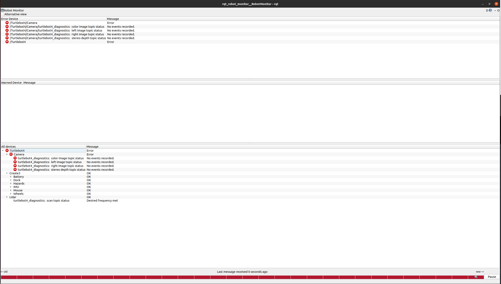
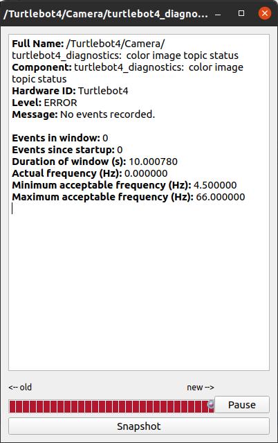

# Diagnostics

The TurtleBot 4 and TurtleBot 4 both run diagnostics updater and aggregator nodes by default. The updater records diagnostics data and the aggregator formats it so that it can be used with `rqt_robot_monitor`. This is a tool that can be used to monitor various robot topics to ensure that they are publishing data at the expected frequency.

To check that diagnostics are running properly, call

```bash
ros2 node list
```

You should see a node called `turtlebot4_diagnostics`. Additionally, calling

```bash
ros2 topic list
```
should list topics such as `/diagnostics`, `/diagnostics_agg`, and `/diagnostics_toplevel_state`. If diagnostics are not running, you can manually run them by calling 

```bash 
ros2 launch turtlebot4_diagnostics diagnostics.launch.py
``` 

Once diagnostics are running, you can view them with `rqt_robot_monitor`. Ensure that [turtlebot4_desktop](../software/turtlebot4_packages.md#installation-2) is installed on your PC, then call 

```bash
ros2 launch turtlebot4_viz view_diagnostics.launch.py
```

<figure class="aligncenter">
    
    <figcaption>rqt_robot_monitor with TurtleBot 4 diagnostics</figcaption>
</figure>

The monitor will display any errors in the first window, any warnings in the second window, and a summary of all topics in the "All devices" section at the bottom. Each topic has a status level of OK, WARNING, ERROR, or STALE. There is also a more detailed message included as well. You can click on each topic to view more information. 

In this example, the OAK-D node is not running, so the camera topics are not being published.

<figure class="aligncenter">
    
    <figcaption>Color camera diagnostics</figcaption>
</figure>