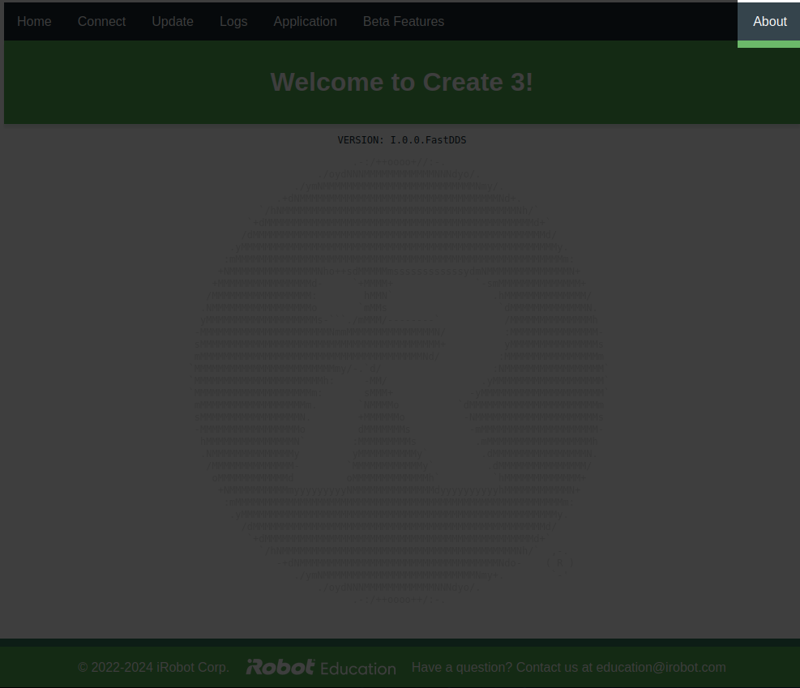
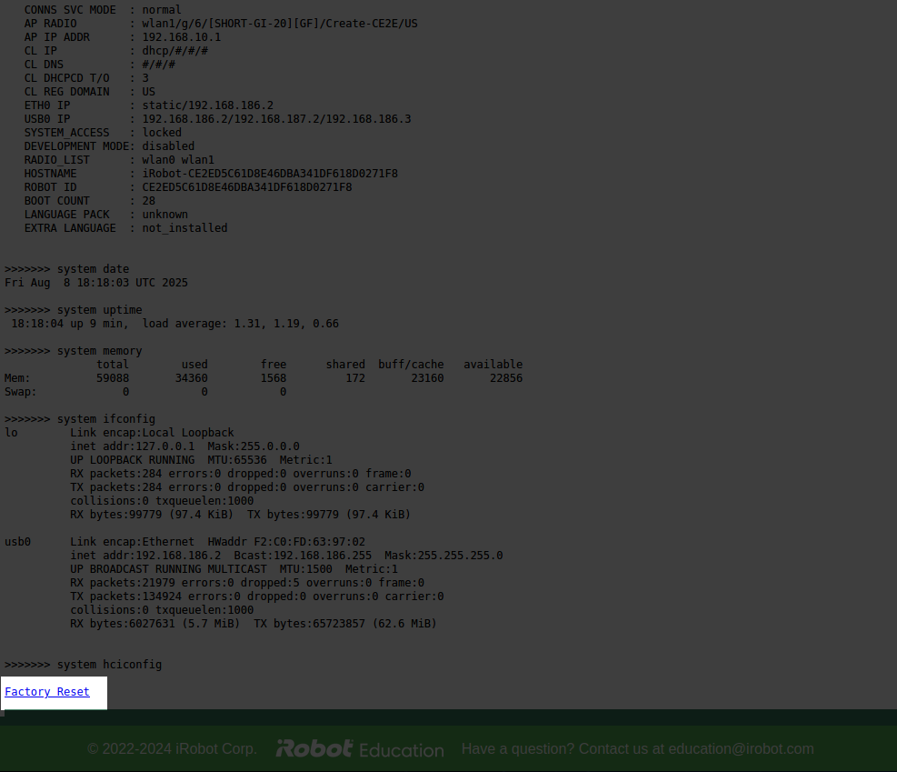

# Factory Reset

Performing a full reset of your TurtleBot 4 is a two-step process:
1. the Create® 3 must be reset, and
2. the Raspberry Pi's SD card must be reset.

## Resetting the Create® 3

To reset the Create® 3 to factory settings, [first open the Create® 3 webserver](../setup/basic.md#accessing-the-create-3-webserver).
Click on the `About` tab in the upper right corner.

<figure class="aligncenter">
    
    <figcaption>Click on the About tab in the upper right corner</figcaption>
</figure>

```note
If you are unable to access the Create® 3 webserver on port `8080` of the TurtleBot 4's Raspberry Pi you may need to put your Create® 3 into Access Point mode and connect to it directly. Press and hold buttons 1 and 2 on the Create® 3 until the light ring shows a spinning blue light.

Once the Create® 3 is in Access Point mode, connect your laptop to the Create® 3's wifi network and navigate to http://192.168.10.1 to access the Create® 3 web server.
```

Scroll to the very bottom of the `About` screen. There you will find a hyperlink marked `Factory Reset`. Click this hyperlink to perform a factory reset of the Create® 3.

<figure class="aligncenter">
    
    <figcaption>Click on the Factory Reset link to reset the Create® 3</figcaption>
</figure>

The Create® 3 factory reset link will reset all user configurations, but will not reinstall the firmware. ROS namespaces,
domain IDs, custom safety parameters, and any custom networking configurations will all be deleted.

 Resetting the Raspberry Pi

To reset the Raspberry Pi, [reinstall the SD card image](../setup/basic.md#install-latest-raspberry-pi-image).
This will permanently delete all information on the SD card; make sure you have any essential data backed up.

 After reset

After you have reset your TurtleBot 4, proceed to [connect it to wifi](../setup/basic.md#connect-the-raspberry-pi-to-your-network) and
[pair the controller](../setup/basic.md#turtlebot-4-controller-manual-setup).
