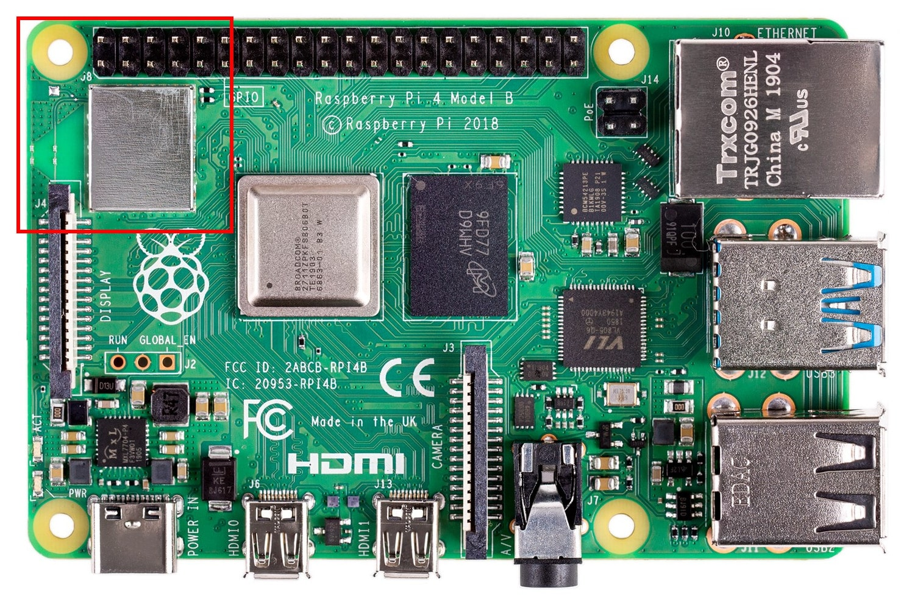
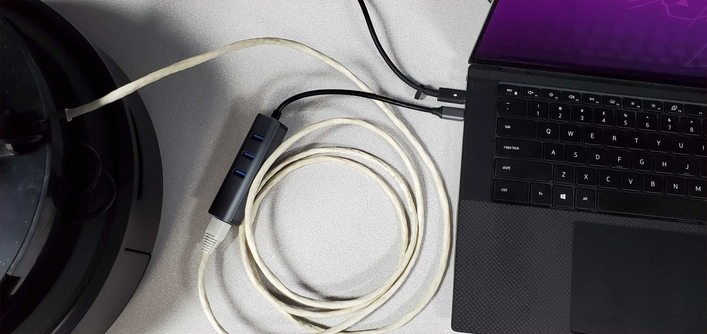

# FAQ

## Common issues with the Raspberry Pi 4B

### 1. Access point is not visible

If your Raspberry Pi is in AP mode, a `Turtlebot4` WiFi network should become visible about 30 seconds after the robot has been powered on. If it does not, try the following.

#### Check that the Raspberry Pi is powered

The Raspberry Pi has a Power LED near the USB-C port. Make sure it is illuminated.

If the LED is not on, then the Raspberry Pi is not powered. Check the USB-C connection and make sure the Create® 3 power adapter board is inserted fully.

#### Check for obstructions

If the Pi is on but you cannot see the access point, make sure that any wires in the robot are not obstructing the WiFi module of the Raspberry Pi. This includes the ribbon cable connecting the RPi to the UI PCBA on the TurtleBot 4, and the wires powering the fans on both models.

<figure class="aligncenter">
    
    <figcaption>Raspberry Pi 4B WiFi module and antenna</figcaption>
</figure>

#### Restart the robot

If the WiFi module is unobstructed, try restarting the robot. Take the robot off of its dock and press and hold the Power button on the Create® 3 until it is off. Wait a few seconds and place the robot back on its dock.

#### Access the RPi over Ethernet

If you are still unable to see the `Turtlebot4` access point, you can connect directly to the RPi using an ethernet cable. You may need a USB to Ethernet adapter for your PC.

<figure class="aligncenter">
    
    <figcaption>Connecting to the TurtleBot 4 over Ethernet</figcaption>
</figure>

The Raspberry Pi uses a static IP address for the ethernet interface, `192.168.185.3`. You will need to configure your wired connection to use the same subnet:

- Go to your wired connection settings.
- Set your IPv4 Method to `Manual` and set your static IP. The IP address cannot be the same as the Raspberry Pi.

<figure class="aligncenter">
    
    <figcaption>Configure your PC's wired IP</figcaption>
</figure>

- Click 'Apply'

You can now go to your terminal and SSH into the robot by typing:

```bash
ssh ubuntu@192.168.185.3
```

### 2. Waiting to connect to bluetoothd...

This issue is usually a result of the bluetooth service being stopped.

To start the service again, run `sudo systemctl start bluetooth`.


### 3. No default controller available

This error occurs if you are attempting to connect a bluetooth device to the Raspberry Pi with `sudo bluetoothctl` and the `hciuart` service throws errors.

To fix this, call `sudo systemctl disable hciuart` and then reboot the Pi with `sudo reboot`.

Once the Pi has restarted, call `sudo systemctl restart hciuart`. Now you can run `sudo bluetoothctl` again and the bluetooth controller should be found.

## Common issues with the user PC

### 1. ros2: command not found




Make sure you have sourced ROS 2 Galactic:

```bash
source /opt/ros/galactic/setup.bash
```




Make sure you have sourced ROS 2 Humble:

```bash
source /opt/ros/humble/setup.bash
```




If you are building packages from source, you will also want to source the workspace:

```bash
source /path/to/ws/install/setup.bash
```

### 2. Create® 3 topics are not visible

First, check that the Create® 3 is connected to your WiFi network. You should be able to access the Create® 3 portal by entering the Create® 3 IP address in a browser. For information on how to connect the Create® 3 to WiFi, check the [Wi-Fi Setup Guide](../setup/simple_discovery.md#wi-fi-setup).

If it is connected to WiFi, check if you can see Create® 3 topics on the Raspberry Pi.

If topics are visible on the Raspberry Pi, ensure that your PC has the following configuration set for CycloneDDS:

```xml
<CycloneDDS>
    <Domain>
        <General>
            <DontRoute>true</DontRoute>
        </General>
    </Domain>
</CycloneDDS> 
```

To set this configuration automatically, add the following line to your `~/.bashrc` file.

```bash
export CYCLONEDDS_URI='<CycloneDDS><Domain><General><DontRoute>true</></></></>'
```

If you have set a `ROS_DOMAIN_ID` for the Create® 3, your terminal will have to have the same ID. You can set the ID by using this command:

```bash
export ROS_DOMAIN_ID=#
```

Replace `#` with the ID.

If topics are not visible on the Raspberry Pi, you may need to restart the Create® 3 application through the portal, or reboot the robot.

## Replacement Components for the Create® 3

The Turtlebot4 is built ontop of the Create® 3 platform which has components that can be replaced as they wear. These components can be purchased directly from iRobot at the following links.

[Lithium Ion Battery](https://www.irobot.com/en_US/roomba-accessories/4624864.html)

<figure class="aligncenter">
    
</figure>

[Wheel Modules](https://www.irobot.com/en_US/roomba-wheel-module-bundle-compatible-with-the-i%2C-e%2C-and-j-series./4624872_4624873.html)

<figure class="aligncenter">
    
</figure>

[Left Wheel Module](https://www.irobot.com/en_US/roomba-left-wheel-module/4624872.html)

<figure class="aligncenter">
    
</figure>

[Right Wheel Module](https://www.irobot.com/en_US/roomba-right-wheel-module/4624873.html)

<figure class="aligncenter">
    
</figure>