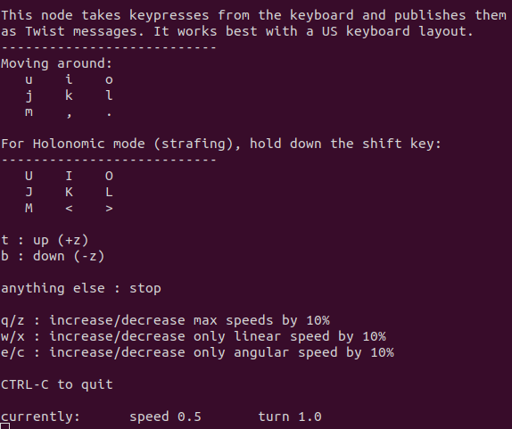

# Driving your TurtleBot 4

There are several methods to get your TurtleBot 4 moving.

```note
The robot must first be set up and connected to Wi-Fi before it can be driven. Check out the [Setup](../setup/basic.md) section if you have not already.
```

## Keyboard Teleoperation

The simplest way to get your robot driving is to use a keyboard application on your PC.

```note
In order to control the Turtlebot 4 while running the application on your pc, you must set up the [networking](../setup/networking.md) between your robot and your pc, so that they can communicate over ros topics.
```




You can install the `teleop_twist_keyboard` package on your PC by running the following commands:

```bash
sudo apt update
sudo apt install ros-galactic-teleop-twist-keyboard
```

Once installed, run the node by calling:

```bash
source /opt/ros/galactic/setup.bash
ros2 run teleop_twist_keyboard teleop_twist_keyboard
```




You can install the `teleop_twist_keyboard` package on your PC by running the following commands:

```bash
sudo apt update
sudo apt install ros-humble-teleop-twist-keyboard
```

Once installed, run the node by calling:

```bash
source /opt/ros/humble/setup.bash
ros2 run teleop_twist_keyboard teleop_twist_keyboard
```




This will start a CLI interface which allows you to press keys to command the robot to drive.

<figure class="aligncenter">
    
    <figcaption>teleop_twist_keyboard CLI</figcaption>
</figure>

Press **i** to drive forward, **j** to rotate left, and so on. You can also adjust linear and angular speeds on the go.

## Joystick Teleoperation

If you have a TurtleBot 4 controller or have your own Bluetooth controller, you can drive the robot with it.

First, make sure that your controller is paired and connects to the robot. If you have a TurtleBot 4 controller, press the home button and check that the controller's light turns blue. If your controller is not paired or connecting, refer to the [Controller Setup](../setup/basic.md#turtlebot-4-controller-setup) section.

```note
If you are using a TurtleBot 4 Lite with ROS 2 Galactic, the Bluetooth packages will not be installed by default. To install them, SSH into the Raspberry Pi and call `sudo bluetooth.sh` and then reboot the Pi. Then follow the Controller Setup instructions.
```

Once your controller is connected, make sure that the `joy_teleop` nodes are running. These are launched as part of the Standard and Lite launch files under `turtlebot4_bringup`. If it is not running, you can run it manually by calling:

```bash
ros2 launch turtlebot4_bringup joy_teleop.launch.py
```

```note
The default configuration for the joy_teleop nodes will only work for the TurtleBot 4 controller and PS4 controllers. You may need to create your own [config](https://github.com/turtlebot/turtlebot4_robot/blob/galactic/turtlebot4_bringup/config/turtlebot4_controller.config.yaml) file if the button mappings on your controller differ.
```

To drive the robot, press and hold either **L1** or **R1**, and move the left joystick. By default, **L1** will drive the robot at 'normal' speeds, and **R1** will drive the robot at 'turbo' speeds. The buttons can be changed in the configuration file.

## Command Velocity

Both the keyboard and joystick teleop methods work by sending velocity commands the the robot through the `/cmd_vel` topic. This topic uses a [geometry_msgs/Twist](https://docs.ros2.org/galactic/api/geometry_msgs/msg/Twist.html) message to tell the robot what linear and angular velocities should be applied.

You can manually publish to this topic through the command line by calling:

```bash
ros2 topic pub /cmd_vel geometry_msgs/msg/Twist \
"linear:
  x: 0.0
  y: 0.0
  z: 0.0
angular:
  x: 0.0
  y: 0.0
  z: 0.0"
```

Set the `linear.x` value to drive the robot forwards or backwards, and the `angular.z` value to rotate left or right.

## Create® 3 Actions

The Create® 3 provides a set of [ROS 2 Actions](https://docs.ros.org/en/galactic/Tutorials/Beginner-CLI-Tools/Understanding-ROS2-Actions/Understanding-ROS2-Actions.html) for driving the robot. You can use the [DriveDistance](https://github.com/iRobotEducation/irobot_create_msgs/blob/main/action/DriveDistance.action), [DriveArc](https://github.com/iRobotEducation/irobot_create_msgs/blob/main/action/DriveArc.action), and [RotateAngle](https://github.com/iRobotEducation/irobot_create_msgs/blob/main/action/RotateAngle.action) actions to tell the robot exactly how far and how fast to drive or rotate.

For example, command the robot to drive 0.5 m forwards at 0.3 m/s:

```bash
ros2 action send_goal /drive_distance irobot_create_msgs/action/DriveDistance \
"distance: 0.5
max_translation_speed: 0.3"
```

