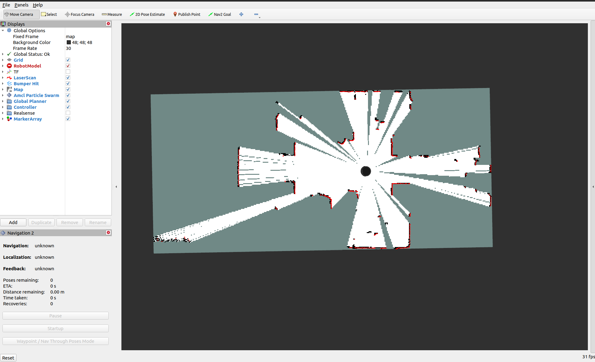
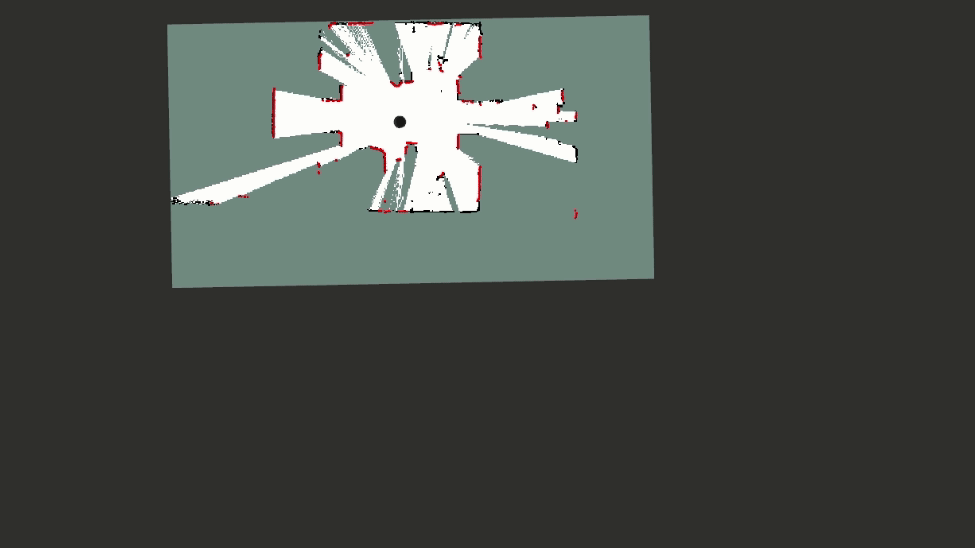
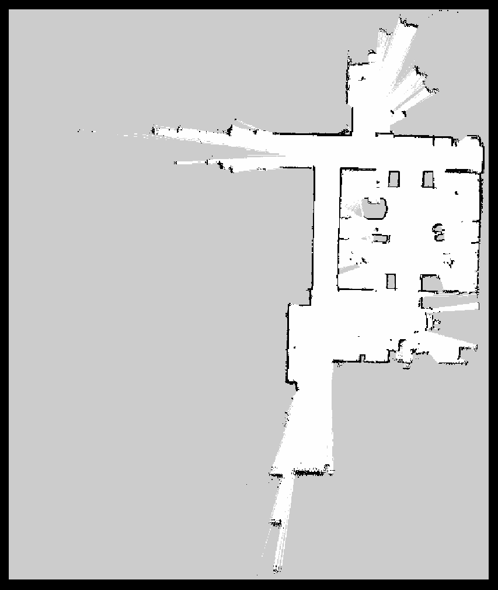

# Generating a map

In this tutorial we will be mapping an area by driving the TurtleBot 4 around and using SLAM. Start by making sure that the area you will be mapping is clear of unwanted obstacles. Ideally, you don't want people or animals moving around the area while creating the map.

## Launch SLAM

```note
Remember to always source your ROS 2 environment before trying to launch a node.
```



```warning
**ROS 2 Galactic is no longer supported.** Please consider upgrading to a newer release
```

First, install `turtlebot4_navigation`:

```bash
sudo apt install ros-galactic-turtlebot4-navigation
```

Then run SLAM. It is recommended to run synchronous SLAM on a remote PC to get a higher resolution map.

```bash
ros2 launch turtlebot4_navigation slam_sync.launch.py
```

Asynchronous SLAM can be used as well.

```bash
ros2 launch turtlebot4_navigation slam_async.launch.py
```




First, install `turtlebot4_navigation`:

```bash
sudo apt install ros-humble-turtlebot4-navigation
```

Then run SLAM. It is recommended to run synchronous SLAM on a remote PC to get a higher resolution map.

```bash
ros2 launch turtlebot4_navigation slam.launch.py
```

Asynchronous SLAM can be used as well.

```bash
ros2 launch turtlebot4_navigation slam.launch.py sync:=false
```

To change map resolution or other SLAM parameters, copy the [default config](https://github.com/turtlebot/turtlebot4/blob/humble/turtlebot4_navigation/config/slam.yaml) and modify it. Then, pass the parameters in as a launch argument.

```bash
ros2 launch turtlebot4_navigation slam.launch.py params:=/full/path/to/slam.yaml
```





## Launch Rviz2

To visualise the map, launch Rviz2 with the `view_robot` launch file on the user computer. This requires a desktop version of Ubuntu with a display and therefore cannot be run on the robot itself.

```bash
ros2 launch turtlebot4_viz view_robot.launch.py
```

<figure class="aligncenter">
    
    <figcaption>Rviz2 showing a map generate by SLAM</figcaption>
</figure>

## Drive the TurtleBot 4

Use any method to drive the robot around the area you wish to map. Check out the [driving](./driving.md) tutorial if you are unsure of how to drive the robot.

Keep watch of RVIZ as you drive the robot around the area to make sure that the map gets filled out properly.

<figure class="aligncenter">
    
    <figcaption>Generating a map by driving the TurtleBot 4</figcaption>
</figure>

## Save the map

Once you are happy with your map, you can save it with the following command:


```bash
ros2 service call /slam_toolbox/save_map slam_toolbox/srv/SaveMap "name:
  data: 'map_name'"
```

<!-- TODO: Change the instructions below when this works - aka when slam-toolbox 2.7.2 is released: If you are using namespacing, you will have to add the namespace to the service topic for example `/robot1/slam_toolbox/save_map`. -->

```note
If you are using namespacing, you will need to call the map saver tool directly: `ros2 run nav2_map_server map_saver_cli -f "map_name" --ros-args -p map_subscribe_transient_local:=true -r __ns:=/namespace`
```

This will save the map to your current directory.

## View the map

Once the map is saved it will generate a `map_name.pgm` file which can be viewed in an image editor. A `map_name.yaml` file is also created. You can edit this file to adjust the map parameters.

<figure class="aligncenter">
    
    <figcaption>Generated map image</figcaption>
</figure>
