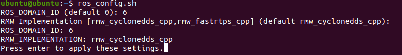
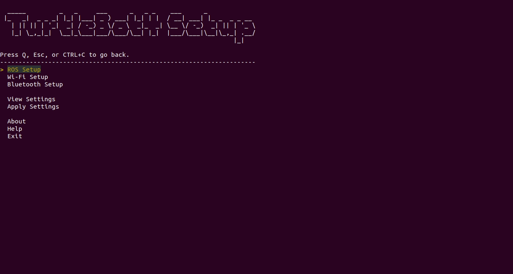
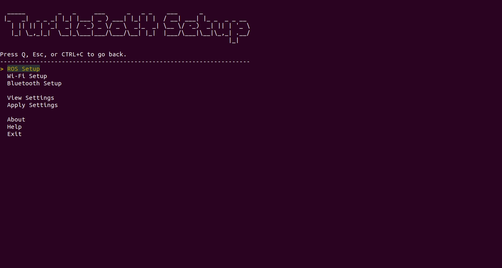

# Multiple robots

By default, each TurtleBot 4 will use the same [topic, action, and service names](../software/turtlebot4_common.md#ros-2-interfaces) for communication. If we connect two default TurtleBot 4's to the same network, the topics from both robots will communicate with each other and cause unwanted behaviours.

This tutorial will cover the two main methods for running multiple TurtleBot 4's on a single network.

## ROS_DOMAIN_ID

The **ROS_DOMAIN_ID** is an environment variable used in ROS 2 to change the ports that ROS 2 processes use for communication. This effectively allows us to separate different ROS 2 processes from communicating with each other on the same network. For a detailed explanation, click [here](https://docs.ros.org/en/galactic/Concepts/About-Domain-ID.html).

We can leverage this by assigning a unique **ROS_DOMAIN_ID** to each of our robots. This will ensure that communication between robots does not occur. The **ROS_DOMAIN_ID** can be set to any value between 0 and 101, inclusively.

### Setting the environment variable

There are four locations in which the **ROS_DOMAIN_ID** environment variable must be set:
 - Create® 3
 - RPi4 Terminal
 - RPi4 Robot Upstart Job
 - User PC




> :warning: **ROS 2 Galactic is no longer supported** Please consider upgrading to a newer release

For RPi4 images v0.1.3 or higher, a script `ros_config.sh` has been installed which will conveniently set the **ROS_DOMAIN_ID** in the first 3 locations. If you are using an earlier version, you can copy the [script](https://github.com/turtlebot/turtlebot4_setup/blob/galactic/scripts/ros_config.sh) to `/usr/local/bin/` on your RPi4. You will also need to update your `install.py` script by downloading it from [here](https://github.com/turtlebot/turtlebot4_setup/blob/galactic/scripts/install.py) and replacing the existing script in `/usr/local/bin`.

Simply call `ros_config.sh` on your RPi4 and follow the instructions. Note that this script can also be used to switch between `fastrtps` and `cyclonedds` middlewares.

<figure class="aligncenter">
    
    <figcaption>Using the ros_config.sh script</figcaption>
</figure>

Once the settings are confirmed, the script will apply the changes to the Create® 3 and restart the Create® application. This may take about a minute or so. The script will also uninstall the TurtleBot 4 Robot Upstart job, and reinstall it with the new settings. Finally, it will add the **ROS_DOMAIN_ID** to the `~/.bashrc` file of the RPi4. To apply the change to your current RPi4 terminal you will need to call `source ~/.bashrc`.

**Create® 3**

To manually set the **ROS_DOMAIN_ID** of the Create® 3, go to the [webserver](../setup/basic.md#accessing-the-create-3-webserver). Navigate to Application->Configuration. Set the Domain ID and click 'Save'. Then restart the application.

**RPi4 Terminal**

To manually set the **ROS_DOMAIN_ID** on the RPi4 terminal, simply call `export ROS_DOMAIN_ID=#`, replacing `#` with your ID number. Note that this will only be applied in your current terminal. To apply this environment variable to all new terminals, add this line to your `~/.bashrc` file.

**RPi4 Robot Upstart Job**

To change the **ROS_DOMAIN_ID** of the TurtleBot 4 Robot Upstart job, you will need to reinstall the job.

First, stop the `turtlebot4` service:

```bash
sudo systemctl stop turtlebot4.service
```

Then, uninstall it:

```bash
uninstall.py
```

Now you can install it again:

**v0.1.3 or higher**

```bash
install.py <model> --domain #
```

**v0.1.2**

```bash
install.py <model> #
```

```note
Replace <model> with your TurtleBot 4 model (standard or lite) and # with your ROS_DOMAIN_ID
```

**User PC**

The **ROS_DOMAIN_ID** can be set on the User PC in the same way as the RPi4 Terminal (described above).




SSH into your TurtleBot 4 and run the turtlebot4 setup tool:

```bash
turtlebot4-setup
```

Navigate to 'Bash Setup' in the 'ROS Setup' menu, then change your `ROS_DOMAIN_ID`. Save the settings, then apply settings in the main menu.

<figure class="aligncenter">
    
    <figcaption>Setting the ROS_DOMAIN_ID</figcaption>
</figure>

This will apply the new `ROS_DOMAIN_ID` to the Create® 3, RPi4 Terminal, and RPi4 Robot Upstart job.

On the user PC, set the `ROS_DOMAIN_ID` in your *setup.bash* file and source it. See [Installing ROS 2](../setup/basic.md#installing-ros-2) for more details.




Once the Create® 3 application has restarted, try calling `ros2 topic list` on both your PC and the RPi4 to ensure that all topics are visible.


## Namespacing

Namespacing is a method of adding a prefix to topic names to group certain topics, or to make them unique.
By namespacing all topics on a TurtleBot 4, we can have a full set of unique topics for that robot. This allows
us to run multiple robots on the same `ROS_DOMAIN_ID`.

It is common to use the name of the robot as the namespace. For example,
if we have a robot named `robot1`, the namespaced topics would look like:

```bash
ubuntu@ubuntu:~$ ros2 topic list
/parameter_events
/robot1/battery_state
/robot1/cmd_audio
/robot1/cmd_lightring
/robot1/cmd_vel
/robot1/diagnostics
/robot1/dock_status
/robot1/function_calls
/robot1/hazard_detection
/robot1/imu
/robot1/interface_buttons
/robot1/ip
/robot1/ir_intensity
/robot1/ir_opcode
/robot1/joint_states
/robot1/joy
/robot1/joy/set_feedback
/robot1/kidnap_status
/robot1/mobility_monitor/transition_event
/robot1/mouse
/robot1/odom
/robot1/robot_description
/robot1/robot_state/transition_event
/robot1/scan
/robot1/slip_status
/robot1/static_transform/transition_event
/robot1/stop_status
/robot1/tf
/robot1/tf_static
/robot1/wheel_status
/robot1/wheel_ticks
/robot1/wheel_vels
/rosout
```




> :warning: **ROS 2 Galactic is no longer supported** Please consider upgrading to a newer release

Namespacing is not supported in Galactic.




To set the robot namespace, SSH into your TurtleBot 4 and run the turtlebot4 setup tool:

```bash
turtlebot4-setup
```

Navigate to 'Bash Setup' in the 'ROS Setup' menu, then change the `ROBOT_NAMESPACE` setting.
Save the settings, then apply settings in the main menu.

<figure class="aligncenter">
    
    <figcaption>Setting the robot namespace</figcaption>
</figure>

This will apply the new namespace to the Create® 3, RPi4 Terminal, and RPi4 Robot Upstart job.

### Viewing the Robot in RViz

On the user PC, `turtlebot4_desktop` launch files can use a `namespace` argument to view a specific robot:

```bash
ros2 launch turtlebot4_viz view_model.launch.py namespace:=/robot1
```

### Launching Robots in Simulation

The first robot can be launched normally, with the addition of a `namespace`. All other parameters are still available as shown below:

```bash
ros2 launch turtlebot4_ignition_bringup turtlebot4_ignition.launch.py namespace:=/robot1 nav2:=true slam:=false localization:=true rviz:=true
```

Any additional robots must be launched using the `turtlebot4_spawn` launch file, a unique `namespace` and a unique spawn location:

```bash
ros2 launch turtlebot4_ignition_bringup turtlebot4_spawn.launch.py namespace:=/robot2 x:=0.0 y:=1.0 nav2:=true slam:=false localization:=true rviz:=true
```

```note
Not all functionality is currently fully supported in multi-robot simulation.
```

### Launching Navigation

The SLAM, Localization and Nav2 launch files all support namespacing and can be launched as follows:

```bash
ros2 launch turtlebot4_navigation slam.launch.py namespace:=/robot1
ros2 launch turtlebot4_navigation localization.launch.py map:=office.yaml namespace:=/robot1
ros2 launch turtlebot4_navigation nav2.launch.py namespace:=/robot1
```

Replace `robot1` with the desired robot namespace.


