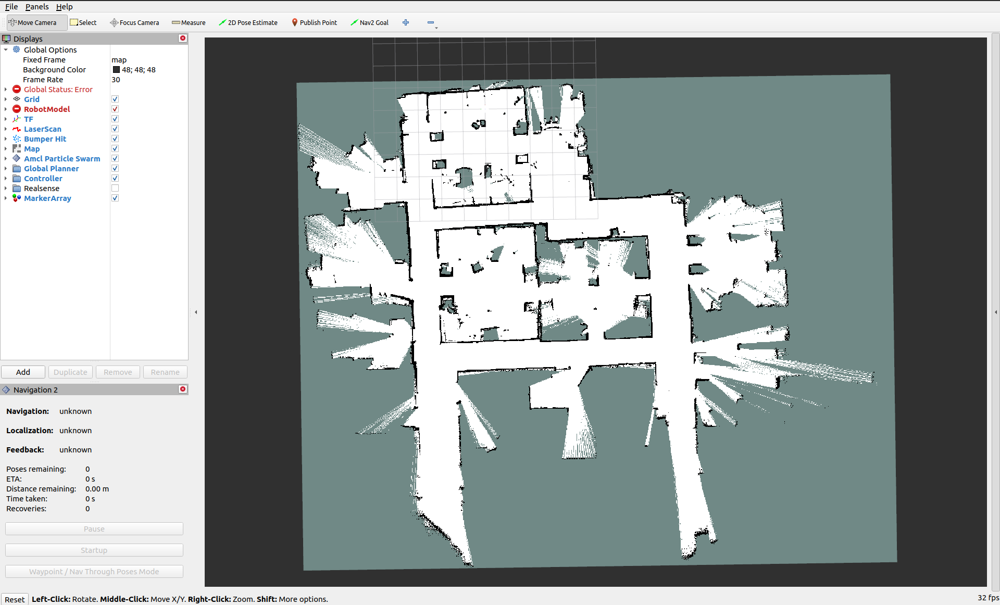
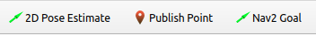
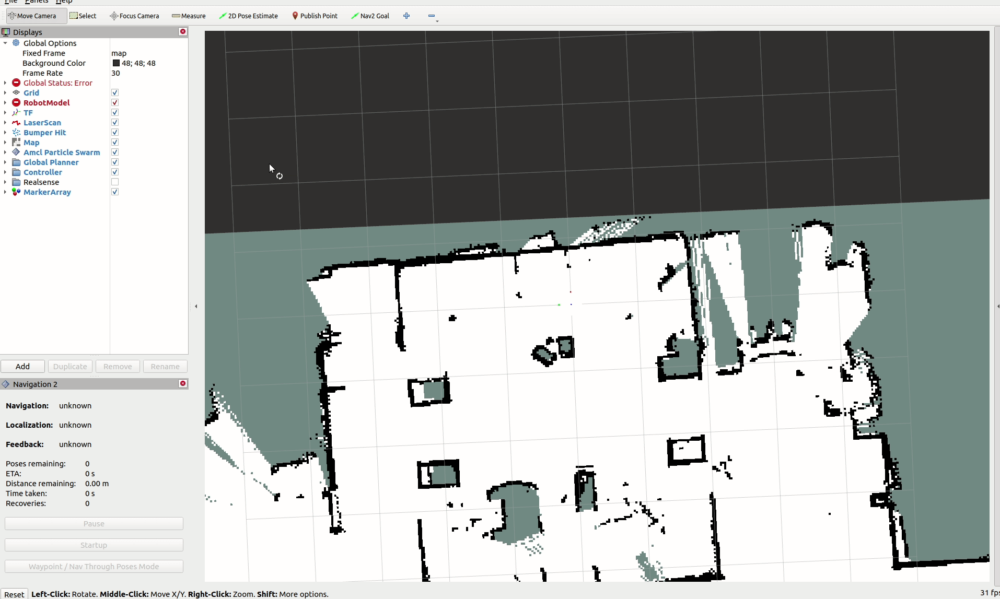

# Navigation

This tutorial will cover various methods of navigating with the TurtleBot 4 and Nav2.

## SLAM vs Localization

There are two localization methods we can use to figure out where the robot is on the map: SLAM or Localization. SLAM allows us to generate the map as we navigate, while localization requires that a map already exists.

### SLAM

SLAM is useful for generating a new map, or navigating in unknown or dynamic environments. It updates the map as it detects and changes, but cannot see areas of the environment that it has not discovered yet. 

### Localization

Localization uses an existing map along with live odometry and laserscan data to figure out the position of the robot on the given map. It does not update the map if any changes have been made to the environment, but we can still avoid new obstacles when navigating. Because the map doesn't change, we can get more repeatable navigation results.

For this tutorial, we will be using localization to navigate on a map [generated with SLAM](generate_map.md#generating-a-map).

## Nav2

The TurtleBot 4 uses the [Nav2](https://navigation.ros.org/) stack for navigation.

```note
Remember to always source your ROS 2 environment before trying to launch a node.
```

### Launching navigation




For this tutorial we can launch navigation with [Nav Bringup](https://github.com/turtlebot/turtlebot4/blob/galactic/turtlebot4_navigation/launch/nav_bringup.launch.py).

**On a physical TurtleBot 4, call:**

```bash
ros2 launch turtlebot4_navigation nav_bringup.launch.py slam:=off localization:=true map:=office.yaml
```

Replace `office.yaml` with your own map.

**If you are using the simulator, call:**

```bash
ros2 launch turtlebot4_ignition_bringup ignition.launch.py nav2:=true slam:=off localization:=true
```

This will launch the simulation in the default `depot` world and will use the existing `depot.yaml` file for the map. If you are using a custom world you will need to build the [turtlebot4_simulator package](../software/turtlebot4_simulator.md#source-installation) from source and place your world file [alongside the others](https://github.com/turtlebot/turtlebot4_simulator/tree/galactic/turtlebot4_ignition_bringup/worlds). You will then need to create a map for it and pass both the world name and the map file path in as launch arguments.

For example:
```bash
ros2 launch turtlebot4_ignition_bringup ignition.launch.py nav2:=true slam:=off localization:=true world:=classroom map:=path/to/classroom.yaml
```




For this tutorial we can launch navigation with the [turtlebot4_navigation](https://github.com/turtlebot/turtlebot4/tree/humble/turtlebot4_navigation) package.

**For a physical TurtleBot 4:**

If you do not have a map of the environment, [generate a map](./generate_map.md) first.  

Open a terminal and launch [localization](https://github.com/turtlebot/turtlebot4/blob/humble/turtlebot4_navigation/launch/localization.launch.py):

```bash
ros2 launch turtlebot4_navigation localization.launch.py map:=office.yaml
```

Replace `office.yaml` with the path to your own map.

Then, in another terminal, launch [nav2](https://github.com/turtlebot/turtlebot4/blob/humble/turtlebot4_navigation/launch/nav2.launch.py):

```bash
ros2 launch turtlebot4_navigation nav2.launch.py
```

```note
If using multiple robots through the namespacing method, an additional `namespace` parameter must be passed to both the Localization and Nav2 launch files. For example: `namespace:=/robot1` See [Multiple robots](./multiple_robots.md) for more details.
```

**If you are using the simulator, call:**

```bash
ros2 launch turtlebot4_ignition_bringup turtlebot4_ignition.launch.py nav2:=true slam:=false localization:=true rviz:=true
```

This will launch the simulation in the default `warehouse` world and will use the existing [`warehouse.yaml`](https://github.com/turtlebot/turtlebot4/blob/humble/turtlebot4_navigation/maps/warehouse.yaml) file for the map.

To launch a different supported world, see the [simulation package](../software/turtlebot4_simulator.md#ignition-bringup) for a list of supported worlds. You must pass the name of the chosen world and the path to the map file.

For example:
```bash
ros2 launch turtlebot4_ignition_bringup turtlebot4_ignition.launch.py nav2:=true slam:=false localization:=true \
rviz:=true world:=depot map:=/opt/ros/humble/share/turtlebot4_navigation/maps/depot.yaml
```

If you are using a custom world you will need to build the [turtlebot4_simulator package](../software/turtlebot4_simulator.md#source-installation) from source and place your world file [alongside the others](https://github.com/turtlebot/turtlebot4_simulator/tree/humble/turtlebot4_ignition_bringup/worlds). You will then need to create a map for it and pass both the world name and the map file path in as launch arguments.

For example:
```bash
ros2 launch turtlebot4_ignition_bringup turtlebot4_ignition.launch.py nav2:=true slam:=false localization:=true \
rviz:=true world:=classroom map:=path/to/classroom.yaml
```




```note
An initial pose is required before navigation can begin.
```

### Interacting with Nav2

If you are using the physical robot: In a new terminal launch Rviz so that you can view the map and interact with navigation:

```bash
ros2 launch turtlebot4_viz view_robot.launch.py
```

```note
If using multiple robots through the namespacing method, an additional `namespace` parameter must be passed. For example: `namespace:=/robot1` See [Multiple robots](./multiple_robots.md) for more details.
```

<figure class="aligncenter">
    
    <figcaption>Office Map shown in Rviz</figcaption>
</figure>

At the top of the Rviz window is the toolbar. You will notice that there are three navigation tools available to you.

<figure class="aligncenter">
    
    <figcaption>Navigation tools in Rviz</figcaption>
</figure>

#### 2D Pose Estimate

The 2D Pose Estimate tool is used in localization to set the approximate initial pose of the robot on the map. This is required for the Nav2 stack to know where to start localizing from. Click on the tool, and then click and drag the arrow on the map to approximate the position and orientation of the robot.

<figure class="aligncenter">
    
    <figcaption>Setting the initial pose</figcaption>
</figure>

#### Publish Point

The Publish Point tool allows you to click on a point on the map, and have the coordinates of that point published to the `/clicked_point` topic.

Open a new terminal and call:

```bash
ros2 topic echo /clicked_point
```

Then, select the Publish Point tool and click on a point on the map. You should see the coordinates published in your terminal.

<figure class="aligncenter">
    
    <figcaption>Getting a point coordinate</figcaption>
</figure>


#### Nav2 Goal

The Nav2 Goal tool allows you to set a goal pose for the robot. The Nav2 stack will then plan a path to the goal pose and attempt to drive the robot there. Make sure to set the initial pose of the robot before you set a goal pose.

<figure class="aligncenter">
    
    <figcaption>Driving the TurtleBot4 with a Nav2 Goal</figcaption>
</figure>