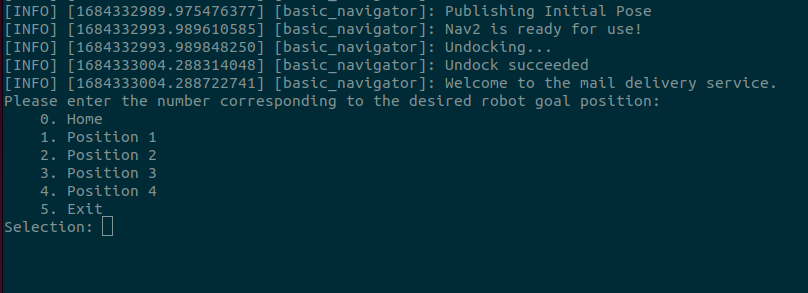

# TurtleBot 4 Navigator



```warning
**ROS 2 Galactic is no longer supported.** Please consider upgrading to a newer release
```

The [TurtleBot 4 Navigator](https://github.com/turtlebot/turtlebot4/blob/galactic/turtlebot4_navigation/turtlebot4_navigation/turtlebot4_navigator.py) is a Python node that adds on to the [Nav2 Simple Commander](https://github.com/ros-planning/navigation2/blob/galactic/nav2_simple_commander/nav2_simple_commander/robot_navigator.py). It includes TurtleBot 4 specific features such as docking and undocking, as well as easy to use methods for navigating.




The [TurtleBot 4 Navigator](https://github.com/turtlebot/turtlebot4/blob/humble/turtlebot4_navigation/turtlebot4_navigation/turtlebot4_navigator.py) is a Python node that adds on to the [Nav2 Simple Commander](https://github.com/ros-planning/navigation2/blob/humble/nav2_simple_commander/nav2_simple_commander/robot_navigator.py). It includes TurtleBot 4 specific features such as docking and undocking, as well as easy to use methods for navigating.




```note
TurtleBot 4 Navigator requires at least version 1.0.11 of Nav2 Simple Commander
```

## Install Tutorial Package

The following examples can be installed with `sudo apt install ros-$ROS_DISTRO-turtlebot4-tutorials` and are available at <https://github.com/turtlebot/turtlebot4_tutorials>. For each example, the robot starts on a dock at the origin of the map.

```note
All of these examples are designed to be run in the simulation environment. In order to run these tutorial codes with a physical robot you must install the tutorial package from source and modify target destinations to ones that make sense in your map. You then must individually launch SLAM, Nav2, Localization, and RViz as necessary and pass a map of your environment when launching localization. This is only recommended for intermediate users and up because there are no walkthrough instructions.
```

## Navigate to Pose

This example demonstrates the same behaviour as [Nav2 Goal](./navigation.md/#nav2-goal). The Nav2 stack is given a pose on the map with which it calculates a path. The robot then attempts to drive along the path. This example is demonstrated in the `depot` world of the TurtleBot 4 simulation.



```warning
**ROS 2 Galactic is no longer supported.** Please consider upgrading to a newer release
```

To run this example, start the Ignition Gazebo simulation:

```bash
ros2 launch turtlebot4_ignition_bringup ignition.launch.py nav:=true slam:=off localization:=true
```

Once the simulation has started, ensure to press the "Play" button on Gazebo to start the simulation.

Next, open another terminal and run:

```bash
ros2 run turtlebot4_python_tutorials nav_to_pose
```




To run this example, start the Ignition Gazebo simulation:

```bash
ros2 launch turtlebot4_ignition_bringup turtlebot4_ignition.launch.py nav2:=true slam:=false localization:=true rviz:=true
```

Once the simulation has started, ensure to press the "Play" button on Gazebo to start the simulation.

Next, open another terminal and run:

```bash
ros2 run turtlebot4_python_tutorials nav_to_pose
```




### Code breakdown




```warning
**ROS 2 Galactic is no longer supported.** Please consider upgrading to a newer release
```

The source code for this example is available [here](https://github.com/turtlebot/turtlebot4_tutorials/blob/galactic/turtlebot4_python_tutorials/turtlebot4_python_tutorials/nav_to_pose.py).


Let's take a look at the main function.

```py
def main():
    rclpy.init()

    navigator = TurtleBot4Navigator()

    # Start on dock
    if not navigator.getDockedStatus():
        navigator.info('Docking before initialising pose')
        navigator.dock()

    # Set initial pose
    initial_pose = navigator.getPoseStamped([0.0, 0.0], TurtleBot4Directions.NORTH)
    navigator.setInitialPose(initial_pose)

    # Wait for Nav2
    navigator.waitUntilNav2Active()

    # Set goal poses
    goal_pose = navigator.getPoseStamped([13.0, 5.0], TurtleBot4Directions.EAST)

    # Undock
    navigator.undock()

    # Go to each goal pose
    navigator.startToPose(goal_pose)

    rclpy.shutdown()
```





The source code for this example is available [here](https://github.com/turtlebot/turtlebot4_tutorials/blob/humble/turtlebot4_python_tutorials/turtlebot4_python_tutorials/nav_to_pose.py).


Let's take a look at the main function.

```py
def main():
    rclpy.init()

    navigator = TurtleBot4Navigator()

    # Start on dock
    if not navigator.getDockedStatus():
        navigator.info('Docking before initialising pose')
        navigator.dock()

    # Set initial pose
    initial_pose = navigator.getPoseStamped([0.0, 0.0], TurtleBot4Directions.NORTH)
    navigator.setInitialPose(initial_pose)

    # Wait for Nav2
    navigator.waitUntilNav2Active()

    # Set goal poses
    goal_pose = navigator.getPoseStamped([-13.0, 9.0], TurtleBot4Directions.EAST)

    # Undock
    navigator.undock()

    # Go to each goal pose
    navigator.startToPose(goal_pose)

    rclpy.shutdown()
```





#### Initialise the node

We start by initialising `rclpy` and creating the `TurtleBot4Navigator` object. This will initialise any ROS 2 publishers, subscribers and action clients that we need.

```py
rclpy.init()

navigator = TurtleBot4Navigator()
```

#### Dock the robot

Next, we check if the robot is docked. If it is not, we send an action goal to dock the robot. By docking the robot we guarantee that it is at the [0.0, 0.0] coordinates on the map.

```py
if not navigator.getDockedStatus():
    navigator.info('Docking before initialising pose')
    navigator.dock()
```

#### Set the initial pose

Now that we know the robot is docked, we can set the initial pose to [0.0, 0.0], facing "North".

```py
initial_pose = navigator.getPoseStamped([0.0, 0.0], TurtleBot4Directions.NORTH)
navigator.setInitialPose(initial_pose)
```

The TurtleBot 4 Navigator uses cardinal directions to set the orientation of the robot relative to the map. You can use actual integers or floating points if you need a more precise direction.

```py
class TurtleBot4Directions(IntEnum):
    NORTH = 0
    NORTH_WEST = 45
    WEST = 90
    SOUTH_WEST = 135
    SOUTH = 180
    SOUTH_EAST = 225
    EAST = 270
    NORTH_EAST = 315
```

```note
These cardinal directions are relative to the map, not the actual magnetic north pole. Driving north is equivalent to driving upwards on the map, west is driving left, and so on.
```

#### Wait for Nav2

Once the initial position has been set, the Nav2 stack will place the robot at that position on the map and begin localizing. We want to wait for Nav2 to be ready before we start sending navigation goals.

```py
navigator.waitUntilNav2Active()
```

```note
This call will block until Nav2 is ready. Make sure you have launched Nav2.
```

#### Set the goal pose



```warning
**ROS 2 Galactic is no longer supported.** Please consider upgrading to a newer release
```

Now we can create a [geometry_msgs/PoseStamped](https://github.com/ros2/common_interfaces/blob/galactic/geometry_msgs/msg/PoseStamped.msg) message. The `getPoseStamped` method makes it easy for us. All we have to do is pass in a list describing the x and y position that we want to drive to on the map, and the direction that we want the robot to be facing when it reaches that point.

```py
goal_pose = navigator.getPoseStamped([13.0, 5.0], TurtleBot4Directions.EAST)
```




Now we can create a [geometry_msgs/PoseStamped](https://github.com/ros2/common_interfaces/blob/humble/geometry_msgs/msg/PoseStamped.msg) message. The `getPoseStamped` method makes it easy for us. All we have to do is pass in a list describing the x and y position that we want to drive to on the map, and the direction that we want the robot to be facing when it reaches that point.

```py
goal_pose = navigator.getPoseStamped([-13.0, 9.0], TurtleBot4Directions.EAST)
```




#### Undock the robot and go to the goal pose

We are ready to drive to the goal pose. We start by undocking the robot so that it does not attempt to drive through the dock, and then send the goal pose. As the robot drives to the goal pose, we will be receiving feedback from the action. This feedback includes the estimated time of arrival.

```py
navigator.undock()

navigator.startToPose(goal_pose)
```

Once the robot has reached the goal, we call `rclpy.shutdown()` to gracefully destroy the rclpy context.

### Watch navigation progress in Rviz

You can visualise the navigation process in Rviz. If Rviz wasn't already launched, launch it by calling:

```bash
ros2 launch turtlebot4_viz view_robot.launch.py
```



```warning
**ROS 2 Galactic is no longer supported.** Please consider upgrading to a newer release
```

<figure class="aligncenter">
    
    <figcaption>Navigate to a pose</figcaption>
</figure>




<figure class="aligncenter">
    <video style="width: 100%" controls autoplay muted>
    <source src="media/nav_to_pose_rviz_humble.mp4" type="video/mp4">
    Your browser does not support the video tag.
    </video>
    <figcaption>Navigate to a pose (3x speed)</figcaption>
</figure>




## Navigate Through Poses



```warning
**ROS 2 Galactic is no longer supported.** Please consider upgrading to a newer release
```

This example demonstrates the [Navigate Through Poses](https://docs.nav2.org/behavior_trees/trees/nav_through_poses_recovery.html) behaviour tree. The Nav2 stack is given a set of poses on the map and creates a path that goes through each pose in order until the last pose is reached. The robot then attempts to drive along the path. This example is demonstrated in the `depot` world of the TurtleBot 4 simulation.

To run this example, start the Ignition Gazebo simulation:

```bash
ros2 launch turtlebot4_ignition_bringup ignition.launch.py nav:=true slam:=off localization:=true
```

Once the simulation has started, ensure to press the "Play" button on Gazebo to start the simulation.

Next, open another terminal and run:

```bash
ros2 run turtlebot4_python_tutorials nav_through_poses
```




This example demonstrates the [Navigate Through Poses](https://navigation.ros.org/behavior_trees/trees/nav_through_poses_recovery.html) behaviour tree. The Nav2 stack is given a set of poses on the map and creates a path that goes through each pose in order until the last pose is reached. The robot then attempts to drive along the path. This example is demonstrated in the `warehouse` world of the TurtleBot 4 simulation.

To run this example, start the Ignition Gazebo simulation:

```bash
ros2 launch turtlebot4_ignition_bringup turtlebot4_ignition.launch.py nav2:=true slam:=false localization:=true rviz:=true
```

Once the simulation has started, ensure to press the "Play" button on Gazebo to start the simulation.

Next, open another terminal and run:

```bash
ros2 run turtlebot4_python_tutorials nav_through_poses
```




### Code breakdown



```warning
**ROS 2 Galactic is no longer supported.** Please consider upgrading to a newer release
```

The source code for this example is available [here](https://github.com/turtlebot/turtlebot4_tutorials/blob/galactic/turtlebot4_python_tutorials/turtlebot4_python_tutorials/nav_through_poses.py).


Let's take a look at the main function.

```py
def main():
    rclpy.init()

    navigator = TurtleBot4Navigator()

    # Start on dock
    if not navigator.getDockedStatus():
        navigator.info('Docking before initialising pose')
        navigator.dock()

    # Set initial pose
    initial_pose = navigator.getPoseStamped([0.0, 0.0], TurtleBot4Directions.NORTH)
    navigator.setInitialPose(initial_pose)

    # Wait for Nav2
    navigator.waitUntilNav2Active()

    # Set goal poses
    goal_pose = []
    goal_pose.append(navigator.getPoseStamped([0.0, -1.0], TurtleBot4Directions.NORTH))
    goal_pose.append(navigator.getPoseStamped([1.7, -1.0], TurtleBot4Directions.EAST))
    goal_pose.append(navigator.getPoseStamped([1.6, -3.5], TurtleBot4Directions.NORTH))
    goal_pose.append(navigator.getPoseStamped([6.75, -3.46], TurtleBot4Directions.NORTH_WEST))
    goal_pose.append(navigator.getPoseStamped([7.4, -1.0], TurtleBot4Directions.SOUTH))
    goal_pose.append(navigator.getPoseStamped([-1.0, -1.0], TurtleBot4Directions.WEST))

    # Undock
    navigator.undock()

    # Navigate through poses
    navigator.startThroughPoses(goal_pose)

    # Finished navigating, dock
    navigator.dock()

    rclpy.shutdown()
```





The source code for this example is available [here](https://github.com/turtlebot/turtlebot4_tutorials/blob/humble/turtlebot4_python_tutorials/turtlebot4_python_tutorials/nav_through_poses.py).


Let's take a look at the main function.

```py
def main():
    rclpy.init()

    navigator = TurtleBot4Navigator()

    # Start on dock
    if not navigator.getDockedStatus():
        navigator.info('Docking before initialising pose')
        navigator.dock()

    # Set initial pose
    initial_pose = navigator.getPoseStamped([0.0, 0.0], TurtleBot4Directions.NORTH)
    navigator.setInitialPose(initial_pose)

    # Wait for Nav2
    navigator.waitUntilNav2Active()

    # Set goal poses
    goal_pose = []
    goal_pose.append(navigator.getPoseStamped([-3.0, -0.0], TurtleBot4Directions.EAST))
    goal_pose.append(navigator.getPoseStamped([-3.0, -3.0], TurtleBot4Directions.NORTH))
    goal_pose.append(navigator.getPoseStamped([3.0, -3.0], TurtleBot4Directions.NORTH_WEST))
    goal_pose.append(navigator.getPoseStamped([9.0, -1.0], TurtleBot4Directions.WEST))
    goal_pose.append(navigator.getPoseStamped([9.0, 1.0], TurtleBot4Directions.SOUTH))
    goal_pose.append(navigator.getPoseStamped([-1.0, 1.0], TurtleBot4Directions.EAST))

    # Undock
    navigator.undock()

    # Navigate through poses
    navigator.startThroughPoses(goal_pose)

    # Finished navigating, dock
    navigator.dock()

    rclpy.shutdown()
```




This example starts the same as [navigate to pose](#navigate-to-pose). We initialise the node, make sure the robot is docked, and set the initial pose. Then we wait for Nav2 to become active.

#### Set goal poses

The next step is to create a list of `PoseStamped` messages which represent the poses that the robot needs to drive through.



```warning
**ROS 2 Galactic is no longer supported.** Please consider upgrading to a newer release
```

```py
goal_pose = []
goal_pose.append(navigator.getPoseStamped([0.0, -1.0], TurtleBot4Directions.NORTH))
goal_pose.append(navigator.getPoseStamped([1.7, -1.0], TurtleBot4Directions.EAST))
goal_pose.append(navigator.getPoseStamped([1.6, -3.5], TurtleBot4Directions.NORTH))
goal_pose.append(navigator.getPoseStamped([6.75, -3.46], TurtleBot4Directions.NORTH_WEST))
goal_pose.append(navigator.getPoseStamped([7.4, -1.0], TurtleBot4Directions.SOUTH))
goal_pose.append(navigator.getPoseStamped([-1.0, -1.0], TurtleBot4Directions.WEST))
```



```py
goal_pose = []
goal_pose.append(navigator.getPoseStamped([-3.0, -0.0], TurtleBot4Directions.EAST))
goal_pose.append(navigator.getPoseStamped([-3.0, -3.0], TurtleBot4Directions.NORTH))
goal_pose.append(navigator.getPoseStamped([3.0, -3.0], TurtleBot4Directions.NORTH_WEST))
goal_pose.append(navigator.getPoseStamped([9.0, -1.0], TurtleBot4Directions.WEST))
goal_pose.append(navigator.getPoseStamped([9.0, 1.0], TurtleBot4Directions.SOUTH))
goal_pose.append(navigator.getPoseStamped([-1.0, 1.0], TurtleBot4Directions.EAST))
```




#### Navigate through the poses

Now we can undock the robot and begin navigating through each point. Once the robot has reached the final pose, it will then return to the dock.

```py
navigator.undock()

navigator.startThroughPoses(goal_pose)

navigator.dock()
```

### Watch navigation progress in Rviz

You can visualise the navigation process in Rviz. If Rviz wasn't already launched, launch it by calling:

```bash
ros2 launch turtlebot4_viz view_robot.launch.py
```


```warning
**ROS 2 Galactic is no longer supported.** Please consider upgrading to a newer release
```

<figure class="aligncenter">
    
    <figcaption>Navigate through a set of poses</figcaption>
</figure>




<figure class="aligncenter">
    <video style="width: 100%" controls autoplay muted>
    <source src="media/nav_through_pose_rviz_humble.mp4" type="video/mp4">
    Your browser does not support the video tag.
    </video>
    <figcaption>Navigate through a set of poses</figcaption>
</figure>




## Follow Waypoints



```warning
**ROS 2 Galactic is no longer supported.** Please consider upgrading to a newer release
```

This example demonstrates how to follow waypoints. The Nav2 stack is given a set of waypoints on the map and creates a path that goes through each waypoint in order until the last waypoint is reached. The robot then attempts to drive along the path. The difference between this example and Navigating Through Poses is that when following waypoints the robot will plan to reach each waypoint individually, rather than planning to reach the last pose by driving through the other poses.  This example is demonstrated in the `depot` world of the TurtleBot 4 simulation.

To run this example, start the Ignition Gazebo simulation:

```bash
ros2 launch turtlebot4_ignition_bringup ignition.launch.py nav:=true slam:=off localization:=true
```

Once the simulation has started, ensure to press the "Play" button on Gazebo to start the simulation.

Next, open another terminal and run:

```bash
ros2 run turtlebot4_python_tutorials follow_waypoints
```




This example demonstrates how to follow waypoints. The Nav2 stack is given a set of waypoints on the map and creates a path that goes through each waypoint in order until the last waypoint is reached. The robot then attempts to drive along the path. The difference between this example and Navigating Through Poses is that when following waypoints the robot will plan to reach each waypoint individually, rather than planning to reach the last pose by driving through the other poses.  This example is demonstrated in the `depot` world of the TurtleBot 4 simulation.

To run this example, start the Ignition Gazebo simulation:

```bash
ros2 launch turtlebot4_ignition_bringup turtlebot4_ignition.launch.py nav2:=true slam:=false localization:=true rviz:=true
```

Once the simulation has started, ensure to press the "Play" button on Gazebo to start the simulation.

Next, open another terminal and run:

```bash
ros2 run turtlebot4_python_tutorials follow_waypoints
```





### Code breakdown



```warning
**ROS 2 Galactic is no longer supported.** Please consider upgrading to a newer release
```

The source code for this example is available [here](https://github.com/turtlebot/turtlebot4_tutorials/blob/galactic/turtlebot4_python_tutorials/turtlebot4_python_tutorials/follow_waypoints.py).




The source code for this example is available [here](https://github.com/turtlebot/turtlebot4_tutorials/blob/humble/turtlebot4_python_tutorials/turtlebot4_python_tutorials/follow_waypoints.py).




Let's take a look at the main function.

```py
def main():
    rclpy.init()

    navigator = TurtleBot4Navigator()

    # Start on dock
    if not navigator.getDockedStatus():
        navigator.info('Docking before initialising pose')
        navigator.dock()

    # Set initial pose
    initial_pose = navigator.getPoseStamped([0.0, 0.0], TurtleBot4Directions.NORTH)
    navigator.setInitialPose(initial_pose)

    # Wait for Nav2
    navigator.waitUntilNav2Active()

    # Set goal poses
    goal_pose = []
    goal_pose.append(navigator.getPoseStamped([-3.3, 5.9], TurtleBot4Directions.NORTH))
    goal_pose.append(navigator.getPoseStamped([2.1, 6.3], TurtleBot4Directions.EAST))
    goal_pose.append(navigator.getPoseStamped([2.0, 1.0], TurtleBot4Directions.SOUTH))
    goal_pose.append(navigator.getPoseStamped([-1.0, 0.0], TurtleBot4Directions.NORTH))

    # Undock
    navigator.undock()

    # Follow Waypoints
    navigator.startFollowWaypoints(goal_pose)

    # Finished navigating, dock
    navigator.dock()

    rclpy.shutdown()
```

This example is very similar to [Navigate Through Poses](#navigate-through-poses). The difference is that we are using different poses as our waypoints, and that we use the `startFollowWaypoints` method to perform our navigation behaviour.


### Watch navigation progress in Rviz

You can visualise the navigation process in Rviz. If Rviz wasn't already launched, launch it by calling:

```bash
ros2 launch turtlebot4_viz view_robot.launch.py
```



```warning
**ROS 2 Galactic is no longer supported.** Please consider upgrading to a newer release
```

<figure class="aligncenter">
    
    <figcaption>Follow a set of Waypoints</figcaption>
</figure>




<figure class="aligncenter">
    <video style="width: 100%" controls autoplay muted>
    <source src="media/follow_waypoint_rviz_humble.mp4" type="video/mp4">
    Your browser does not support the video tag.
    </video>
    <figcaption>Follow a set of Waypoints</figcaption>
</figure>





## Create Path

This example demonstrates how to create a navigation path in Rviz during runtime. It uses the [2D Pose Estimate](./navigation.md/#2d-pose-estimate) tool to pass the TurtleBot 4 Navigator a set of poses. Then we use the [Follow Waypoints](#follow-waypoints) behaviour to follow those poses. This example was run on a physical TurtleBot 4.

To run this example, start [Navigation](./navigation.md#launching-navigation) on your PC or on the Raspberry Pi using a map of your environment.

Once the navigation has started, open another terminal and run:

```bash
ros2 run turtlebot4_python_tutorials create_path
```

On your PC you will need to start Rviz:

```bash
ros2 launch turtlebot4_viz view_robot.launch.py
```

### Code breakdown



```warning
**ROS 2 Galactic is no longer supported.** Please consider upgrading to a newer release
```

The source code for this example is available [here](https://github.com/turtlebot/turtlebot4_tutorials/blob/galactic/turtlebot4_python_tutorials/turtlebot4_python_tutorials/create_path.py).




The source code for this example is available [here](https://github.com/turtlebot/turtlebot4_tutorials/blob/humble/turtlebot4_python_tutorials/turtlebot4_python_tutorials/create_path.py).




Let's take a look at the main function.

```py
def main():
    rclpy.init()

    navigator = TurtleBot4Navigator()

    # Set goal poses
    goal_pose = navigator.createPath()

    if len(goal_pose) == 0:
        navigator.error('No poses were given, exiting.')
        exit(0)

    # Start on dock
    if not navigator.getDockedStatus():
        navigator.info('Docking before initialising pose')
        navigator.dock()

    # Set initial pose
    initial_pose = navigator.getPoseStamped([0.0, 0.0], TurtleBot4Directions.NORTH)
    navigator.clearAllCostmaps()
    navigator.setInitialPose(initial_pose)

    # Wait for Nav2
    navigator.waitUntilNav2Active()

    # Undock
    navigator.undock()

    # Navigate through poses
    navigator.startFollowWaypoints(goal_pose)

    # Finished navigating, dock
    navigator.dock()

    rclpy.shutdown()
```

This example begins the same as the others by initialising the TurtleBot 4 Navigator.

#### Create your path

After initialisation, the user is prompted to create their path by using the [2D Pose Estimate](./navigation.md/#2d-pose-estimate) tool. You must set at least one pose. Once all of the poses have been set, the robot will begin navigating.

```py
goal_pose = navigator.createPath()

if len(goal_pose) == 0:
    navigator.error('No poses were given, exiting.')
    exit(0)
```

#### Set initial pose and clear costmaps

Next we set the initial pose and clear all costmaps. We clear costmaps because the 2D Pose Estimate tool is subscribed to by the Nav2 stack, and every time we use it Nav2 assumes that the robot is in that position, when it is not. Clearing the costmaps will get rid of any false costmaps that may have spawned when creating the path.

```py
if not navigator.getDockedStatus():
    navigator.info('Docking before initialising pose')
    navigator.dock()

initial_pose = navigator.getPoseStamped([0.0, 0.0], TurtleBot4Directions.NORTH)
navigator.clearAllCostmaps()
navigator.setInitialPose(initial_pose)

navigator.waitUntilNav2Active()
```

We also wait for Nav2 to be active before continuing.

#### Follow the path

Now we can undock and follow the created path. In this example we use the [Follow Waypoints](#follow-waypoints) behaviour, but this can easily be replaced with [Navigate Through Poses](#navigate-through-poses).

```py
navigator.undock()

navigator.startFollowWaypoints(goal_pose)

navigator.dock()
```

We finish the example by docking the robot. This assumes that the last pose in the created path is near the dock. If it is not, you can remove this action.


### Creating a path with Rviz

Running this example will look something like this:



```warning
**ROS 2 Galactic is no longer supported.** Please consider upgrading to a newer release
```

<figure class="aligncenter">
    
    <figcaption>Creating a path and following it</figcaption>
</figure>




<figure class="aligncenter">
    <video style="width: 100%" controls autoplay muted>
    <source src="media/create_path_rviz_humble.mp4" type="video/mp4">
    Your browser does not support the video tag.
    </video>
    <figcaption>Creating a path and following it</figcaption>
</figure>




```note
As the path is created, you will see the robot being placed at the position you click on. This is normal and gets cleared up when the initial pose is set by the TurtleBot 4 Navigator.
```

## Mail Delivery



```warning
**ROS 2 Galactic is no longer supported.** Please consider upgrading to a newer release
```

This tutorial is only available in Humble




This example demonstrates how to create an interactive delivery route. The user is able to send the robot to different pre-defined locations on demand using the terminal interface. It then uses the [Navigate to Pose](#navigate-to-pose) behaviour to navigate to the pose.

To run this example, start the Ignition simulation:

```bash
ros2 launch turtlebot4_ignition_bringup turtlebot4_ignition.launch.py nav2:=true slam:=false localization:=true rviz:=true
```

Once the simulation has started, ensure to press the "Play" button on Gazebo to start the simulation.

Next, open another terminal and run:

```bash
ros2 run turtlebot4_python_tutorials mail_delivery
```




### Code breakdown



```warning
**ROS 2 Galactic is no longer supported.** Please consider upgrading to a newer release
```

This tutorial is only available in Humble




The source code for this example is available [here](https://github.com/turtlebot/turtlebot4_tutorials/blob/humble/turtlebot4_python_tutorials/turtlebot4_python_tutorials/mail_delivery.py).

Let's take a look at the main function.

```py
def main(args=None):
    rclpy.init(args=args)

    navigator = TurtleBot4Navigator()

    # Start on dock
    if not navigator.getDockedStatus():
        navigator.info('Docking before initialising pose')
        navigator.dock()

    # Set initial pose
    initial_pose = navigator.getPoseStamped([0.0, 0.0], TurtleBot4Directions.NORTH)
    navigator.setInitialPose(initial_pose)

    # Wait for Nav2
    navigator.waitUntilNav2Active()

    # Undock
    navigator.undock()

    # Prepare goal pose options
    goal_options = [
        {'name': 'Home',
         'pose': navigator.getPoseStamped([-1.0, 1.0], TurtleBot4Directions.EAST)},

        {'name': 'Position 1',
         'pose': navigator.getPoseStamped([10.0, 6.0], TurtleBot4Directions.EAST)},

        {'name': 'Position 2',
         'pose': navigator.getPoseStamped([-9.0, 9.0], TurtleBot4Directions.NORTH)},

        {'name': 'Position 3',
         'pose': navigator.getPoseStamped([-12.0, 2.0], TurtleBot4Directions.NORTH_WEST)},

        {'name': 'Position 4',
         'pose': navigator.getPoseStamped([3.0, -7.0], TurtleBot4Directions.WEST)},

        {'name': 'Exit',
         'pose': None}
    ]

    navigator.info('Welcome to the mail delivery service.')

    while True:
        # Create a list of the goals for display
        options_str = 'Please enter the number corresponding to the desired robot goal position:\n'
        for i in range(len(goal_options)):
            options_str += f'    {i}. {goal_options[i]["name"]}\n'

        # Prompt the user for the goal location
        raw_input = input(f'{options_str}Selection: ')

        selected_index = 0

        # Verify that the value input is a number
        try:
            selected_index = int(raw_input)
        except ValueError:
            navigator.error(f'Invalid goal selection: {raw_input}')
            continue

        # Verify that the user input is within a valid range
        if (selected_index < 0) or (selected_index >= len(goal_options)):
            navigator.error(f'Goal selection out of bounds: {selected_index}')

        # Check for exit
        elif goal_options[selected_index]['name'] == 'Exit':
            break

        else:
            # Navigate to requested position
            navigator.startToPose(goal_options[selected_index]['pose'])

    rclpy.shutdown()
```
This example starts the same as [navigate to pose](#navigate-to-pose). We initialise the node, make sure the robot is docked, and set the initial pose. Then we wait for Nav2 to become active.

#### Prepare Goal Poses

The next step is to create a list of `PoseStamped` messages which represent all possible poses that the robot can be sent to.

```py
goal_options = [
    {'name': 'Home',
        'pose': navigator.getPoseStamped([-1.0, 1.0], TurtleBot4Directions.EAST)},

    {'name': 'Position 1',
        'pose': navigator.getPoseStamped([10.0, 6.0], TurtleBot4Directions.EAST)},

    {'name': 'Position 2',
        'pose': navigator.getPoseStamped([-9.0, 9.0], TurtleBot4Directions.NORTH)},

    {'name': 'Position 3',
        'pose': navigator.getPoseStamped([-12.0, 2.0], TurtleBot4Directions.NORTH_WEST)},

    {'name': 'Position 4',
        'pose': navigator.getPoseStamped([3.0, -7.0], TurtleBot4Directions.WEST)},

    {'name': 'Exit',
        'pose': None}
]
```

#### Select the Goal Pose

The remainder of the program is repeated in a loop.

A list of goals is compiled and displayed on the terminal as a prompt and the program will wait for input from the user.

```py
# Create a list of the goals for display
options_str = 'Please enter the number corresponding to the desired robot goal position:\n'
for i in range(len(goal_options)):
    options_str += f'    {i}. {goal_options[i]["name"]}\n'

# Prompt the user for the goal location
raw_input = input(f'{options_str}Selection: ')
```
The terminal will display:

<figure class="aligncenter">
    
    <figcaption>Mail Delivery Terminal Prompt</figcaption>
</figure>

The user will then enter a number and press enter.

#### User Input Validation

The user input is verified to be an integer which is within the allowable range. If it is not a number or if the number does not correspond to a valid option then the loop will restart, prompting the user for a new input.

```py
selected_index = 0

# Verify that the value input is a number
try:
    selected_index = int(raw_input)
except ValueError:
    navigator.error(f'Invalid goal selection: {raw_input}')
    continue

# Verify that the user input is within a valid range
if (selected_index < 0) or (selected_index >= len(goal_options)):
    navigator.error(f'Goal selection out of bounds: {selected_index}')
```

#### Check for exit

If the user selected to exit the program then the loop is terminated and the program will exit.

```py
# Check for exit
elif goal_options[selected_index]['name'] == 'Exit':
    break
```




### Watch navigation progress in Rviz



```warning
**ROS 2 Galactic is no longer supported.** Please consider upgrading to a newer release
```

This tutorial is only available in Humble




<figure class="aligncenter">
    <video style="width: 100%" controls autoplay muted>
    <source src="media/mail_delivery_rviz.mp4" type="video/mp4">
    Your browser does not support the video tag.
    </video>
    <figcaption>Mail Delivery (3x speed)</figcaption>
</figure>


#### Navigate

Finally, navigate to the selected position.

```py
else:
    # Navigate to requested position
    navigator.startToPose(goal_options[selected_index]['pose'])
```

The loop then repeats, prompting the user for the next goal position.





## Patrol Loop



```warning
**ROS 2 Galactic is no longer supported.** Please consider upgrading to a newer release
```

This tutorial is only available in Humble




This example demonstrates how to create an infinite patrol loop with auto-charging. The robot will continuously drive through a set of poses until the charge is low and then it will go charge. Once the robot is sufficiently charged, it will start driving through the set of poses again. It uses the [Navigate to Pose](#navigate-to-pose) behaviour to navigate to the pose.

To run this example, start the Ignition simulation:

```bash
ros2 launch turtlebot4_ignition_bringup turtlebot4_ignition.launch.py nav2:=true slam:=false localization:=true rviz:=true
```

Once the simulation has started, ensure to press the "Play" button on Gazebo to start the simulation.

Next, open another terminal and run:

```bash
ros2 run turtlebot4_python_tutorials patrol_loop
```




### Code breakdown



```warning
**ROS 2 Galactic is no longer supported.** Please consider upgrading to a newer release
```

This tutorial is only available in Humble




The source code for this example is available [here](https://github.com/turtlebot/turtlebot4_tutorials/blob/humble/turtlebot4_python_tutorials/turtlebot4_python_tutorials/patrol_loop.py).

#### Battery Monitoring Node
Let's take a look at the battery monitoring node class.

```py
class BatteryMonitor(Node):

    def __init__(self, lock):
        super().__init__('battery_monitor')

        self.lock = lock

        # Subscribe to the /battery_state topic
        self.battery_state_subscriber = self.create_subscription(
            BatteryState,
            'battery_state',
            self.battery_state_callback,
            qos_profile_sensor_data)

    # Callbacks
    def battery_state_callback(self, batt_msg: BatteryState):
        with self.lock:
            self.battery_percent = batt_msg.percentage

    def thread_function(self):
        executor = SingleThreadedExecutor()
        executor.add_node(self)
        executor.spin()
```
This class serves to monitor the Create3® battery charge percentage and to make it available for decision making.

##### Subscription

The class contains a subscriber that listens on the `battery_state` topic for the latest battery state published by the Create3® and calls the `battery_state_callback` function whenever new information has been published.

```py
# Subscribe to the /battery_state topic
self.battery_state_subscriber = self.create_subscription(
    BatteryState,
    'battery_state',
    self.battery_state_callback,
    qos_profile_sensor_data)
```

##### Battery State Callback

Whenever a `battery_state` message is received, the battery charge percentage is saved in a member variable.

A Global Interpreter Lock (GIL) is used to ensure that the main function and battery monitoring functions do not access or modify that member variable at the same time. The process will queue until the lock is available.

```py
# Callbacks
def battery_state_callback(self, batt_msg: BatteryState):
    with self.lock:
        self.battery_percent = batt_msg.percentage
```

##### Prepare Threading

In order to listen for new messages and run callbacks, a node must be actively spinning. To simultaneously spin the node and run the navigation code, multi-threading is used. Here the battery node is prepared to spin in a separate thread which is created in the main function (see below).

```py
def thread_function(self):
    executor = SingleThreadedExecutor()
    executor.add_node(self)
    executor.spin()

```

#### Main Function
Let's take a look at the main function.

```py
def main(args=None):
    rclpy.init(args=args)

    lock = Lock()
    battery_monitor = BatteryMonitor(lock)

    navigator = TurtleBot4Navigator()
    battery_percent = None
    position_index = 0

    thread = Thread(target=battery_monitor.thread_function, daemon=True)
    thread.start()

    # Start on dock
    if not navigator.getDockedStatus():
        navigator.info('Docking before initialising pose')
        navigator.dock()

    # Set initial pose
    initial_pose = navigator.getPoseStamped([0.0, 0.0], TurtleBot4Directions.NORTH)
    navigator.setInitialPose(initial_pose)

    # Wait for Nav2
    navigator.waitUntilNav2Active()

    # Undock
    navigator.undock()

    # Prepare goal poses
    goal_pose = []
    goal_pose.append(navigator.getPoseStamped([-5.0, 1.0], TurtleBot4Directions.EAST))
    goal_pose.append(navigator.getPoseStamped([-5.0, -23.0], TurtleBot4Directions.NORTH))
    goal_pose.append(navigator.getPoseStamped([9.0, -23.0], TurtleBot4Directions.NORTH_WEST))
    goal_pose.append(navigator.getPoseStamped([10.0, 2.0], TurtleBot4Directions.WEST))

    while True:
        with lock:
            battery_percent = battery_monitor.battery_percent

        if (battery_percent is not None):
            navigator.info(f'Battery is at {(battery_percent*100):.2f}% charge')

            # Check battery charge level
            if (battery_percent < BATTERY_CRITICAL):
                navigator.error('Battery critically low. Charge or power down')
                break
            elif (battery_percent < BATTERY_LOW):
                # Go near the dock
                navigator.info('Docking for charge')
                navigator.startToPose(navigator.getPoseStamped([-1.0, 1.0],
                                      TurtleBot4Directions.EAST))
                navigator.dock()

                if not navigator.getDockedStatus():
                    navigator.error('Robot failed to dock')
                    break

                # Wait until charged
                navigator.info('Charging...')
                battery_percent_prev = 0
                while (battery_percent < BATTERY_HIGH):
                    sleep(15)
                    battery_percent_prev = floor(battery_percent*100)/100
                    with lock:
                        battery_percent = battery_monitor.battery_percent

                    # Print charge level every time it increases a percent
                    if battery_percent > (battery_percent_prev + 0.01):
                        navigator.info(f'Battery is at {(battery_percent*100):.2f}% charge')

                # Undock
                navigator.undock()
                position_index = 0

            else:
                # Navigate to next position
                navigator.startToPose(goal_pose[position_index])

                position_index = position_index + 1
                if position_index >= len(goal_pose):
                    position_index = 0

    battery_monitor.destroy_node()
    rclpy.shutdown()
```
This example starts with many of the same steps as [navigate to pose](#navigate-to-pose). We initialise the node, make sure the robot is docked, and set the initial pose. Then we wait for Nav2 to become active. The additional steps are discussed below.

##### Multi-threading

 A Global Interpreter Lock (GIL) is used to ensure that the main function and battery monitoring functions do not access or modify that member variable at the same time.

 The lock is created as well as the battery monitor node being created. The lock is passed into the battery monitor node to ensure that both processes are using the same lock.


```py
lock = Lock()
battery_monitor = BatteryMonitor(lock)
```

A thread is created to run the battery monitor thread function that was created earlier. This thread is started.

```py
thread = Thread(target=battery_monitor.thread_function, daemon=True)
thread.start()
```

##### Prepare Goal Pose Loop

The robot poses that make up the robot's patrol loop are assembled into a list.

```py
# Prepare goal poses
goal_pose = []
goal_pose.append(navigator.getPoseStamped([-5.0, 1.0], TurtleBot4Directions.EAST))
goal_pose.append(navigator.getPoseStamped([-5.0, -23.0], TurtleBot4Directions.NORTH))
goal_pose.append(navigator.getPoseStamped([9.0, -23.0], TurtleBot4Directions.NORTH_WEST))
goal_pose.append(navigator.getPoseStamped([10.0, 2.0], TurtleBot4Directions.WEST))
```

##### Operating Loop
The remainder of the code continues until it is interrupted.

The battery percentage is updated when it is granted access by the lock.

```py
with lock:
    battery_percent = battery_monitor.battery_percent
```
Initially when the processes are not ready, the battery percent may be None. The program continues to check until the battery percent is not None.

```py
if (battery_percent is not None):

```

Based on the battery charge level, the program chooses an action:

If the battery is at critical levels, it breaks the loop, ending the program.

```py
navigator.info(f'Battery is at {(battery_percent*100):.2f}% charge')

# Check battery charge level
if (battery_percent < BATTERY_CRITICAL):
    navigator.error('Battery critically low. Charge or power down')
    break
```

If the battery is low then it navigates near the charger, docks and then waits for full charge. While charging it continues to periodically use the lock to update the battery percentage. Once full, it undocks and prepares to start the patrol loop again from the first position.

```py
elif (battery_percent < BATTERY_LOW):
    # Go near the dock
    navigator.info('Docking for charge')
    navigator.startToPose(navigator.getPoseStamped([-1.0, 1.0],
                            TurtleBot4Directions.EAST))
    navigator.dock()

    if not navigator.getDockedStatus():
        navigator.error('Robot failed to dock')
        break

    # Wait until charged
    navigator.info('Charging...')
    battery_percent_prev = 0
    while (battery_percent < BATTERY_HIGH):
        sleep(15)
        battery_percent_prev = floor(battery_percent*100)/100
        with lock:
            battery_percent = battery_monitor.battery_percent

        # Print charge level every time it increases a percent
        if battery_percent > (battery_percent_prev + 0.01):
            navigator.info(f'Battery is at {(battery_percent*100):.2f}% charge')

    # Undock
    navigator.undock()
    position_index = 0
```

Finally, if the battery was not critical or low then the robot navigates to the next position in the loop. This position is tracked by the 'position_index' variable

```py
else:
    # Navigate to next position
    navigator.startToPose(goal_pose[position_index])

    position_index = position_index + 1
    if position_index >= len(goal_pose):
        position_index = 0
```




### Watch navigation progress in Rviz



```warning
**ROS 2 Galactic is no longer supported.** Please consider upgrading to a newer release
```
This tutorial is only available in Humble




<figure class="aligncenter">
    <video style="width: 100%" controls autoplay muted>
    <source src="media/patrol_loop_rviz.mp4" type="video/mp4">
    Your browser does not support the video tag.
    </video>
    <figcaption>Patrol Loop (9x speed)</figcaption>
</figure>




## Large Language Model Integration

This example demonstrates an integration between the OpenAI [Chat Completions API](https://platform.openai.com/docs/guides/gpt/chat-completions-api) and the Turtlebot 4, substantially inspired by the ['Code as Policies: Language Model Programs for Embodied Control' (Liang et al.)](https://arxiv.org/abs/2209.07753) research.

It demonstrates how an Large Language Model (LLM) can be 'taught' how to use the Turtlebot 4 Navigation API with only a few examples, and also shows how an LLM can easily bridge natural language commands to API calls without an intermediate parsing step.

Before using this as the basis for a product, please consult the substantial list of caveats found in the original paper! :smile:

### Installation
1. Create an [OpenAI account](https://platform.openai.com/signup?launch) and [API key](https://platform.openai.com/account/api-keys). Be sure to copy your API key to a safe place, it cannot be retrieved after creation!
2. Verify that your OpenAI account has [some credit](https://platform.openai.com/account/usage). A few cents are all that's required for initial testing
3. Install the OpenAI Python library via `pip install openai`
4. If you do not already have a workspace, open a terminal and create one `mkdir ~/turtlebot4_ws/src -p`
5. Download or clone [the code](https://github.com/turtlebot/turtlebot4_tutorials) into your workspace.
6. Run colcon build in your workspace `cd ~/turtlebot4_ws/ && colcon build`

### Running



```warning
**ROS 2 Galactic is no longer supported.** Please consider upgrading to a newer release
```

To run this example, first start the Gazebo simulation:

```bash
ros2 launch turtlebot4_ignition_bringup ignition.launch.py nav2:=true slam:=false localization:=true rviz:=true
```




To run this example, first start the Gazebo simulation, specifying the 'depot' world:

```bash
ros2 launch turtlebot4_ignition_bringup turtlebot4_ignition.launch.py nav2:=true slam:=false localization:=true rviz:=true world:=depot map:=/opt/ros/humble/share/turtlebot4_navigation/maps/depot.yaml
```




Once the simulation has started, ensure to press the "Play" button on Gazebo to start the simulation.

Next, open another terminal and run:

```bash
ros2 launch turtlebot4_openai_tutorials natural_language_nav_launch.py openai_api_key:=API_KEY parking_brake:=false
```
Use the API key you created earlier in place of API_KEY, and set `parking_brake:=true` if you don't want the commands to be passed to the robot.

<i>I suggest setting `parking_brake:=true` initially, as it takes time for the robot to initialize before the system can even accept commands.</i>

Once the robot is undocked (or, immediately, if the 'parking brake' is not set), open a third terminal and run:
```bash
ros2 topic pub --once /user_input std_msgs/msg/String "data: STRING"
```
where STRING is a command string which corresponds to the prompted API. If you are using unmodified code, the following commands are all good examples:
```bash
ros2 topic pub --once /user_input std_msgs/msg/String "data: Dock"
ros2 topic pub --once /user_input std_msgs/msg/String "data: Go to -1,0, face East"
ros2 topic pub --once /user_input std_msgs/msg/String "data: Go to 5,5"
ros2 topic pub --once /user_input std_msgs/msg/String "data: Move to the wooden object"
ros2 topic pub --once /user_input std_msgs/msg/String "data: Navigate to the item which can hold oil"
ros2 topic pub --once /user_input std_msgs/msg/String "data: Travel to the room containing a toilet"
```

Due to the use of an LLM, the system is capable of inferring a significant amount of relationships which are not present in the code itself. For example, the words 'oil' and 'toilet' are not found in the code base at all, much less how they relate to the API.

<i>Be sure to use the ```--once``` flag, or else a forgotten terminal will be billing you for credits constantly</i>

You can optionally also open a <i>fourth</i> terminal to monitor if the system is ready for new input.
```bash
ros2 topic echo /ready_for_input
```

### Code breakdown

Note that code constructs covered in previous tutorials may not be explained in detail here.

#### Launchfile

Source located [here](https://github.com/turtlebot/turtlebot4_tutorials/blob/humble/turtlebot4_openai_tutorials/launch/natural_language_nav_launch.py).

Let's take a look at the launchfile.

```py
def generate_launch_description():
    return LaunchDescription([
        DeclareLaunchArgument('openai_api_key', default_value='',
                              description='API key set up via \
                              https://platform.openai.com/account/api-keys'),
        DeclareLaunchArgument('model_name', default_value='gpt-3.5-turbo',
                              description='OpenAI model name as selected from \
                              https://platform.openai.com/docs/guides/gpt'),
        DeclareLaunchArgument('parking_brake', default_value='true',
                              description='Set to false to execute commands on the robot'),
        Node(
            package='turtlebot4_openai_tutorials',
            executable='natural_language_nav',
            output='screen',
            emulate_tty=True,
            parameters=[
                {'openai_api_key': LaunchConfiguration('openai_api_key')},
                {'model_name': LaunchConfiguration('model_name')},
                {'parking_brake': LaunchConfiguration('parking_brake')}
            ]
        ),
    ])
```
This is a straightforward launchfile, used to create three key parameters.

`openai_api_key` must be altered here or set on the command line at launch time

`model_name` is unlikely to need to change, but options can be found [here](https://platform.openai.com/docs/guides/gpt)

`parking_brake` serves the purpose outlined above in the <b>Running</b> section

#### GPTNode
Let's take a look at the new node in this example, found [here](https://github.com/turtlebot/turtlebot4_tutorials/blob/humble/turtlebot4_openai_tutorials/turtlebot4_openai_tutorials/natural_language_nav.py)

##### Constructor

This is a straightforward Python ROS 2 node `__init__` example. It declares and uses some parameters, sets up some variables, creates a subscription for a user input string, and creates a publisher to provide status feedback.

```py
def __init__(self, navigator):
    super().__init__('gpt_node')
    self.declare_parameter('openai_api_key', '')
    self.declare_parameter('model_name', 'gpt-3.5-turbo')
    self.declare_parameter('parking_brake', True)

    # OpenAI key, model, prompt setup
    openai.api_key = self.get_parameter('openai_api_key').value
    self.model_name = self.get_parameter('model_name').value
    self.prompts = []
    self.full_prompt = ""

    # ROS stuff. Navigator node handle, topics
    self.navigator = navigator
    self.sub_input = self.create_subscription(String, 'user_input', self.user_input, 10)
    self.pub_ready = self.create_publisher(Bool, 'ready_for_input', 10)
    self.publish_status(False)
```

##### OpenAI Interaction

This code is mainly the original paper's example code modified to use more recent API calls. It takes a prompt (i.e. context) and a query, sends it to OpenAI, and returns a response.

```py
def query(self, base_prompt, query, stop_tokens=None, query_kwargs=None, log=True):
    new_prompt = f'{base_prompt}\n{query}'
    """ Query OpenAI API with a prompt and query """

    use_query_kwargs = {
        'model': self.model_name,
        'max_tokens': 512,
        'temperature': 0,
    }
    if query_kwargs is not None:
        use_query_kwargs.update(query_kwargs)

    messages = [
        {"role": "user", "content": new_prompt}
    ]
    response = openai.ChatCompletion.create(
        messages=messages, stop=stop_tokens, **use_query_kwargs
    )['choices'][0]['message']['content'].strip()

    if log:
        self.info(query)
        self.info(response)

    return response
```

##### User Input

This code is the handler for new user input. If the system is ready to process new information, it applies some formatting, calls the OpenAI API via ```self.query```, and optionally executes the resulting code. The use of the ```globals()``` and ```locals()``` variables could likely be improved.

```py
def user_input(self, msg):
    """Process user input and optionally execute resulting code."""
    # User input
    if not self.ready_for_input:
        # This doesn't seem to be an issue when there's only one publisher
        # but it's good practice
        self.info(f"Received input <{msg.data}> when not ready, skipping")
        return
    self.publish_status(False)
    self.info(f"Received input <{msg.data}>")

    # Add "# " to the start to match code samples, issue query
    query = '# ' + msg.data
    result = self.query(f'{self.full_prompt}', query, ['#', 'objects = ['])

    # This is because the example API calls 'navigator', not 'self.navigator'
    navigator = self.navigator

    # Execute?
    if not self.get_parameter('parking_brake').value:
        try:
            exec(result, globals(), locals())
        except Exception:
            self.error("Failure to execute resulting code:")
            self.error("---------------\n"+result)
            self.error("---------------")
    self.publish_status(True)
```

#### Main Script
The main script [here](https://github.com/turtlebot/turtlebot4_tutorials/blob/humble/turtlebot4_openai_tutorials/turtlebot4_openai_tutorials/natural_language_nav.py) is similar to previous examples.

##### Prompt File Input

This file reads in a set of example prompts found in a text file in a 'ROS 2-friendly' way. Aside from the call to `ament_index_python`, it's quite standard Python.

```py
def read_prompt_file(prompt_file):
    """Read in a specified file which is located in the package 'prompts' directory."""
    data_path = ament_index_python.get_package_share_directory('turtlebot4_openai_tutorials')
    prompt_path = os.path.join(data_path, 'prompts', prompt_file)

    with open(prompt_path, 'r') as file:
        return file.read()
```

##### System Setup

The first part of `main()` creates the `navigator` and `gpt` nodes, reads in the prompt file, and initializes navigation. The latter is virtually identical to previous examples, with the only difference being the `parking_brake` parameter.

```py
def main():
    rclpy.init()

    navigator = TurtleBot4Navigator()
    gpt = GPTNode(navigator)

    gpt.prompts.append(read_prompt_file('turtlebot4_api.txt'))
    for p in gpt.prompts:
        gpt.full_prompt = gpt.full_prompt + '\n' + p

    # No need to talk to robot if we're not executing
    if not gpt.get_parameter('parking_brake').value:
        gpt.warn("Parking brake not set, robot will execute commands!")
        # Start on dock
        if not navigator.getDockedStatus():
            navigator.info('Docking before initialising pose')
            navigator.dock()

        # Set initial pose
        initial_pose = navigator.getPoseStamped([0.0, 0.0], TurtleBot4Directions.NORTH)
        navigator.setInitialPose(initial_pose)

        # Wait for Nav2
        navigator.waitUntilNav2Active()

        # Undock
        navigator.undock()
    else:
        gpt.warn("Parking brake set, robot will not execute commands!")
```

##### User Input

Once the navigation system is initialized, additional custom context can be added. In this case, since an object detection system is not included, relationships between certain objects in the environment and their positions have been added to the context.

Then, `spin()` is entered and we are ready to receive commands!

```py
    # Add custom context
    context = "destinations = {'wood crate': [0.0, 3.0, 0], 'steel barrels': [2.0, 2.0, 90], \
        'bathroom door': [-6.0, -6.0, 180] }"
    exec(context, globals())
    gpt.info("Entering input parsing loop with context:")
    gpt.info(context)
    gpt.full_prompt = gpt.full_prompt + '\n' + context

    # Main loop
    gpt.publish_status(True)
    try:
        rclpy.spin(gpt)
    except KeyboardInterrupt:
        pass

    gpt.destroy_node()
    navigator.destroy_node()

    rclpy.shutdown()
```

#### Prompt File
A prompt file or files as found [here](https://github.com/turtlebot/turtlebot4_tutorials/blob/humble/turtlebot4_openai_tutorials/prompts/turtlebot4_api.txt) are also required. This file contains a handful of examples of 'proper' API use, where each set of API calls or commands to be executed is preceded by a representative prompt.

For example, a prompt of `# Navigate to shelf` is tied to the series of valid Python commands
```py
dest = destinations['metal shelf']
navigator.info('Moving to metal shelf')
goal = navigator.getPoseStamped(dest[0:2], dest[2])
```

It is very important that the examples found in this file are bug-free. For further details, see the [original paper](https://arxiv.org/abs/2209.07753).

```py
# Dock
navigator.dock()
# Undock
navigator.undock()
# Go to location 0.0, 1.0, facing North
navigator.info('Moving to 0.0, 1.0, North')
goal = navigator.getPoseStamped([0.0, 1.0], TurtleBot4Directions.NORTH)
navigator.startToPose(goal)
# Move to location -1.0, 5.0, facing South East
navigator.info('Moving to -1.0, 5.0, South East')
goal = navigator.getPoseStamped([-1.0, 5.0], TurtleBot4Directions.SOUTH_EAST)
navigator.startToPose(goal)
# Navigate to shelf
dest = destinations['metal shelf']
navigator.info('Moving to metal shelf')
goal = navigator.getPoseStamped(dest[0:2], dest[2])
navigator.startToPose(goal)
# Navigate to wooden object
dest = destinations['wooden crate']
navigator.info('Moving to wooden crate')
goal = navigator.getPoseStamped(dest[0:2], dest[2])
navigator.startToPose(goal)
# Go to forklift
dest = destinations['forklift']
navigator.info('Moving to forklift')
goal = navigator.getPoseStamped(dest[0:2], dest[2])
navigator.startToPose(goal)
```